# E-Commerce Database - Final ERD (Updated v2)

```mermaid
erDiagram
    %% ==========================================
    %% AUTH SYSTEM (9 Tabel)
    %% ==========================================
    
    ROLE ||--o{ USER : has
    ROLE ||--o{ ROLE_PERMISSION : has
    PERMISSION ||--o{ ROLE_PERMISSION : has
    
    USER ||--o{ REFRESH_TOKEN : generates
    USER ||--o{ TOKEN_BLACKLIST : blacklists
    USER ||--o{ LOGIN_HISTORY : logs_in
    USER ||--o{ EMAIL_VERIFICATION : verifies_email
    USER ||--o{ PASSWORD_RESET : requests_reset
    2
    %% ==========================================
    %% E-COMMERCE PRODUCT (4 Tabel)
    %% ==========================================
    
    CATEGORY ||--o{ PRODUCT : contains
    PRODUCT ||--o{ PRODUCT_VARIANT : has_variants
    PRODUCT ||--o{ PRODUCT_IMAGE : has_images
    
    %% ==========================================
    %% E-COMMERCE SHOPPING (4 Tabel)
    %% ==========================================
    
    USER ||--o{ ADDRESS : has
    USER ||--|| CART : owns
    CART ||--o{ CART_ITEM : contains
    PRODUCT_VARIANT ||--o{ CART_ITEM : references
    USER ||--o{ WISHLIST : saves
    PRODUCT ||--o{ WISHLIST : saved_in
    
    %% ==========================================
    %% E-COMMERCE TRANSACTION (5 Tabel)
    %% ==========================================
    
    USER ||--o{ ORDER : places
    ADDRESS ||--o{ ORDER : ships_to
    ORDER ||--o{ ORDER_ITEM : consists_of
    ORDER ||--|| PAYMENT : has_payment
    PRODUCT_VARIANT ||--o{ ORDER_ITEM : snapshot_from
    COUPON ||--o{ ORDER : gets_discount
    
    %% ==========================================
    %% E-COMMERCE PROMO (2 Tabel)
    %% ==========================================
    
    COUPON ||--o{ COUPON_USAGE : tracks_usage
    USER ||--o{ COUPON_USAGE : uses
    ORDER ||--o{ COUPON_USAGE : references
    
    %% ==========================================
    %% E-COMMERCE REVIEW (2 Tabel)
    %% ==========================================
    
    USER ||--o{ REVIEW : writes
    PRODUCT ||--o{ REVIEW : receives
    REVIEW ||--o{ REVIEW_IMAGE : has_images
    
    %% ==========================================
    %% E-COMMERCE RETURN & REFUND (3 Tabel)
    %% ==========================================
    
    USER ||--o{ RETURN : requests
    ORDER ||--o{ RETURN : returns
    RETURN ||--o{ RETURN_ITEM : contains
    ORDER_ITEM ||--o{ RETURN_ITEM : references
    RETURN ||--o{ RETURN_IMAGE : has_images
    
    %% ==========================================
    %% E-COMMERCE AUDIT (2 Tabel)
    %% ==========================================
    
    ORDER ||--o{ ORDER_STATUS_LOG : logs
    PRODUCT_VARIANT ||--o{ STOCK_LOG : tracks
    
    %% ==========================================
    %% TABLE DEFINITIONS (dengan GUID)
    %% ==========================================
    
    ROLE {
        uniqueidentifier Id PK
        nvarchar Name
        datetime CreatedAt
        uniqueidentifier CreatedBy FK
        datetime UpdatedAt
        uniqueidentifier UpdatedBy FK
    }
    
    USER {
        uniqueidentifier Id PK
        nvarchar FullName
        nvarchar Email
        nvarchar PasswordHash
        nvarchar Phone
        uniqueidentifier RoleId FK
        bit IsActive
        bit IsEmailVerified
        datetime DeletedAt
        datetime CreatedAt
        uniqueidentifier CreatedBy FK
        datetime UpdatedAt
        uniqueidentifier UpdatedBy FK
    }
    
    PERMISSION {
        uniqueidentifier Id PK
        nvarchar Name
        nvarchar Category
        nvarchar Description
        bit IsActive
        datetime CreatedAt
    }
    
    ROLE_PERMISSION {
        uniqueidentifier Id PK
        uniqueidentifier RoleId FK
        uniqueidentifier PermissionId FK
        datetime CreatedAt
    }
    
    REFRESH_TOKEN {
        uniqueidentifier Id PK
        uniqueidentifier UserId FK
        nvarchar TokenHash
        datetime ExpiresAt
        datetime RevokedAt
        nvarchar RevokeReason
        nvarchar IpAddress
        nvarchar UserAgent
        nvarchar DeviceName
        datetime CreatedAt
    }
    
    TOKEN_BLACKLIST {
        uniqueidentifier Id PK
        uniqueidentifier UserId FK
        nvarchar TokenHash
        nvarchar Reason
        datetime ExpiresAt
        datetime CreatedAt
    }
    
    LOGIN_HISTORY {
        uniqueidentifier Id PK
        uniqueidentifier UserId FK
        nvarchar Status
        nvarchar FailureReason
        nvarchar IpAddress
        nvarchar UserAgent
        nvarchar DeviceName
        datetime CreatedAt
    }
    
    EMAIL_VERIFICATION {
        uniqueidentifier Id PK
        uniqueidentifier UserId FK
        nvarchar Code
        datetime ExpiresAt
        datetime VerifiedAt
        int Attempts
        datetime CreatedAt
    }
    
    PASSWORD_RESET {
        uniqueidentifier Id PK
        uniqueidentifier UserId FK
        nvarchar TokenHash
        datetime ExpiresAt
        datetime UsedAt
        datetime CreatedAt
    }
    
    CATEGORY {
        uniqueidentifier Id PK
        nvarchar Name
        uniqueidentifier ParentId FK
        nvarchar Slug
        datetime DeletedAt
        datetime CreatedAt
        uniqueidentifier CreatedBy FK
        datetime UpdatedAt
        uniqueidentifier UpdatedBy FK
    }
    
    PRODUCT {
        uniqueidentifier Id PK
        uniqueidentifier CategoryId FK
        nvarchar Name
        nvarchar Description
        nvarchar Slug
        decimal BasePrice
        int ViewCount
        bit IsActive
        datetime DeletedAt
        datetime CreatedAt
        uniqueidentifier CreatedBy FK
        datetime UpdatedAt
        uniqueidentifier UpdatedBy FK
    }
    
    PRODUCT_VARIANT {
        uniqueidentifier Id PK
        uniqueidentifier ProductId FK
        nvarchar Sku
        nvarchar Size
        nvarchar Color
        decimal PriceAdjustment
        int Stock
        bit IsActive
        datetime DeletedAt
        datetime CreatedAt
        uniqueidentifier CreatedBy FK
        datetime UpdatedAt
        uniqueidentifier UpdatedBy FK
    }
    
    PRODUCT_IMAGE {
        uniqueidentifier Id PK
        uniqueidentifier ProductId FK
        nvarchar ImageUrl
        bit IsPrimary
        int DisplayOrder
        datetime CreatedAt
        uniqueidentifier CreatedBy FK
        datetime UpdatedAt
        uniqueidentifier UpdatedBy FK
    }
    
    ADDRESS {
        uniqueidentifier Id PK
        uniqueidentifier UserId FK
        nvarchar Label
        nvarchar RecipientName
        nvarchar Phone
        nvarchar Province
        nvarchar City
        nvarchar District
        nvarchar PostalCode
        nvarchar FullAddress
        bit IsDefault
        datetime CreatedAt
        uniqueidentifier CreatedBy FK
        datetime UpdatedAt
        uniqueidentifier UpdatedBy FK
    }
    
    CART {
        uniqueidentifier Id PK
        uniqueidentifier UserId FK
        datetime CreatedAt
        uniqueidentifier CreatedBy FK
        datetime UpdatedAt
        uniqueidentifier UpdatedBy FK
    }
    
    CART_ITEM {
        uniqueidentifier Id PK
        uniqueidentifier CartId FK
        uniqueidentifier ProductVariantId FK
        int Quantity
        datetime CreatedAt
        uniqueidentifier CreatedBy FK
        datetime UpdatedAt
        uniqueidentifier UpdatedBy FK
    }
    
    WISHLIST {
        uniqueidentifier Id PK
        uniqueidentifier UserId FK
        uniqueidentifier ProductId FK
        datetime CreatedAt
    }
    
    ORDER {
        uniqueidentifier Id PK
        uniqueidentifier UserId FK
        uniqueidentifier AddressId FK
        nvarchar OrderNumber
        nvarchar ShippingRecipientName
        nvarchar ShippingPhone
        nvarchar ShippingFullAddress
        nvarchar ShippingCity
        nvarchar ShippingPostalCode
        decimal TotalAmount
        decimal ShippingCost
        uniqueidentifier CouponId FK
        decimal DiscountAmount
        decimal FinalAmount
        nvarchar Status
        nvarchar Courier
        nvarchar TrackingNumber
        nvarchar CustomerNote
        nvarchar AdminNote
        datetime CreatedAt
        uniqueidentifier CreatedBy FK
        datetime UpdatedAt
        uniqueidentifier UpdatedBy FK
    }
    
    ORDER_ITEM {
        uniqueidentifier Id PK
        uniqueidentifier OrderId FK
        uniqueidentifier ProductVariantId FK
        nvarchar SnapshotProductName
        nvarchar SnapshotVariantName
        decimal SnapshotPrice
        int Quantity
        datetime CreatedAt
        uniqueidentifier CreatedBy FK
        datetime UpdatedAt
        uniqueidentifier UpdatedBy FK
    }
    
    PAYMENT {
        uniqueidentifier Id PK
        uniqueidentifier OrderId FK
        nvarchar PaymentMethod
        decimal Amount
        nvarchar Status
        nvarchar ProofImageUrl
        nvarchar AdminNote
        datetime ConfirmedAt
        uniqueidentifier ConfirmedBy FK
        datetime CreatedAt
        uniqueidentifier CreatedBy FK
        datetime UpdatedAt
        uniqueidentifier UpdatedBy FK
    }
    
    COUPON {
        uniqueidentifier Id PK
        nvarchar Code
        decimal DiscountAmount
        nvarchar DiscountType
        decimal MinimumPurchase
        decimal MaxDiscount
        int MaxUsage
        int UsedCount
        datetime ValidFrom
        datetime ValidUntil
        bit IsActive
        datetime CreatedAt
        uniqueidentifier CreatedBy FK
        datetime UpdatedAt
        uniqueidentifier UpdatedBy FK
    }
    
    COUPON_USAGE {
        uniqueidentifier Id PK
        uniqueidentifier CouponId FK
        uniqueidentifier UserId FK
        uniqueidentifier OrderId FK
        datetime UsedAt
        datetime CreatedAt
    }
    
    REVIEW {
        uniqueidentifier Id PK
        uniqueidentifier UserId FK
        uniqueidentifier ProductId FK
        int Rating
        nvarchar Comment
        datetime CreatedAt
        uniqueidentifier CreatedBy FK
        datetime UpdatedAt
        uniqueidentifier UpdatedBy FK
    }
    
    REVIEW_IMAGE {
        uniqueidentifier Id PK
        uniqueidentifier ReviewId FK
        nvarchar ImageUrl
        int DisplayOrder
        datetime CreatedAt
    }
    
    RETURN {
        uniqueidentifier Id PK
        uniqueidentifier OrderId FK
        uniqueidentifier UserId FK
        nvarchar ReturnNumber
        nvarchar Reason
        nvarchar Status
        datetime RequestedAt
        datetime ApprovedAt
        uniqueidentifier ApprovedBy FK
        decimal RefundAmount
        nvarchar BankName
        nvarchar BankAccountNumber
        nvarchar AccountHolderName
        datetime RefundDate
        datetime CreatedAt
        uniqueidentifier CreatedBy FK
        datetime UpdatedAt
        uniqueidentifier UpdatedBy FK
    }
    
    RETURN_ITEM {
        uniqueidentifier Id PK
        uniqueidentifier ReturnId FK
        uniqueidentifier OrderItemId FK
        int Quantity
        nvarchar Condition
        nvarchar AdminNote
        datetime CreatedAt
        uniqueidentifier CreatedBy FK
        datetime UpdatedAt
        uniqueidentifier UpdatedBy FK
    }
    
    RETURN_IMAGE {
        uniqueidentifier Id PK
        uniqueidentifier ReturnId FK
        nvarchar ImageUrl
        nvarchar Description
        datetime CreatedAt
    }
    
    ORDER_STATUS_LOG {
        uniqueidentifier Id PK
        uniqueidentifier OrderId FK
        nvarchar Status
        nvarchar Note
        datetime ChangedAt
        datetime CreatedAt
        uniqueidentifier CreatedBy FK
    }
    
    STOCK_LOG {
        uniqueidentifier Id PK
        uniqueidentifier ProductVariantId FK
        nvarchar Type
        int QuantityChange
        int StockBefore
        int StockAfter
        nvarchar ReferenceType
        uniqueidentifier ReferenceId
        nvarchar Note
        datetime CreatedAt
        uniqueidentifier CreatedBy FK
    }
```



---

# 📊 FINAL SUMMARY - 29 TABLES E-COMMERCE DATABASE

## 🔄 Key Changes in This Version

| Change | Description |
|--------|-------------|
| ✅ **Guest Role DIHAPUS** | Hanya Admin & Customer. Public endpoints untuk browse products tanpa auth. |
| ✅ **Semua Id → GUID** | `uniqueidentifier` dengan `DEFAULT NEWID()` |
| ✅ **Stock Constraint** | `CHECK ([Stock] >= 0)` untuk prevent negative stock |
| ✅ **CreatedBy/UpdatedBy** | Semua FK ke `User.Id` (GUID) |

---

## 📋 Complete Table List

### **AUTH SYSTEM (9 Tables)**
| # | Table | Purpose | Key Fields |
|---|-------|---------|-----------|
| 1 | ROLE | Define user roles (Admin, Customer) | Id (GUID), Name |
| 2 | USER | Master user data | Id (GUID), Email, PasswordHash, RoleId |
| 3 | PERMISSION | Master permissions | Id (GUID), Name, Category |
| 4 | ROLE_PERMISSION | Map permissions to roles | RoleId (GUID), PermissionId (GUID) |
| 5 | REFRESH_TOKEN | JWT token management | UserId (GUID), TokenHash, ExpiresAt |
| 6 | TOKEN_BLACKLIST | Blacklist revoked tokens | UserId (GUID), TokenHash, ExpiresAt |
| 7 | LOGIN_HISTORY | Login audit trail | UserId (GUID), Status, FailureReason |
| 8 | EMAIL_VERIFICATION | Email OTP verification | UserId (GUID), Code, ExpiresAt |
| 9 | PASSWORD_RESET | Password reset tokens | UserId (GUID), TokenHash, ExpiresAt |

### **E-COMMERCE: PRODUCT (4 Tables)**
| # | Table | Purpose | Key Fields |
|---|-------|---------|-----------|
| 10 | CATEGORY | Product categories (with soft delete) | Id (GUID), Name, Slug, DeletedAt |
| 11 | PRODUCT | Master products (with analytics) | Id (GUID), Name, Slug, ViewCount, DeletedAt |
| 12 | PRODUCT_VARIANT | Product variants with stock constraint | Id (GUID), Sku, Stock (CHECK >= 0) |
| 13 | PRODUCT_IMAGE | Product images | Id (GUID), ImageUrl, IsPrimary |

### **E-COMMERCE: SHOPPING (4 Tables)**
| # | Table | Purpose | Key Fields |
|---|-------|---------|-----------|
| 14 | ADDRESS | Customer shipping addresses | Id (GUID), RecipientName, Phone, IsDefault |
| 15 | CART | Shopping cart per customer | Id (GUID), UserId (GUID) |
| 16 | CART_ITEM | Items in cart | Id (GUID), CartId (GUID), ProductVariantId (GUID) |
| 17 | WISHLIST | Customer saved products | Id (GUID), UserId (GUID), ProductId (GUID) |

### **E-COMMERCE: TRANSACTION (5 Tables)**
| # | Table | Purpose | Key Fields |
|---|-------|---------|-----------|
| 18 | ORDER | Main order record | Id (GUID), OrderNumber, Status, TrackingNumber |
| 19 | ORDER_ITEM | Items in order (snapshot) | Id (GUID), SnapshotPrice, Quantity |
| 20 | PAYMENT | Payment tracking (WhatsApp flow) | Id (GUID), ProofImageUrl, ConfirmedAt |
| 21 | COUPON | Master coupons | Id (GUID), Code, MinimumPurchase, MaxDiscount |
| 22 | COUPON_USAGE | Coupon usage log | Id (GUID), CouponId (GUID), UserId (GUID) |

### **E-COMMERCE: REVIEW (2 Tables)**
| # | Table | Purpose | Key Fields |
|---|-------|---------|-----------|
| 23 | REVIEW | Product reviews/ratings | Id (GUID), Rating, Comment |
| 24 | REVIEW_IMAGE | Review photos | Id (GUID), ReviewId (GUID), ImageUrl |

### **E-COMMERCE: RETURN (3 Tables)**
| # | Table | Purpose | Key Fields |
|---|-------|---------|-----------|
| 25 | RETURN | Return/refund requests | Id (GUID), ReturnNumber, RefundAmount |
| 26 | RETURN_ITEM | Items being returned | Id (GUID), Quantity, Condition |
| 27 | RETURN_IMAGE | Photos of returned items | Id (GUID), ImageUrl, Description |

### **E-COMMERCE: AUDIT (2 Tables)**
| # | Table | Purpose | Key Fields |
|---|-------|---------|-----------|
| 28 | ORDER_STATUS_LOG | Order status history | Id (GUID), Status, ChangedAt |
| 29 | STOCK_LOG | Stock movement audit | Id (GUID), Type, QuantityChange |

---

## 🔐 Role System (Updated - No Guest)

### Role Table Data
| Id (GUID) | Name |
|-----------|------|
| `{guid-1}` | Admin |
| `{guid-2}` | Customer |

### Public Access (No Auth Required)
```
Endpoints yang bisa diakses tanpa login:
- GET /api/products        → Browse semua produk
- GET /api/products/{slug} → Detail produk
- GET /api/categories      → Browse kategori
- POST /api/auth/register  → Register customer
- POST /api/auth/login     → Login
```

### Admin Permissions
```
Total: 26 permissions

PRODUCTS:
├─ product.read, product.create, product.edit, product.delete

ORDERS:
├─ order.read, order.edit, order.cancel

PAYMENTS:
├─ payment.read, payment.verify, payment.refund

RETURNS:
├─ return.read, return.approve, return.reject

REVIEWS:
├─ review.read, review.delete

USERS:
├─ user.read, user.edit, user.delete, user.manage_roles

INVENTORY:
├─ stock.read, stock.adjust

SETTINGS:
├─ permission.manage, role.manage

ANALYTICS:
├─ analytics.view
```

### Customer Permissions
```
Total: 17 permissions

PRODUCTS:
├─ product.read

CART:
├─ cart.read, cart.add, cart.update, cart.delete

WISHLIST:
├─ wishlist.read, wishlist.add, wishlist.delete

ADDRESS:
├─ address.read, address.create, address.edit, address.delete

ORDERS:
├─ order.create, order.read, order.cancel

RETURNS:
├─ return.create, return.read

REVIEWS:
├─ review.create, review.read
```

---

## 🔄 Data Flow

### Registration & Authentication Flow
```
Guest browse products (no auth)
  ↓
Click "Register"
  ↓
1. Create USER record (IsEmailVerified = 0)
   - Id = NEWID() (GUID)
   - RoleId = Customer GUID
2. Auto-create CART for this user
3. Send OTP via EMAIL_VERIFICATION
4. User input OTP
5. Update USER.IsEmailVerified = 1
  ↓
Ready to login
```

### Shopping & Checkout Flow (with WhatsApp)
```
Customer (logged in) browse PRODUCT
  ↓
(Optional) Add to WISHLIST
  ↓
Add to CART (create CART_ITEM)
  ↓
Select/Add ADDRESS
  ↓
Checkout:
1. Validate stock (CHECK Stock >= 0)
2. Apply COUPON if any
3. Create ORDER (with address snapshot)
4. Create ORDER_ITEM (price snapshot)
5. Reduce PRODUCT_VARIANT.Stock
6. Create STOCK_LOG (type: "out")
7. Create PAYMENT (status: "pending")
8. Clear CART_ITEM
  ↓
Redirect to WhatsApp with order details
  ↓
Chat & transfer via WhatsApp
  ↓
Admin verify & update PAYMENT
  ↓
Order processing → shipped → completed
```

---

## 📊 Key Relationships Summary (with GUID)

```
USER (GUID):
├─ 1 : 1 ROLE (GUID)
├─ 1 : 1 CART (GUID)
├─ 1 : Many ADDRESS (GUID)
├─ 1 : Many WISHLIST (GUID)
├─ 1 : Many ORDER (GUID)
├─ 1 : Many REVIEW (GUID)
├─ 1 : Many RETURN (GUID)
├─ 1 : Many REFRESH_TOKEN (GUID)
└─ 1 : Many LOGIN_HISTORY (GUID)

PRODUCT (GUID):
├─ 1 : Many PRODUCT_VARIANT (GUID)
├─ 1 : Many PRODUCT_IMAGE (GUID)
├─ 1 : Many REVIEW (GUID)
├─ 1 : Many WISHLIST (GUID)
└─ belongs to CATEGORY (GUID)

PRODUCT_VARIANT (GUID):
├─ Stock: CHECK ([Stock] >= 0)
├─ 1 : Many CART_ITEM (GUID)
├─ 1 : Many ORDER_ITEM (GUID)
└─ 1 : Many STOCK_LOG (GUID)
```

---

## ✅ Final Checklist

- ✅ 29 tables (9 Auth + 20 E-Commerce)
- ✅ All IDs using GUID (uniqueidentifier)
- ✅ Guest role removed (public endpoints instead)
- ✅ Stock constraint (CHECK >= 0)
- ✅ CreatedBy/UpdatedBy FK to User.Id (GUID)
- ✅ Soft delete support (DeletedAt)
- ✅ Product analytics (ViewCount)
- ✅ WhatsApp payment flow
- ✅ Review & Return with photos
- ✅ Stock audit trail (STOCK_LOG)
- ✅ Ready for production MVP

---

# TABLE DOCUMENTATION

---

# 1. ROLE Table

## 📌 Kegunaan Utama
Mendefinisikan level akses/role user dalam sistem e-commerce.
**Hanya 2 role: Admin & Customer** (Guest dihapus, pakai public endpoints).

## 🏗️ Struktur Field

| Field | Tipe | Constraint | Penjelasan |
|-------|------|-----------|-----------|
| **Id** | uniqueidentifier | PK, DEFAULT NEWID() | GUID unique identifier |
| **Name** | nvarchar(100) | NOT NULL, UNIQUE | Nama role (Admin, Customer) |
| **CreatedAt** | datetime | NOT NULL, DEFAULT GETDATE() | Waktu role dibuat |
| **CreatedBy** | uniqueidentifier | FK (User.Id), NULLABLE | Admin yang membuat |
| **UpdatedAt** | datetime | NOT NULL, DEFAULT GETDATE() | Waktu diupdate |
| **UpdatedBy** | uniqueidentifier | FK (User.Id), NULLABLE | Admin yang update |

## 📊 Contoh Data

| Id | Name | CreatedAt |
|----|------|-----------|
| 550e8400-e29b-41d4-a716-446655440001 | Admin | 2026-01-01 10:00:00 |
| 550e8400-e29b-41d4-a716-446655440002 | Customer | 2026-01-01 10:00:00 |

## 🔗 Relasi
- **1 ROLE : Many USER** (satu role punya banyak user)
- **1 ROLE : Many ROLE_PERMISSION** (satu role punya banyak permission)

## 💡 Guest Handling (No Guest Role)
```
Frontend (tanpa login):
- Bisa browse products (GET /api/products) → Public endpoint
- Bisa lihat detail produk (GET /api/products/{slug}) → Public endpoint
- Tidak bisa add to cart, checkout, dll

Saat akses fitur yang butuh auth:
- Redirect ke login page
- Setelah login, dapat JWT token dengan role Customer
```

---

# 2. USER Table

## 📌 Kegunaan Utama
Master data untuk semua user (Admin & Customer).
Semua ID menggunakan GUID.

## 🏗️ Struktur Field

| Field | Tipe | Constraint | Penjelasan |
|-------|------|-----------|-----------|
| **Id** | uniqueidentifier | PK, DEFAULT NEWID() | GUID unique identifier |
| **FullName** | nvarchar(255) | NOT NULL | Nama lengkap |
| **Email** | nvarchar(255) | NOT NULL, UNIQUE | Email login (unique) |
| **PasswordHash** | nvarchar(MAX) | NOT NULL | Password terenkripsi (bcrypt) |
| **Phone** | nvarchar(20) | NULLABLE | Nomor telepon/WhatsApp |
| **RoleId** | uniqueidentifier | FK (Role.Id), NOT NULL | Role user (GUID) |
| **IsActive** | bit | NOT NULL, DEFAULT 1 | User aktif? |
| **IsEmailVerified** | bit | NOT NULL, DEFAULT 0 | Email sudah verified? |
| **DeletedAt** | datetime | NULLABLE | Soft delete timestamp |
| **CreatedAt** | datetime | NOT NULL, DEFAULT GETDATE() | Waktu user dibuat |
| **CreatedBy** | uniqueidentifier | FK (User.Id), NULLABLE | User yang create |
| **UpdatedAt** | datetime | NOT NULL, DEFAULT GETDATE() | Waktu diupdate |
| **UpdatedBy** | uniqueidentifier | FK (User.Id), NULLABLE | User yang update |

## 📊 Contoh Data

```json
{
  "id": "550e8400-e29b-41d4-a716-446655440010",
  "fullName": "Andi Customer",
  "email": "andi@customer.com",
  "passwordHash": "$2b$10$...(bcrypt hash)...",
  "phone": "08987654321",
  "roleId": "550e8400-e29b-41d4-a716-446655440002",
  "isActive": true,
  "isEmailVerified": true,
  "deletedAt": null,
  "createdAt": "2026-01-15T15:30:00",
  "createdBy": null,
  "updatedAt": "2026-01-20T11:00:00",
  "updatedBy": "550e8400-e29b-41d4-a716-446655440010"
}
```

## 🔗 Relasi
- **1 USER : 1 ROLE** (via RoleId GUID)
- **1 USER : 1 CART** (auto-created on register)
- **1 USER : Many ADDRESS**
- **1 USER : Many WISHLIST**
- **1 USER : Many ORDER**
- **1 USER : Many REVIEW**
- **1 USER : Many RETURN**
- **1 USER : Many REFRESH_TOKEN**
- **1 USER : Many LOGIN_HISTORY**

## 💡 Business Logic

### Saat Register Customer
```
1. User input: email, password, fullName, phone
2. Validate: email format, email unique, password strength
3. Hash password dengan bcrypt
4. Insert ke USER:
   - Id = NEWID() (auto-generate GUID)
   - RoleId = Customer GUID
   - CreatedBy = NULL (self-register)
5. Auto-create CART untuk user ini
6. Generate OTP & send email
```

---

# 3. PERMISSION Table

## 📌 Kegunaan Utama
Master data permission. Tidak ada audit trail (CreatedBy/UpdatedBy) karena static data.

## 🏗️ Struktur Field

| Field | Tipe | Constraint | Penjelasan |
|-------|------|-----------|-----------|
| **Id** | uniqueidentifier | PK, DEFAULT NEWID() | GUID unique identifier |
| **Name** | nvarchar(100) | NOT NULL, UNIQUE | Nama permission |
| **Category** | nvarchar(50) | NULLABLE | Kategori permission |
| **Description** | nvarchar(MAX) | NULLABLE | Deskripsi |
| **IsActive** | bit | NOT NULL, DEFAULT 1 | Permission aktif? |
| **CreatedAt** | datetime | NOT NULL, DEFAULT GETDATE() | Waktu dibuat |

## 📊 Contoh Data

| Id (GUID) | Name | Category |
|-----------|------|----------|
| {guid} | product.read | products |
| {guid} | product.create | products |
| {guid} | order.create | orders |
| {guid} | stock.adjust | inventory |
| {guid} | wishlist.add | wishlist |
| {guid} | address.create | addresses |

---

# 4. ROLE_PERMISSION Table

## 📌 Kegunaan Utama
Junction table untuk mapping Role ↔ Permission (Many-to-Many).

## 🏗️ Struktur Field

| Field | Tipe | Constraint | Penjelasan |
|-------|------|-----------|-----------|
| **Id** | uniqueidentifier | PK, DEFAULT NEWID() | GUID unique identifier |
| **RoleId** | uniqueidentifier | FK (Role.Id), NOT NULL | Role GUID |
| **PermissionId** | uniqueidentifier | FK (Permission.Id), NOT NULL | Permission GUID |
| **CreatedAt** | datetime | NOT NULL, DEFAULT GETDATE() | Waktu di-assign |

## 📊 Contoh Data

| Id | RoleId | PermissionId |
|----|--------|--------------|
| {guid} | {admin-guid} | {product.create-guid} |
| {guid} | {admin-guid} | {stock.adjust-guid} |
| {guid} | {customer-guid} | {product.read-guid} |
| {guid} | {customer-guid} | {wishlist.add-guid} |

---

# 5. REFRESH_TOKEN Table

## 📌 Kegunaan Utama
Menyimpan refresh token untuk JWT authentication.

## 🏗️ Struktur Field

| Field | Tipe | Constraint | Penjelasan |
|-------|------|-----------|-----------|
| **Id** | uniqueidentifier | PK, DEFAULT NEWID() | GUID unique identifier |
| **UserId** | uniqueidentifier | FK (User.Id), NOT NULL | User GUID |
| **TokenHash** | nvarchar(MAX) | NOT NULL | Hash dari refresh token |
| **ExpiresAt** | datetime | NOT NULL | Kapan token expire |
| **RevokedAt** | datetime | NULLABLE | Kapan token di-revoke |
| **RevokeReason** | nvarchar(255) | NULLABLE | Alasan revoke |
| **IpAddress** | nvarchar(50) | NULLABLE | IP address saat login |
| **UserAgent** | nvarchar(MAX) | NULLABLE | Browser/device info |
| **DeviceName** | nvarchar(100) | NULLABLE | Nama device |
| **CreatedAt** | datetime | NOT NULL, DEFAULT GETDATE() | Waktu token dibuat |

---

# 6. TOKEN_BLACKLIST Table

## 📌 Kegunaan Utama
Blacklist access token yang sudah logout/revoke.

## 🏗️ Struktur Field

| Field | Tipe | Constraint | Penjelasan |
|-------|------|-----------|-----------|
| **Id** | uniqueidentifier | PK, DEFAULT NEWID() | GUID unique identifier |
| **UserId** | uniqueidentifier | FK (User.Id), NOT NULL | User GUID |
| **TokenHash** | nvarchar(MAX) | NOT NULL | Hash dari access token |
| **Reason** | nvarchar(255) | NULLABLE | Alasan blacklist |
| **ExpiresAt** | datetime | NOT NULL | Kapan token seharusnya expire |
| **CreatedAt** | datetime | NOT NULL, DEFAULT GETDATE() | Waktu di-blacklist |

---

# 7. LOGIN_HISTORY Table

## 📌 Kegunaan Utama
Audit trail untuk semua percobaan login.

## 🏗️ Struktur Field

| Field | Tipe | Constraint | Penjelasan |
|-------|------|-----------|-----------|
| **Id** | uniqueidentifier | PK, DEFAULT NEWID() | GUID unique identifier |
| **UserId** | uniqueidentifier | FK (User.Id), NOT NULL | User GUID |
| **Status** | nvarchar(20) | NOT NULL | "success", "failed", "blocked" |
| **FailureReason** | nvarchar(255) | NULLABLE | Alasan gagal |
| **IpAddress** | nvarchar(50) | NULLABLE | IP address |
| **UserAgent** | nvarchar(MAX) | NULLABLE | Browser info |
| **DeviceName** | nvarchar(100) | NULLABLE | Nama device |
| **CreatedAt** | datetime | NOT NULL, DEFAULT GETDATE() | Waktu login attempt |

---

# 8. EMAIL_VERIFICATION Table

## 📌 Kegunaan Utama
Menyimpan OTP code untuk email verification.

## 🏗️ Struktur Field

| Field | Tipe | Constraint | Penjelasan |
|-------|------|-----------|-----------|
| **Id** | uniqueidentifier | PK, DEFAULT NEWID() | GUID unique identifier |
| **UserId** | uniqueidentifier | FK (User.Id), NOT NULL | User GUID |
| **Code** | nvarchar(10) | NOT NULL | OTP code (6 digit) |
| **ExpiresAt** | datetime | NOT NULL | Kapan OTP expire |
| **VerifiedAt** | datetime | NULLABLE | Kapan OTP diverify |
| **Attempts** | int | NOT NULL, DEFAULT 0 | Jumlah percobaan |
| **CreatedAt** | datetime | NOT NULL, DEFAULT GETDATE() | Waktu OTP dibuat |

---

# 9. PASSWORD_RESET Table

## 📌 Kegunaan Utama
Menyimpan token untuk password reset.

## 🏗️ Struktur Field

| Field | Tipe | Constraint | Penjelasan |
|-------|------|-----------|-----------|
| **Id** | uniqueidentifier | PK, DEFAULT NEWID() | GUID unique identifier |
| **UserId** | uniqueidentifier | FK (User.Id), NOT NULL | User GUID |
| **TokenHash** | nvarchar(MAX) | NOT NULL | Hash dari reset token |
| **ExpiresAt** | datetime | NOT NULL | Kapan token expire |
| **UsedAt** | datetime | NULLABLE | Kapan token dipakai |
| **CreatedAt** | datetime | NOT NULL, DEFAULT GETDATE() | Waktu request |

---

# 10. CATEGORY Table

## 📌 Kegunaan Utama
Master data kategori produk dengan hierarki dan soft delete.

## 🏗️ Struktur Field

| Field | Tipe | Constraint | Penjelasan |
|-------|------|-----------|-----------|
| **Id** | uniqueidentifier | PK, DEFAULT NEWID() | GUID unique identifier |
| **Name** | nvarchar(100) | NOT NULL | Nama kategori |
| **ParentId** | uniqueidentifier | FK (Category.Id), NULLABLE | Parent GUID (hierarki) |
| **Slug** | nvarchar(150) | NOT NULL, UNIQUE | URL-friendly name |
| **DeletedAt** | datetime | NULLABLE | Soft delete timestamp |
| **CreatedAt** | datetime | NOT NULL, DEFAULT GETDATE() | Waktu dibuat |
| **CreatedBy** | uniqueidentifier | FK (User.Id), NULLABLE | Admin GUID yang buat |
| **UpdatedAt** | datetime | NOT NULL, DEFAULT GETDATE() | Waktu diupdate |
| **UpdatedBy** | uniqueidentifier | FK (User.Id), NULLABLE | Admin GUID yang update |

## 📊 Contoh Data

```json
{
  "id": "550e8400-e29b-41d4-a716-446655440100",
  "name": "Pakaian Pria",
  "parentId": "550e8400-e29b-41d4-a716-446655440099",
  "slug": "pakaian-pria",
  "deletedAt": null,
  "createdAt": "2026-01-01T10:00:00",
  "createdBy": "550e8400-e29b-41d4-a716-446655440001"
}
```

---

# 11. PRODUCT Table

## 📌 Kegunaan Utama
Master data produk dengan ViewCount untuk analytics dan soft delete.

## 🏗️ Struktur Field

| Field | Tipe | Constraint | Penjelasan |
|-------|------|-----------|-----------|
| **Id** | uniqueidentifier | PK, DEFAULT NEWID() | GUID unique identifier |
| **CategoryId** | uniqueidentifier | FK (Category.Id), NOT NULL | Kategori GUID |
| **Name** | nvarchar(255) | NOT NULL | Nama produk |
| **Description** | nvarchar(MAX) | NULLABLE | Deskripsi lengkap |
| **Slug** | nvarchar(300) | NOT NULL, UNIQUE | URL-friendly name |
| **BasePrice** | decimal(18,2) | NOT NULL | Harga dasar |
| **ViewCount** | int | NOT NULL, DEFAULT 0 | Jumlah view (analytics) |
| **IsActive** | bit | NOT NULL, DEFAULT 1 | Produk aktif? |
| **DeletedAt** | datetime | NULLABLE | Soft delete timestamp |
| **CreatedAt** | datetime | NOT NULL, DEFAULT GETDATE() | Waktu dibuat |
| **CreatedBy** | uniqueidentifier | FK (User.Id), NULLABLE | Admin GUID yang buat |
| **UpdatedAt** | datetime | NOT NULL, DEFAULT GETDATE() | Waktu diupdate |
| **UpdatedBy** | uniqueidentifier | FK (User.Id), NULLABLE | Admin GUID yang update |

## 💡 ViewCount Usage
```sql
-- Increment saat product page dibuka
UPDATE PRODUCT SET ViewCount = ViewCount + 1 WHERE Id = @productId

-- Admin: Top 10 produk terpopuler
SELECT TOP 10 * FROM PRODUCT 
WHERE DeletedAt IS NULL AND IsActive = 1
ORDER BY ViewCount DESC
```

---

# 12. PRODUCT_VARIANT Table

## 📌 Kegunaan Utama
Varian produk dengan **Stock Constraint** untuk prevent negative stock.

## 🏗️ Struktur Field

| Field | Tipe | Constraint | Penjelasan |
|-------|------|-----------|-----------|
| **Id** | uniqueidentifier | PK, DEFAULT NEWID() | GUID unique identifier |
| **ProductId** | uniqueidentifier | FK (Product.Id), NOT NULL | Parent product GUID |
| **Sku** | nvarchar(50) | NOT NULL, UNIQUE | Stock Keeping Unit |
| **Size** | nvarchar(20) | NULLABLE | Ukuran |
| **Color** | nvarchar(50) | NULLABLE | Warna |
| **PriceAdjustment** | decimal(18,2) | NOT NULL, DEFAULT 0 | Adjustment dari BasePrice |
| **Stock** | int | NOT NULL, DEFAULT 0, **CHECK (Stock >= 0)** | Jumlah stok ⚠️ |
| **IsActive** | bit | NOT NULL, DEFAULT 1 | Varian aktif? |
| **DeletedAt** | datetime | NULLABLE | Soft delete timestamp |
| **CreatedAt** | datetime | NOT NULL, DEFAULT GETDATE() | Waktu dibuat |
| **CreatedBy** | uniqueidentifier | FK (User.Id), NULLABLE | Admin GUID |
| **UpdatedAt** | datetime | NOT NULL, DEFAULT GETDATE() | Waktu diupdate |
| **UpdatedBy** | uniqueidentifier | FK (User.Id), NULLABLE | Admin GUID |

## ⚠️ Stock Constraint
```sql
-- Constraint untuk prevent negative stock
ALTER TABLE PRODUCT_VARIANT
ADD CONSTRAINT CK_ProductVariant_Stock CHECK ([Stock] >= 0);

-- Business logic: Validate sebelum reduce stock
IF (SELECT Stock FROM PRODUCT_VARIANT WHERE Id = @variantId) < @quantity
BEGIN
    RAISERROR('Insufficient stock', 16, 1);
    RETURN;
END

-- Reduce stock
UPDATE PRODUCT_VARIANT 
SET Stock = Stock - @quantity 
WHERE Id = @variantId;
```

---

# 13. PRODUCT_IMAGE Table

## 📌 Kegunaan Utama
Gallery gambar produk.

## 🏗️ Struktur Field

| Field | Tipe | Constraint | Penjelasan |
|-------|------|-----------|-----------|
| **Id** | uniqueidentifier | PK, DEFAULT NEWID() | GUID unique identifier |
| **ProductId** | uniqueidentifier | FK (Product.Id), NOT NULL | Parent product GUID |
| **ImageUrl** | nvarchar(500) | NOT NULL | URL gambar |
| **IsPrimary** | bit | NOT NULL, DEFAULT 0 | Gambar utama? |
| **DisplayOrder** | int | NOT NULL, DEFAULT 0 | Urutan tampil |
| **CreatedAt** | datetime | NOT NULL, DEFAULT GETDATE() | Waktu upload |
| **CreatedBy** | uniqueidentifier | FK (User.Id), NULLABLE | Admin GUID |
| **UpdatedAt** | datetime | NOT NULL, DEFAULT GETDATE() | Waktu diupdate |
| **UpdatedBy** | uniqueidentifier | FK (User.Id), NULLABLE | Admin GUID |

---

# 14. ADDRESS Table

## 📌 Kegunaan Utama
Alamat pengiriman customer (multiple addresses per user).

## 🏗️ Struktur Field

| Field | Tipe | Constraint | Penjelasan |
|-------|------|-----------|-----------|
| **Id** | uniqueidentifier | PK, DEFAULT NEWID() | GUID unique identifier |
| **UserId** | uniqueidentifier | FK (User.Id), NOT NULL | Pemilik alamat GUID |
| **Label** | nvarchar(50) | NULLABLE | Label ("Rumah", "Kantor") |
| **RecipientName** | nvarchar(255) | NOT NULL | Nama penerima |
| **Phone** | nvarchar(20) | NOT NULL | Nomor telepon/WA |
| **Province** | nvarchar(100) | NOT NULL | Provinsi |
| **City** | nvarchar(100) | NOT NULL | Kota/Kabupaten |
| **District** | nvarchar(100) | NOT NULL | Kecamatan |
| **PostalCode** | nvarchar(10) | NOT NULL | Kode pos |
| **FullAddress** | nvarchar(500) | NOT NULL | Alamat lengkap |
| **IsDefault** | bit | NOT NULL, DEFAULT 0 | Alamat default? |
| **CreatedAt** | datetime | NOT NULL, DEFAULT GETDATE() | Waktu dibuat |
| **CreatedBy** | uniqueidentifier | FK (User.Id), NULLABLE | User GUID |
| **UpdatedAt** | datetime | NOT NULL, DEFAULT GETDATE() | Waktu diupdate |
| **UpdatedBy** | uniqueidentifier | FK (User.Id), NULLABLE | User GUID |

## 📊 Contoh Data

```json
{
  "id": "550e8400-e29b-41d4-a716-446655440200",
  "userId": "550e8400-e29b-41d4-a716-446655440010",
  "label": "Rumah",
  "recipientName": "Andi Pratama",
  "phone": "08123456789",
  "province": "DKI Jakarta",
  "city": "Jakarta Selatan",
  "district": "Kebayoran Baru",
  "postalCode": "12110",
  "fullAddress": "Jl. Senopati No. 123, RT 01/RW 02",
  "isDefault": true
}
```

---

# 15. CART Table

## 📌 Kegunaan Utama
Shopping cart (auto-created saat user register).

## 🏗️ Struktur Field

| Field | Tipe | Constraint | Penjelasan |
|-------|------|-----------|-----------|
| **Id** | uniqueidentifier | PK, DEFAULT NEWID() | GUID unique identifier |
| **UserId** | uniqueidentifier | FK (User.Id), NOT NULL, UNIQUE | Pemilik cart GUID |
| **CreatedAt** | datetime | NOT NULL, DEFAULT GETDATE() | Waktu dibuat |
| **CreatedBy** | uniqueidentifier | FK (User.Id), NULLABLE | System/user GUID |
| **UpdatedAt** | datetime | NOT NULL, DEFAULT GETDATE() | Waktu diupdate |
| **UpdatedBy** | uniqueidentifier | FK (User.Id), NULLABLE | User GUID |

---

# 16. CART_ITEM Table

## 📌 Kegunaan Utama
Item-item di dalam shopping cart.

## 🏗️ Struktur Field

| Field | Tipe | Constraint | Penjelasan |
|-------|------|-----------|-----------|
| **Id** | uniqueidentifier | PK, DEFAULT NEWID() | GUID unique identifier |
| **CartId** | uniqueidentifier | FK (Cart.Id), NOT NULL | Parent cart GUID |
| **ProductVariantId** | uniqueidentifier | FK (ProductVariant.Id), NOT NULL | Variant GUID |
| **Quantity** | int | NOT NULL, DEFAULT 1 | Jumlah item |
| **CreatedAt** | datetime | NOT NULL, DEFAULT GETDATE() | Waktu ditambahkan |
| **CreatedBy** | uniqueidentifier | FK (User.Id), NULLABLE | User GUID |
| **UpdatedAt** | datetime | NOT NULL, DEFAULT GETDATE() | Waktu diupdate |
| **UpdatedBy** | uniqueidentifier | FK (User.Id), NULLABLE | User GUID |

---

# 17. WISHLIST Table

## 📌 Kegunaan Utama
Produk favorit yang disimpan customer.

## 🏗️ Struktur Field

| Field | Tipe | Constraint | Penjelasan |
|-------|------|-----------|-----------|
| **Id** | uniqueidentifier | PK, DEFAULT NEWID() | GUID unique identifier |
| **UserId** | uniqueidentifier | FK (User.Id), NOT NULL | User GUID |
| **ProductId** | uniqueidentifier | FK (Product.Id), NOT NULL | Product GUID |
| **CreatedAt** | datetime | NOT NULL, DEFAULT GETDATE() | Waktu disimpan |

## 📊 Contoh Data

```json
{
  "id": "550e8400-e29b-41d4-a716-446655440300",
  "userId": "550e8400-e29b-41d4-a716-446655440010",
  "productId": "550e8400-e29b-41d4-a716-446655440150",
  "createdAt": "2026-01-25T14:30:00"
}
```

## 💡 Business Logic
```sql
-- Unique constraint: user tidak bisa simpan produk yang sama 2x
ALTER TABLE WISHLIST 
ADD CONSTRAINT UQ_Wishlist_User_Product UNIQUE (UserId, ProductId);

-- Get wishlist for user
SELECT p.* FROM PRODUCT p
INNER JOIN WISHLIST w ON p.Id = w.ProductId
WHERE w.UserId = @userId AND p.DeletedAt IS NULL;
```

---

# 18. ORDER Table

## 📌 Kegunaan Utama
Data order utama dengan snapshot alamat dan tracking info.

## 🏗️ Struktur Field

| Field | Tipe | Constraint | Penjelasan |
|-------|------|-----------|-----------|
| **Id** | uniqueidentifier | PK, DEFAULT NEWID() | GUID unique identifier |
| **UserId** | uniqueidentifier | FK (User.Id), NOT NULL | Customer GUID |
| **AddressId** | uniqueidentifier | FK (Address.Id), NULLABLE | Reference alamat GUID |
| **OrderNumber** | nvarchar(50) | NOT NULL, UNIQUE | Nomor order (INV-xxx) |
| **ShippingRecipientName** | nvarchar(255) | NOT NULL | Snapshot nama penerima |
| **ShippingPhone** | nvarchar(20) | NOT NULL | Snapshot nomor WA |
| **ShippingFullAddress** | nvarchar(500) | NOT NULL | Snapshot alamat lengkap |
| **ShippingCity** | nvarchar(100) | NOT NULL | Snapshot kota |
| **ShippingPostalCode** | nvarchar(10) | NOT NULL | Snapshot kode pos |
| **TotalAmount** | decimal(18,2) | NOT NULL | Total sebelum diskon |
| **ShippingCost** | decimal(18,2) | NOT NULL, DEFAULT 0 | Ongkos kirim |
| **CouponId** | uniqueidentifier | FK (Coupon.Id), NULLABLE | Kupon yang dipakai |
| **DiscountAmount** | decimal(18,2) | NOT NULL, DEFAULT 0 | Jumlah diskon |
| **FinalAmount** | decimal(18,2) | NOT NULL | Total akhir |
| **Status** | nvarchar(50) | NOT NULL | Status order |
| **Courier** | nvarchar(50) | NULLABLE | Nama kurir (JNE, J&T) |
| **TrackingNumber** | nvarchar(100) | NULLABLE | Nomor resi |
| **CustomerNote** | nvarchar(500) | NULLABLE | Catatan dari customer |
| **AdminNote** | nvarchar(500) | NULLABLE | Catatan internal admin |
| **CreatedAt** | datetime | NOT NULL, DEFAULT GETDATE() | Waktu order dibuat |
| **CreatedBy** | uniqueidentifier | FK (User.Id), NULLABLE | Customer GUID |
| **UpdatedAt** | datetime | NOT NULL, DEFAULT GETDATE() | Waktu diupdate |
| **UpdatedBy** | uniqueidentifier | FK (User.Id), NULLABLE | Admin/Customer GUID |

## 📊 Order Status Flow
```
pending_payment → paid → processing → shipped → completed
                                   ↘ cancelled
```

| Status | Description |
|--------|-------------|
| pending_payment | Menunggu pembayaran |
| paid | Pembayaran dikonfirmasi |
| processing | Sedang diproses |
| shipped | Sudah dikirim |
| completed | Selesai |
| cancelled | Dibatalkan |

---

# 19. ORDER_ITEM Table

## 📌 Kegunaan Utama
Item-item dalam order dengan snapshot harga.

## 🏗️ Struktur Field

| Field | Tipe | Constraint | Penjelasan |
|-------|------|-----------|-----------|
| **Id** | uniqueidentifier | PK, DEFAULT NEWID() | GUID unique identifier |
| **OrderId** | uniqueidentifier | FK (Order.Id), NOT NULL | Parent order GUID |
| **ProductVariantId** | uniqueidentifier | FK (ProductVariant.Id), NOT NULL | Variant GUID |
| **SnapshotProductName** | nvarchar(255) | NOT NULL | Snapshot nama produk |
| **SnapshotVariantName** | nvarchar(100) | NOT NULL | Snapshot nama variant |
| **SnapshotPrice** | decimal(18,2) | NOT NULL | Snapshot harga saat order |
| **Quantity** | int | NOT NULL | Jumlah item |
| **CreatedAt** | datetime | NOT NULL, DEFAULT GETDATE() | Waktu dibuat |
| **CreatedBy** | uniqueidentifier | FK (User.Id), NULLABLE | Customer GUID |
| **UpdatedAt** | datetime | NOT NULL, DEFAULT GETDATE() | Waktu diupdate |
| **UpdatedBy** | uniqueidentifier | FK (User.Id), NULLABLE | User GUID |

---

# 20. PAYMENT Table

## 📌 Kegunaan Utama
Tracking pembayaran (simplified untuk WhatsApp flow).

## 🏗️ Struktur Field

| Field | Tipe | Constraint | Penjelasan |
|-------|------|-----------|-----------|
| **Id** | uniqueidentifier | PK, DEFAULT NEWID() | GUID unique identifier |
| **OrderId** | uniqueidentifier | FK (Order.Id), NOT NULL, UNIQUE | Order GUID |
| **PaymentMethod** | nvarchar(50) | NULLABLE | Metode bayar (transfer_bca, dll) |
| **Amount** | decimal(18,2) | NOT NULL | Jumlah yang dibayar |
| **Status** | nvarchar(20) | NOT NULL, DEFAULT 'pending' | Status payment |
| **ProofImageUrl** | nvarchar(500) | NULLABLE | URL bukti transfer |
| **AdminNote** | nvarchar(500) | NULLABLE | Catatan admin |
| **ConfirmedAt** | datetime | NULLABLE | Kapan dikonfirmasi |
| **ConfirmedBy** | uniqueidentifier | FK (User.Id), NULLABLE | Admin GUID yang konfirmasi |
| **CreatedAt** | datetime | NOT NULL, DEFAULT GETDATE() | Waktu dibuat |
| **CreatedBy** | uniqueidentifier | FK (User.Id), NULLABLE | System/Customer GUID |
| **UpdatedAt** | datetime | NOT NULL, DEFAULT GETDATE() | Waktu diupdate |
| **UpdatedBy** | uniqueidentifier | FK (User.Id), NULLABLE | Admin GUID |

## 📊 Payment Status
| Status | Description |
|--------|-------------|
| pending | Menunggu pembayaran |
| confirmed | Pembayaran dikonfirmasi |
| rejected | Pembayaran ditolak |

---

# 21. COUPON Table

## 📌 Kegunaan Utama
Master data kupon diskon dengan min purchase & max discount.

## 🏗️ Struktur Field

| Field | Tipe | Constraint | Penjelasan |
|-------|------|-----------|-----------|
| **Id** | uniqueidentifier | PK, DEFAULT NEWID() | GUID unique identifier |
| **Code** | nvarchar(50) | NOT NULL, UNIQUE | Kode kupon |
| **DiscountAmount** | decimal(18,2) | NOT NULL | Nilai diskon |
| **DiscountType** | nvarchar(20) | NOT NULL | "fixed" atau "percentage" |
| **MinimumPurchase** | decimal(18,2) | NOT NULL, DEFAULT 0 | Minimal belanja |
| **MaxDiscount** | decimal(18,2) | NULLABLE | Maksimal diskon (untuk %) |
| **MaxUsage** | int | NOT NULL | Maksimal penggunaan |
| **UsedCount** | int | NOT NULL, DEFAULT 0 | Jumlah terpakai |
| **ValidFrom** | datetime | NOT NULL | Mulai berlaku |
| **ValidUntil** | datetime | NOT NULL | Berakhir |
| **IsActive** | bit | NOT NULL, DEFAULT 1 | Kupon aktif? |
| **CreatedAt** | datetime | NOT NULL, DEFAULT GETDATE() | Waktu dibuat |
| **CreatedBy** | uniqueidentifier | FK (User.Id), NULLABLE | Admin GUID |
| **UpdatedAt** | datetime | NOT NULL, DEFAULT GETDATE() | Waktu diupdate |
| **UpdatedBy** | uniqueidentifier | FK (User.Id), NULLABLE | Admin GUID |

## 📊 Contoh Data

```json
{
  "id": "550e8400-e29b-41d4-a716-446655440400",
  "code": "DISKON20",
  "discountAmount": 20,
  "discountType": "percentage",
  "minimumPurchase": 100000,
  "maxDiscount": 50000,
  "maxUsage": 100,
  "usedCount": 25,
  "validFrom": "2026-01-01T00:00:00",
  "validUntil": "2026-02-28T23:59:59",
  "isActive": true
}
```

## 💡 Discount Calculation
```
Jika DiscountType = "percentage":
  discount = TotalAmount * (DiscountAmount / 100)
  if (discount > MaxDiscount) discount = MaxDiscount

Jika DiscountType = "fixed":
  discount = DiscountAmount

Contoh:
- TotalAmount = 300,000
- Kupon: 20% dengan MaxDiscount = 50,000
- Hitung: 300,000 * 20% = 60,000
- Karena 60,000 > 50,000, maka discount = 50,000
```

---

# 22. COUPON_USAGE Table

## 📌 Kegunaan Utama
Log penggunaan kupon (tracking siapa pakai kupon di order mana).

## 🏗️ Struktur Field

| Field | Tipe | Constraint | Penjelasan |
|-------|------|-----------|-----------|
| **Id** | uniqueidentifier | PK, DEFAULT NEWID() | GUID unique identifier |
| **CouponId** | uniqueidentifier | FK (Coupon.Id), NOT NULL | Coupon GUID |
| **UserId** | uniqueidentifier | FK (User.Id), NOT NULL | User GUID |
| **OrderId** | uniqueidentifier | FK (Order.Id), NOT NULL | Order GUID |
| **UsedAt** | datetime | NOT NULL | Kapan dipakai |
| **CreatedAt** | datetime | NOT NULL, DEFAULT GETDATE() | Waktu record dibuat |

---

# 23. REVIEW Table

## 📌 Kegunaan Utama
Review dan rating produk dari customer.

## 🏗️ Struktur Field

| Field | Tipe | Constraint | Penjelasan |
|-------|------|-----------|-----------|
| **Id** | uniqueidentifier | PK, DEFAULT NEWID() | GUID unique identifier |
| **UserId** | uniqueidentifier | FK (User.Id), NOT NULL | Customer GUID |
| **ProductId** | uniqueidentifier | FK (Product.Id), NOT NULL | Product GUID |
| **Rating** | int | NOT NULL, CHECK (Rating >= 1 AND Rating <= 5) | Rating 1-5 |
| **Comment** | nvarchar(MAX) | NULLABLE | Komentar review |
| **CreatedAt** | datetime | NOT NULL, DEFAULT GETDATE() | Waktu review dibuat |
| **CreatedBy** | uniqueidentifier | FK (User.Id), NULLABLE | Customer GUID |
| **UpdatedAt** | datetime | NOT NULL, DEFAULT GETDATE() | Waktu diupdate |
| **UpdatedBy** | uniqueidentifier | FK (User.Id), NULLABLE | Customer GUID |

## 💡 Business Logic
```sql
-- Customer hanya bisa review produk yang sudah dibeli & completed
-- Check sebelum allow review:
SELECT COUNT(*) FROM ORDER o
INNER JOIN ORDER_ITEM oi ON o.Id = oi.OrderId
INNER JOIN PRODUCT_VARIANT pv ON oi.ProductVariantId = pv.Id
WHERE o.UserId = @userId 
  AND pv.ProductId = @productId 
  AND o.Status = 'completed'
```

---


# 24. REVIEW_IMAGE Table

## 📌 Kegunaan Utama
Foto-foto yang dilampirkan di review oleh customer.

## 🏗️ Struktur Field

| Field | Tipe | Constraint | Penjelasan |
|-------|------|-----------|-----------|
| **Id** | uniqueidentifier | PK, DEFAULT NEWID() | GUID unique identifier |
| **ReviewId** | uniqueidentifier | FK (Review.Id), NOT NULL | Parent review GUID |
| **ImageUrl** | nvarchar(500) | NOT NULL | URL gambar |
| **DisplayOrder** | int | NOT NULL, DEFAULT 0 | Urutan tampil |
| **CreatedAt** | datetime | NOT NULL, DEFAULT GETDATE() | Waktu upload |

## 📊 Contoh Data

```json
[
  {
    "id": "550e8400-e29b-41d4-a716-446655440501",
    "reviewId": "550e8400-e29b-41d4-a716-446655440500",
    "imageUrl": "/uploads/reviews/review-1-photo-1.jpg",
    "displayOrder": 1,
    "createdAt": "2026-01-28T14:30:00"
  },
  {
    "id": "550e8400-e29b-41d4-a716-446655440502",
    "reviewId": "550e8400-e29b-41d4-a716-446655440500",
    "imageUrl": "/uploads/reviews/review-1-photo-2.jpg",
    "displayOrder": 2,
    "createdAt": "2026-01-28T14:30:00"
  }
]
```

## 🔗 Relasi
- **Many REVIEW_IMAGE : 1 REVIEW** (review bisa punya banyak foto)

## 💡 Business Logic
```
- Max 5 foto per review (validasi di backend)
- Format yang diizinkan: jpg, jpeg, png
- Max file size: 2MB per foto
- Foto di-upload saat submit review
```

---

# 25. RETURN Table

## 📌 Kegunaan Utama
Request pengembalian barang/refund dari customer dengan ReturnNumber untuk tracking.

## 🏗️ Struktur Field

| Field | Tipe | Constraint | Penjelasan |
|-------|------|-----------|-----------|
| **Id** | uniqueidentifier | PK, DEFAULT NEWID() | GUID unique identifier |
| **OrderId** | uniqueidentifier | FK (Order.Id), NOT NULL | Order GUID yang di-return |
| **UserId** | uniqueidentifier | FK (User.Id), NOT NULL | Customer GUID |
| **ReturnNumber** | nvarchar(50) | NOT NULL, UNIQUE | Nomor return (RET-xxx) |
| **Reason** | nvarchar(MAX) | NOT NULL | Alasan return |
| **Status** | nvarchar(20) | NOT NULL, DEFAULT 'requested' | Status return |
| **RequestedAt** | datetime | NOT NULL, DEFAULT GETDATE() | Waktu request |
| **ApprovedAt** | datetime | NULLABLE | Waktu disetujui |
| **ApprovedBy** | uniqueidentifier | FK (User.Id), NULLABLE | Admin GUID yang approve |
| **RefundAmount** | decimal(18,2) | NULLABLE | Jumlah refund |
| **BankName** | nvarchar(100) | NULLABLE | Nama bank untuk refund |
| **BankAccountNumber** | nvarchar(50) | NULLABLE | Nomor rekening |
| **AccountHolderName** | nvarchar(255) | NULLABLE | Nama pemilik rekening |
| **RefundDate** | datetime | NULLABLE | Tanggal refund ditransfer |
| **CreatedAt** | datetime | NOT NULL, DEFAULT GETDATE() | Waktu record dibuat |
| **CreatedBy** | uniqueidentifier | FK (User.Id), NULLABLE | Customer GUID |
| **UpdatedAt** | datetime | NOT NULL, DEFAULT GETDATE() | Waktu diupdate |
| **UpdatedBy** | uniqueidentifier | FK (User.Id), NULLABLE | Admin/Customer GUID |

## 📊 Return Status Flow
```
requested → approved → refunded
         ↘ rejected
```

| Status | Description |
|--------|-------------|
| requested | Customer mengajukan return |
| approved | Admin menyetujui return |
| rejected | Admin menolak return |
| refunded | Refund sudah ditransfer |

## 📊 Contoh Data

```json
{
  "id": "550e8400-e29b-41d4-a716-446655440600",
  "orderId": "550e8400-e29b-41d4-a716-446655440350",
  "userId": "550e8400-e29b-41d4-a716-446655440010",
  "returnNumber": "RET-20260129-001",
  "reason": "Barang tidak sesuai dengan deskripsi, warna berbeda",
  "status": "approved",
  "requestedAt": "2026-01-28T10:00:00",
  "approvedAt": "2026-01-29T09:00:00",
  "approvedBy": "550e8400-e29b-41d4-a716-446655440001",
  "refundAmount": 189000.00,
  "bankName": "BCA",
  "bankAccountNumber": "1234567890",
  "accountHolderName": "Andi Pratama",
  "refundDate": null
}
```

## 🔗 Relasi
- **Many RETURN : 1 ORDER** (order bisa punya banyak return request)
- **Many RETURN : 1 USER** (customer bisa punya banyak return)
- **1 RETURN : Many RETURN_ITEM** (return bisa punya banyak item)
- **1 RETURN : Many RETURN_IMAGE** (return bisa punya banyak foto bukti)

## 💡 Business Logic

### Return Window
```
- Customer hanya bisa request return dalam 3 hari setelah order completed
- Validasi:
  IF (DATEDIFF(day, Order.CompletedAt, GETDATE()) > 3)
    REJECT "Return window expired"
```

### Generate ReturnNumber
```
Format: RET-YYYYMMDD-XXX
Contoh: RET-20260129-001, RET-20260129-002

-- Generate ReturnNumber
DECLARE @today NVARCHAR(8) = FORMAT(GETDATE(), 'yyyyMMdd')
DECLARE @count INT = (
  SELECT COUNT(*) + 1 FROM RETURN 
  WHERE CONVERT(DATE, CreatedAt) = CONVERT(DATE, GETDATE())
)
SET @returnNumber = 'RET-' + @today + '-' + RIGHT('000' + CAST(@count AS NVARCHAR), 3)
```

### Return Flow
```
1. Customer request return (within 3 days):
   - Input reason
   - Upload foto kondisi barang (RETURN_IMAGE)
   - Select items to return (RETURN_ITEM)
   - Input bank details for refund
   - Status = 'requested'

2. Admin review:
   - Check foto kondisi barang
   - Verify items

3. Admin approve/reject:
   - IF approve:
     - Status = 'approved'
     - Calculate RefundAmount
     - Arrange pickup (via WhatsApp)
   - IF reject:
     - Status = 'rejected'
     - Notify customer (reason)

4. After barang diterima & verified:
   - Restore stock (create STOCK_LOG type: 'in')
   - Transfer refund ke rekening customer
   - Status = 'refunded'
   - Set RefundDate
```

---

# 26. RETURN_ITEM Table

## 📌 Kegunaan Utama
Item-item yang di-return dari sebuah order.

## 🏗️ Struktur Field

| Field | Tipe | Constraint | Penjelasan |
|-------|------|-----------|-----------|
| **Id** | uniqueidentifier | PK, DEFAULT NEWID() | GUID unique identifier |
| **ReturnId** | uniqueidentifier | FK (Return.Id), NOT NULL | Parent return GUID |
| **OrderItemId** | uniqueidentifier | FK (OrderItem.Id), NOT NULL | Order item GUID yang di-return |
| **Quantity** | int | NOT NULL | Jumlah yang di-return |
| **Condition** | nvarchar(50) | NULLABLE | Kondisi barang saat diterima |
| **AdminNote** | nvarchar(500) | NULLABLE | Catatan admin |
| **CreatedAt** | datetime | NOT NULL, DEFAULT GETDATE() | Waktu dibuat |
| **CreatedBy** | uniqueidentifier | FK (User.Id), NULLABLE | Customer GUID |
| **UpdatedAt** | datetime | NOT NULL, DEFAULT GETDATE() | Waktu diupdate |
| **UpdatedBy** | uniqueidentifier | FK (User.Id), NULLABLE | Admin GUID |

## 📊 Condition Values

| Condition | Description |
|-----------|-------------|
| pending | Belum diterima/dicek |
| good | Kondisi baik, bisa dijual lagi |
| damaged | Rusak |
| defective | Cacat produksi |
| wrong_item | Item salah kirim |

## 📊 Contoh Data

```json
{
  "id": "550e8400-e29b-41d4-a716-446655440610",
  "returnId": "550e8400-e29b-41d4-a716-446655440600",
  "orderItemId": "550e8400-e29b-41d4-a716-446655440360",
  "quantity": 1,
  "condition": "good",
  "adminNote": "Barang diterima dalam kondisi baik, tag masih terpasang",
  "createdAt": "2026-01-28T10:00:00",
  "updatedAt": "2026-01-29T11:00:00"
}
```

## 🔗 Relasi
- **Many RETURN_ITEM : 1 RETURN**
- **Many RETURN_ITEM : 1 ORDER_ITEM**

## 💡 Business Logic
```
- Quantity tidak boleh melebihi OrderItem.Quantity
- Validasi:
  IF @returnQuantity > (SELECT Quantity FROM ORDER_ITEM WHERE Id = @orderItemId)
    REJECT "Return quantity exceeds order quantity"

- Saat condition diupdate ke 'good':
  - Restore stock ke PRODUCT_VARIANT
  - Create STOCK_LOG (type: 'in', referenceType: 'return')
```

---

# 27. RETURN_IMAGE Table

## 📌 Kegunaan Utama
Foto-foto kondisi barang yang di-return sebagai bukti.

## 🏗️ Struktur Field

| Field | Tipe | Constraint | Penjelasan |
|-------|------|-----------|-----------|
| **Id** | uniqueidentifier | PK, DEFAULT NEWID() | GUID unique identifier |
| **ReturnId** | uniqueidentifier | FK (Return.Id), NOT NULL | Parent return GUID |
| **ImageUrl** | nvarchar(500) | NOT NULL | URL gambar |
| **Description** | nvarchar(255) | NULLABLE | Deskripsi foto |
| **CreatedAt** | datetime | NOT NULL, DEFAULT GETDATE() | Waktu upload |

## 📊 Contoh Data

```json
[
  {
    "id": "550e8400-e29b-41d4-a716-446655440620",
    "returnId": "550e8400-e29b-41d4-a716-446655440600",
    "imageUrl": "/uploads/returns/return-1-kondisi-depan.jpg",
    "description": "Foto kondisi barang tampak depan",
    "createdAt": "2026-01-28T10:00:00"
  },
  {
    "id": "550e8400-e29b-41d4-a716-446655440621",
    "returnId": "550e8400-e29b-41d4-a716-446655440600",
    "imageUrl": "/uploads/returns/return-1-label.jpg",
    "description": "Foto label/tag produk",
    "createdAt": "2026-01-28T10:00:00"
  },
  {
    "id": "550e8400-e29b-41d4-a716-446655440622",
    "returnId": "550e8400-e29b-41d4-a716-446655440600",
    "imageUrl": "/uploads/returns/return-1-cacat.jpg",
    "description": "Foto bagian yang cacat/bermasalah",
    "createdAt": "2026-01-28T10:00:00"
  }
]
```

## 🔗 Relasi
- **Many RETURN_IMAGE : 1 RETURN**

## 💡 Business Logic
```
- Wajib upload minimal 1 foto saat request return
- Max 10 foto per return request
- Format yang diizinkan: jpg, jpeg, png
- Max file size: 5MB per foto
- Foto membantu admin menilai kondisi barang sebelum approve
```

---

# 28. ORDER_STATUS_LOG Table

## 📌 Kegunaan Utama
Audit trail perubahan status order untuk tracking history.

## 🏗️ Struktur Field

| Field | Tipe | Constraint | Penjelasan |
|-------|------|-----------|-----------|
| **Id** | uniqueidentifier | PK, DEFAULT NEWID() | GUID unique identifier |
| **OrderId** | uniqueidentifier | FK (Order.Id), NOT NULL | Order GUID |
| **Status** | nvarchar(50) | NOT NULL | Status baru |
| **Note** | nvarchar(500) | NULLABLE | Catatan perubahan |
| **ChangedAt** | datetime | NOT NULL, DEFAULT GETDATE() | Waktu perubahan |
| **CreatedAt** | datetime | NOT NULL, DEFAULT GETDATE() | Waktu record dibuat |
| **CreatedBy** | uniqueidentifier | FK (User.Id), NULLABLE | Admin/System GUID |

## 📊 Contoh Data

```json
[
  {
    "id": "550e8400-e29b-41d4-a716-446655440700",
    "orderId": "550e8400-e29b-41d4-a716-446655440350",
    "status": "pending_payment",
    "note": "Order created, waiting for payment",
    "changedAt": "2026-01-25T10:00:00",
    "createdBy": "550e8400-e29b-41d4-a716-446655440010"
  },
  {
    "id": "550e8400-e29b-41d4-a716-446655440701",
    "orderId": "550e8400-e29b-41d4-a716-446655440350",
    "status": "paid",
    "note": "Payment confirmed via BCA transfer",
    "changedAt": "2026-01-25T14:30:00",
    "createdBy": "550e8400-e29b-41d4-a716-446655440001"
  },
  {
    "id": "550e8400-e29b-41d4-a716-446655440702",
    "orderId": "550e8400-e29b-41d4-a716-446655440350",
    "status": "processing",
    "note": "Order is being prepared",
    "changedAt": "2026-01-25T15:00:00",
    "createdBy": "550e8400-e29b-41d4-a716-446655440001"
  },
  {
    "id": "550e8400-e29b-41d4-a716-446655440703",
    "orderId": "550e8400-e29b-41d4-a716-446655440350",
    "status": "shipped",
    "note": "Shipped via JNE REG, Resi: JNE123456789",
    "changedAt": "2026-01-26T09:00:00",
    "createdBy": "550e8400-e29b-41d4-a716-446655440001"
  },
  {
    "id": "550e8400-e29b-41d4-a716-446655440704",
    "orderId": "550e8400-e29b-41d4-a716-446655440350",
    "status": "completed",
    "note": "Order delivered and completed",
    "changedAt": "2026-01-28T11:00:00",
    "createdBy": "550e8400-e29b-41d4-a716-446655440001"
  }
]
```

## 🔗 Relasi
- **Many ORDER_STATUS_LOG : 1 ORDER**

## 💡 Business Logic

### Auto-create log saat status berubah
```sql
-- Trigger atau application logic
-- Setiap kali ORDER.Status diupdate, insert ke ORDER_STATUS_LOG

CREATE TRIGGER tr_Order_StatusChange
ON [ORDER]
AFTER UPDATE
AS
BEGIN
    IF UPDATE(Status)
    BEGIN
        INSERT INTO ORDER_STATUS_LOG (Id, OrderId, Status, Note, ChangedAt, CreatedAt, CreatedBy)
        SELECT 
            NEWID(),
            i.Id,
            i.Status,
            'Status changed to ' + i.Status,
            GETDATE(),
            GETDATE(),
            i.UpdatedBy
        FROM inserted i
        INNER JOIN deleted d ON i.Id = d.Id
        WHERE i.Status <> d.Status
    END
END
```

### Query: Get order history timeline
```sql
SELECT 
    Status,
    Note,
    ChangedAt,
    u.FullName AS ChangedByName
FROM ORDER_STATUS_LOG osl
LEFT JOIN [USER] u ON osl.CreatedBy = u.Id
WHERE OrderId = @orderId
ORDER BY ChangedAt ASC
```

---

# 29. STOCK_LOG Table

## 📌 Kegunaan Utama
Audit trail pergerakan stok untuk tracking dan laporan inventory.

## 🏗️ Struktur Field

| Field | Tipe | Constraint | Penjelasan |
|-------|------|-----------|-----------|
| **Id** | uniqueidentifier | PK, DEFAULT NEWID() | GUID unique identifier |
| **ProductVariantId** | uniqueidentifier | FK (ProductVariant.Id), NOT NULL | Variant GUID |
| **Type** | nvarchar(20) | NOT NULL | Tipe pergerakan |
| **QuantityChange** | int | NOT NULL | Perubahan jumlah (+/-) |
| **StockBefore** | int | NOT NULL | Stok sebelum perubahan |
| **StockAfter** | int | NOT NULL | Stok setelah perubahan |
| **ReferenceType** | nvarchar(50) | NULLABLE | Tipe referensi |
| **ReferenceId** | uniqueidentifier | NULLABLE | ID referensi (GUID) |
| **Note** | nvarchar(500) | NULLABLE | Catatan |
| **CreatedAt** | datetime | NOT NULL, DEFAULT GETDATE() | Waktu perubahan |
| **CreatedBy** | uniqueidentifier | FK (User.Id), NULLABLE | Admin/System GUID |

## 📊 Type Values

| Type | Description | QuantityChange |
|------|-------------|----------------|
| in | Stok masuk | + (positif) |
| out | Stok keluar | - (negatif) |
| adjustment | Penyesuaian manual | +/- |

## 📊 ReferenceType Values

| ReferenceType | Description | ReferenceId Points To |
|---------------|-------------|----------------------|
| order | Stok keluar karena order | Order.Id |
| return | Stok masuk karena return | Return.Id |
| manual | Adjustment manual | NULL |
| restock | Restok dari supplier | NULL |

## 📊 Contoh Data

```json
[
  {
    "id": "550e8400-e29b-41d4-a716-446655440800",
    "productVariantId": "550e8400-e29b-41d4-a716-446655440160",
    "type": "in",
    "quantityChange": 100,
    "stockBefore": 0,
    "stockAfter": 100,
    "referenceType": "restock",
    "referenceId": null,
    "note": "Initial stock from supplier",
    "createdAt": "2026-01-01T10:00:00",
    "createdBy": "550e8400-e29b-41d4-a716-446655440001"
  },
  {
    "id": "550e8400-e29b-41d4-a716-446655440801",
    "productVariantId": "550e8400-e29b-41d4-a716-446655440160",
    "type": "out",
    "quantityChange": -2,
    "stockBefore": 100,
    "stockAfter": 98,
    "referenceType": "order",
    "referenceId": "550e8400-e29b-41d4-a716-446655440350",
    "note": "Order INV-20260125-001",
    "createdAt": "2026-01-25T10:00:00",
    "createdBy": null
  },
  {
    "id": "550e8400-e29b-41d4-a716-446655440802",
    "productVariantId": "550e8400-e29b-41d4-a716-446655440160",
    "type": "in",
    "quantityChange": 1,
    "stockBefore": 98,
    "stockAfter": 99,
    "referenceType": "return",
    "referenceId": "550e8400-e29b-41d4-a716-446655440600",
    "note": "Return RET-20260129-001 - item in good condition",
    "createdAt": "2026-01-29T11:00:00",
    "createdBy": "550e8400-e29b-41d4-a716-446655440001"
  },
  {
    "id": "550e8400-e29b-41d4-a716-446655440803",
    "productVariantId": "550e8400-e29b-41d4-a716-446655440160",
    "type": "adjustment",
    "quantityChange": -5,
    "stockBefore": 99,
    "stockAfter": 94,
    "referenceType": "manual",
    "referenceId": null,
    "note": "Stock adjustment - damaged items found during audit",
    "createdAt": "2026-01-30T14:00:00",
    "createdBy": "550e8400-e29b-41d4-a716-446655440001"
  }
]
```

## 🔗 Relasi
- **Many STOCK_LOG : 1 PRODUCT_VARIANT**

## 💡 Business Logic

### Saat Order Created (Stock Out)
```sql
-- 1. Get current stock
DECLARE @currentStock INT = (SELECT Stock FROM PRODUCT_VARIANT WHERE Id = @variantId)

-- 2. Validate stock
IF @currentStock < @quantity
    RAISERROR('Insufficient stock', 16, 1)

-- 3. Update stock
UPDATE PRODUCT_VARIANT 
SET Stock = Stock - @quantity,
    UpdatedAt = GETDATE()
WHERE Id = @variantId

-- 4. Create stock log
INSERT INTO STOCK_LOG (Id, ProductVariantId, Type, QuantityChange, StockBefore, StockAfter, ReferenceType, ReferenceId, Note, CreatedAt)
VALUES (
    NEWID(),
    @variantId,
    'out',
    -@quantity,
    @currentStock,
    @currentStock - @quantity,
    'order',
    @orderId,
    'Order ' + @orderNumber,
    GETDATE()
)
```

### Saat Return Approved & Item Good (Stock In)
```sql
-- 1. Get current stock
DECLARE @currentStock INT = (SELECT Stock FROM PRODUCT_VARIANT WHERE Id = @variantId)

-- 2. Update stock
UPDATE PRODUCT_VARIANT 
SET Stock = Stock + @quantity,
    UpdatedAt = GETDATE()
WHERE Id = @variantId

-- 3. Create stock log
INSERT INTO STOCK_LOG (Id, ProductVariantId, Type, QuantityChange, StockBefore, StockAfter, ReferenceType, ReferenceId, Note, CreatedAt, CreatedBy)
VALUES (
    NEWID(),
    @variantId,
    'in',
    @quantity,
    @currentStock,
    @currentStock + @quantity,
    'return',
    @returnId,
    'Return ' + @returnNumber + ' - item in good condition',
    GETDATE(),
    @adminId
)
```

### Admin: Stock Movement Report
```sql
-- Stock movement report for a variant
SELECT 
    sl.Type,
    sl.QuantityChange,
    sl.StockBefore,
    sl.StockAfter,
    sl.ReferenceType,
    sl.Note,
    sl.CreatedAt,
    u.FullName AS CreatedByName
FROM STOCK_LOG sl
LEFT JOIN [USER] u ON sl.CreatedBy = u.Id
WHERE sl.ProductVariantId = @variantId
ORDER BY sl.CreatedAt DESC

-- Summary: Total in vs out for a period
SELECT 
    Type,
    SUM(ABS(QuantityChange)) AS TotalQuantity
FROM STOCK_LOG
WHERE ProductVariantId = @variantId
  AND CreatedAt BETWEEN @startDate AND @endDate
GROUP BY Type
```

### Admin: Low Stock Alert
```sql
-- Products with low stock (< 10)
SELECT 
    p.Name AS ProductName,
    pv.Sku,
    pv.Size,
    pv.Color,
    pv.Stock
FROM PRODUCT_VARIANT pv
INNER JOIN PRODUCT p ON pv.ProductId = p.Id
WHERE pv.Stock < 10 
  AND pv.IsActive = 1 
  AND pv.DeletedAt IS NULL
  AND p.IsActive = 1
  AND p.DeletedAt IS NULL
ORDER BY pv.Stock ASC
```

---

# 📊 COMPLETE ERD SUMMARY

## Table Count: 29 Tables

```
┌─────────────────────────────────────────────────────────────┐
│  AUTH SYSTEM (9 Tables)                                     │
├─────────────────────────────────────────────────────────────┤
│  1.  ROLE                  - User roles (Admin, Customer)   │
│  2.  USER                  - Master user data               │
│  3.  PERMISSION            - Master permissions             │
│  4.  ROLE_PERMISSION       - Role-Permission mapping        │
│  5.  REFRESH_TOKEN         - JWT refresh tokens             │
│  6.  TOKEN_BLACKLIST       - Blacklisted access tokens      │
│  7.  LOGIN_HISTORY         - Login audit trail              │
│  8.  EMAIL_VERIFICATION    - OTP verification               │
│  9.  PASSWORD_RESET        - Password reset tokens          │
└─────────────────────────────────────────────────────────────┘

┌─────────────────────────────────────────────────────────────┐
│  E-COMMERCE: PRODUCT (4 Tables)                             │
├─────────────────────────────────────────────────────────────┤
│  10. CATEGORY              - Product categories             │
│  11. PRODUCT               - Master products                │
│  12. PRODUCT_VARIANT       - Variants with stock            │
│  13. PRODUCT_IMAGE         - Product gallery                │
└─────────────────────────────────────────────────────────────┘

┌─────────────────────────────────────────────────────────────┐
│  E-COMMERCE: SHOPPING (4 Tables)                            │
├─────────────────────────────────────────────────────────────┤
│  14. ADDRESS               - Shipping addresses             │
│  15. CART                  - Shopping cart                  │
│  16. CART_ITEM             - Cart items                     │
│  17. WISHLIST              - Saved products                 │
└─────────────────────────────────────────────────────────────┘

┌─────────────────────────────────────────────────────────────┐
│  E-COMMERCE: TRANSACTION (5 Tables)                         │
├─────────────────────────────────────────────────────────────┤
│  18. ORDER                 - Orders with tracking           │
│  19. ORDER_ITEM            - Order line items               │
│  20. PAYMENT               - Payment tracking               │
│  21. COUPON                - Discount coupons               │
│  22. COUPON_USAGE          - Coupon usage log               │
└─────────────────────────────────────────────────────────────┘

┌─────────────────────────────────────────────────────────────┐
│  E-COMMERCE: REVIEW (2 Tables)                              │
├─────────────────────────────────────────────────────────────┤
│  23. REVIEW                - Product reviews                │
│  24. REVIEW_IMAGE          - Review photos                  │
└─────────────────────────────────────────────────────────────┘

┌─────────────────────────────────────────────────────────────┐
│  E-COMMERCE: RETURN (3 Tables)                              │
├─────────────────────────────────────────────────────────────┤
│  25. RETURN                - Return requests                │
│  26. RETURN_ITEM           - Return line items              │
│  27. RETURN_IMAGE          - Return condition photos        │
└─────────────────────────────────────────────────────────────┘

┌─────────────────────────────────────────────────────────────┐
│  E-COMMERCE: AUDIT (2 Tables)                               │
├─────────────────────────────────────────────────────────────┤
│  28. ORDER_STATUS_LOG      - Order status history           │
│  29. STOCK_LOG             - Stock movement audit           │
└─────────────────────────────────────────────────────────────┘
```

---

## 🔑 Key Design Decisions

| Decision | Implementation |
|----------|----------------|
| **Primary Key** | GUID (uniqueidentifier) dengan DEFAULT NEWID() |
| **Foreign Key** | Semua reference menggunakan GUID |
| **Audit Trail** | CreatedAt, CreatedBy, UpdatedAt, UpdatedBy (FK ke User.Id) |
| **Soft Delete** | DeletedAt pada CATEGORY, PRODUCT, PRODUCT_VARIANT |
| **Stock Protection** | CHECK constraint (Stock >= 0) |
| **Guest Handling** | No Guest role, public endpoints instead |
| **Analytics** | ViewCount pada PRODUCT untuk tracking popularity |
| **Snapshot Data** | Address & price snapshot di ORDER untuk historical accuracy |

---

## ✅ Final Implementation Checklist

### Database
- [ ] Create all 29 tables with GUID primary keys
- [ ] Add all foreign key constraints
- [ ] Add CHECK constraint on PRODUCT_VARIANT.Stock
- [ ] Add UNIQUE constraints (Email, Slug, Sku, OrderNumber, etc.)
- [ ] Create indexes for performance
- [ ] Seed initial data (Roles, Permissions, Admin user)

### Backend API
- [ ] Auth endpoints (register, login, verify OTP, refresh token, logout)
- [ ] Product endpoints (CRUD + public browse)
- [ ] Cart endpoints (add, update, remove, clear)
- [ ] Wishlist endpoints (add, remove, list)
- [ ] Address endpoints (CRUD)
- [ ] Order endpoints (create, list, detail, cancel)
- [ ] Payment endpoints (upload proof, verify)
- [ ] Review endpoints (create with photos, list)
- [ ] Return endpoints (create with photos, list, approve/reject)
- [ ] Admin endpoints (order management, stock management, analytics)

### Frontend
- [ ] Public product browsing (no auth)
- [ ] Auth pages (login, register, verify OTP)
- [ ] Product detail with reviews
- [ ] Cart management
- [ ] Wishlist management
- [ ] Address management
- [ ] Checkout with WhatsApp redirect
- [ ] Order tracking
- [ ] Return request with photo upload
- [ ] Review with photo upload

### Admin Panel
- [ ] Dashboard with analytics
- [ ] Product management (with ViewCount stats)
- [ ] Order management (status updates)
- [ ] Payment verification
- [ ] Return processing
- [ ] Stock management (with STOCK_LOG)
- [ ] User management

---

## 🚀 Ready for Production MVP!

Total: **29 Tables** | All using **GUID** | **Stock Protected** | **Full Audit Trail**
