# E-Commerce Database - Final ERD

```mermaid
erDiagram
    %% ==========================================
    %% AUTH SYSTEM (10 Tabel)
    %% ==========================================
    
    ROLE ||--o{ USER : has
    ROLE ||--o{ ROLE_PERMISSION : has
    PERMISSION ||--o{ ROLE_PERMISSION : has
    
    USER ||--o{ REFRESH_TOKEN : generates
    USER ||--o{ TOKEN_BLACKLIST : blacklists
    USER ||--o{ LOGIN_HISTORY : logs_in
    USER ||--o{ EMAIL_VERIFICATION : verifies_email
    USER ||--o{ PASSWORD_RESET : requests_reset
    
    %% ==========================================
    %% E-COMMERCE PRODUCT (4 Tabel)
    %% ==========================================
    
    CATEGORY ||--o{ PRODUCT : contains
    PRODUCT ||--o{ PRODUCT_VARIANT : has_variants
    PRODUCT ||--o{ PRODUCT_IMAGE : has_images
    PRODUCT ||--o{ REVIEW : receives
    
    %% ==========================================
    %% E-COMMERCE SHOPPING (2 Tabel)
    %% ==========================================
    
    USER ||--|| CART : owns
    CART ||--o{ CART_ITEM : contains
    PRODUCT_VARIANT ||--o{ CART_ITEM : references
    
    %% ==========================================
    %% E-COMMERCE TRANSACTION (3 Tabel)
    %% ==========================================
    
    USER ||--o{ ORDER : places
    ORDER ||--o{ ORDER_ITEM : consists_of
    ORDER ||--o{ PAYMENT : has_payment
    PRODUCT_VARIANT ||--o{ ORDER_ITEM : snapshot_from
    COUPON ||--o{ ORDER : gets_discount
    
    %% ==========================================
    %% E-COMMERCE PROMO (2 Tabel)
    %% ==========================================
    
    COUPON ||--o{ COUPON_USAGE : tracks_usage
    USER ||--o{ COUPON_USAGE : uses
    ORDER ||--o{ COUPON_USAGE : references
    
    %% ==========================================
    %% E-COMMERCE REVIEW (1 Tabel)
    %% ==========================================
    
    USER ||--o{ REVIEW : writes
    
    %% ==========================================
    %% E-COMMERCE RETURN & REFUND (2 Tabel)
    %% ==========================================
    
    USER ||--o{ RETURN : requests
    ORDER ||--o{ RETURN : returns
    RETURN ||--o{ RETURN_ITEM : contains
    ORDER_ITEM ||--o{ RETURN_ITEM : references
    
    %% ==========================================
    %% E-COMMERCE AUDIT (1 Tabel)
    %% ==========================================
    
    ORDER ||--o{ ORDER_STATUS_LOG : logs
    
    %% ==========================================
    %% TABLE DEFINITIONS
    %% ==========================================
    
    ROLE {
        int Id PK
        string Name
        datetime CreatedAt
        int CreatedBy FK
        datetime UpdatedAt
        int UpdatedBy FK
    }
    
    USER {
        int Id PK
        string FullName
        string Email
        string PasswordHash
        string Phone
        int RoleId FK
        boolean IsActive
        boolean IsEmailVerified
        datetime DeletedAt
        datetime CreatedAt
        int CreatedBy FK
        datetime UpdatedAt
        int UpdatedBy FK
    }
    
    PERMISSION {
        int Id PK
        string Name
        string Category
        string Description
        boolean IsActive
        datetime CreatedAt
    }
    
    ROLE_PERMISSION {
        int Id PK
        int RoleId FK
        int PermissionId FK
        datetime CreatedAt
    }
    
    REFRESH_TOKEN {
        int Id PK
        int UserId FK
        string TokenHash
        datetime ExpiresAt
        datetime RevokedAt
        string RevokeReason
        string IpAddress
        string UserAgent
        string DeviceName
        datetime CreatedAt
    }
    
    TOKEN_BLACKLIST {
        int Id PK
        int UserId FK
        string TokenHash
        string Reason
        datetime ExpiresAt
        datetime CreatedAt
    }
    
    LOGIN_HISTORY {
        int Id PK
        int UserId FK
        string Status
        string FailureReason
        string IpAddress
        string UserAgent
        string DeviceName
        datetime CreatedAt
    }
    
    EMAIL_VERIFICATION {
        int Id PK
        int UserId FK
        string Code
        datetime ExpiresAt
        datetime VerifiedAt
        int Attempts
        datetime CreatedAt
    }
    
    PASSWORD_RESET {
        int Id PK
        int UserId FK
        string TokenHash
        datetime ExpiresAt
        datetime UsedAt
        datetime CreatedAt
    }
    
    CATEGORY {
        int Id PK
        string Name
        int ParentId FK
        string Slug
        datetime CreatedAt
        int CreatedBy FK
        datetime UpdatedAt
        int UpdatedBy FK
    }
    
    PRODUCT {
        int Id PK
        int CategoryId FK
        string Name
        string Description
        string Slug
        decimal BasePrice
        boolean IsActive
        datetime CreatedAt
        int CreatedBy FK
        datetime UpdatedAt
        int UpdatedBy FK
    }
    
    PRODUCT_VARIANT {
        int Id PK
        int ProductId FK
        string Sku
        string Size
        string Color
        decimal PriceAdjustment
        int Stock
        boolean IsActive
        datetime CreatedAt
        int CreatedBy FK
        datetime UpdatedAt
        int UpdatedBy FK
    }
    
    PRODUCT_IMAGE {
        int Id PK
        int ProductId FK
        string ImageUrl
        boolean IsPrimary
        int DisplayOrder
        datetime CreatedAt
        int CreatedBy FK
        datetime UpdatedAt
        int UpdatedBy FK
    }
    
    CART {
        int Id PK
        int UserId FK
        datetime CreatedAt
        int CreatedBy FK
        datetime UpdatedAt
        int UpdatedBy FK
    }
    
    CART_ITEM {
        int Id PK
        int CartId FK
        int ProductVariantId FK
        int Quantity
        datetime CreatedAt
        int CreatedBy FK
        datetime UpdatedAt
        int UpdatedBy FK
    }
    
    ORDER {
        int Id PK
        int UserId FK
        string OrderNumber
        decimal TotalAmount
        decimal ShippingCost
        int CouponId FK
        decimal DiscountAmount
        decimal FinalAmount
        string Status
        datetime CreatedAt
        int CreatedBy FK
        datetime UpdatedAt
        int UpdatedBy FK
    }
    
    ORDER_ITEM {
        int Id PK
        int OrderId FK
        int ProductVariantId FK
        string SnapshotProductName
        string SnapshotVariantName
        decimal SnapshotPrice
        int Quantity
        datetime CreatedAt
        int CreatedBy FK
        datetime UpdatedAt
        int UpdatedBy FK
    }
    
    PAYMENT {
        int Id PK
        int OrderId FK
        string PaymentMethod
        string TransactionId
        decimal Amount
        string Status
        string PaymentProof
        datetime PaymentDate
        datetime VerifiedAt
        datetime CreatedAt
        int CreatedBy FK
        datetime UpdatedAt
        int UpdatedBy FK
    }
    
    COUPON {
        int Id PK
        string Code
        decimal DiscountAmount
        string DiscountType
        int MaxUsage
        int UsedCount
        datetime ValidFrom
        datetime ValidUntil
        boolean IsActive
        datetime CreatedAt
        int CreatedBy FK
        datetime UpdatedAt
        int UpdatedBy FK
    }
    
    COUPON_USAGE {
        int Id PK
        int CouponId FK
        int UserId FK
        int OrderId FK
        datetime UsedAt
        datetime CreatedAt
    }
    
    REVIEW {
        int Id PK
        int UserId FK
        int ProductId FK
        int Rating
        string Comment
        datetime CreatedAt
        int CreatedBy FK
        datetime UpdatedAt
        int UpdatedBy FK
    }
    
    RETURN {
        int Id PK
        int OrderId FK
        int UserId FK
        string Reason
        string Status
        datetime RequestedAt
        datetime ApprovedAt
        int ApprovedBy FK
        decimal RefundAmount
        string BankName
        string BankAccountNumber
        string AccountHolderName
        datetime RefundDate
        datetime CreatedAt
        int CreatedBy FK
        datetime UpdatedAt
        int UpdatedBy FK
    }
    
    RETURN_ITEM {
        int Id PK
        int ReturnId FK
        int OrderItemId FK
        int Quantity
        string Condition
        string AdminNote
        datetime CreatedAt
        int CreatedBy FK
        datetime UpdatedAt
        int UpdatedBy FK
    }
    
    ORDER_STATUS_LOG {
        int Id PK
        int OrderId FK
        string Status
        string Note
        datetime ChangedAt
        datetime CreatedAt
        int CreatedBy FK
        datetime UpdatedAt
        int UpdatedBy FK
    }
```



# 📊 FINAL SUMMARY - 28 TABLES E-COMMERCE DATABASE

## 📋 Complete Table List

### **AUTH SYSTEM (10 Tables)**
| # | Table | Purpose | Key Fields |
|---|-------|---------|-----------|
| 1 | ROLE | Define user roles (Admin, Customer) | Id, Name |
| 2 | USER | Master user data | Id, Email, PasswordHash, RoleId, IsEmailVerified |
| 3 | PERMISSION | Master permissions | Id, Name, Category |
| 4 | ROLE_PERMISSION | Map permissions to roles | RoleId, PermissionId |
| 5 | REFRESH_TOKEN | JWT token management | UserId, TokenHash, ExpiresAt, RevokedAt |
| 6 | TOKEN_BLACKLIST | Blacklist revoked tokens | UserId, TokenHash, ExpiresAt |
| 7 | LOGIN_HISTORY | Login audit trail | UserId, Status, FailureReason |
| 8 | EMAIL_VERIFICATION | Email OTP verification | UserId, Code, ExpiresAt, VerifiedAt |
| 9 | PASSWORD_RESET | Password reset tokens | UserId, TokenHash, ExpiresAt, UsedAt |

### **E-COMMERCE: PRODUCT (4 Tables)**
| # | Table | Purpose | Key Fields |
|---|-------|---------|-----------|
| 10 | CATEGORY | Product categories | Id, Name, ParentId, Slug |
| 11 | PRODUCT | Master products | Id, CategoryId, Name, BasePrice |
| 12 | PRODUCT_VARIANT | Product variants (size, color, stock) | ProductId, Sku, Size, Color, Stock |
| 13 | PRODUCT_IMAGE | Product images | ProductId, ImageUrl, IsPrimary |

### **E-COMMERCE: SHOPPING (2 Tables)**
| # | Table | Purpose | Key Fields |
|---|-------|---------|-----------|
| 14 | CART | Shopping cart per customer | UserId |
| 15 | CART_ITEM | Items in cart | CartId, ProductVariantId, Quantity |

### **E-COMMERCE: TRANSACTION (3 Tables)**
| # | Table | Purpose | Key Fields |
|---|-------|---------|-----------|
| 16 | ORDER | Main order record | UserId, OrderNumber, FinalAmount, Status |
| 17 | ORDER_ITEM | Items in order (snapshot) | OrderId, ProductVariantId, SnapshotPrice |
| 18 | PAYMENT | Payment tracking | OrderId, Amount, Status, PaymentProof |

### **E-COMMERCE: PROMO (2 Tables)**
| # | Table | Purpose | Key Fields |
|---|-------|---------|-----------|
| 19 | COUPON | Master coupons | Code, DiscountAmount, MaxUsage, UsedCount |
| 20 | COUPON_USAGE | Coupon usage log | CouponId, UserId, OrderId |

### **E-COMMERCE: REVIEW (1 Table)**
| # | Table | Purpose | Key Fields |
|---|-------|---------|-----------|
| 21 | REVIEW | Product reviews/ratings | UserId, ProductId, Rating, Comment |

### **E-COMMERCE: RETURN (2 Tables)**
| # | Table | Purpose | Key Fields |
|---|-------|---------|-----------|
| 22 | RETURN | Return/refund requests | OrderId, Reason, Status, BankName, RefundAmount |
| 23 | RETURN_ITEM | Items being returned | ReturnId, OrderItemId, Quantity, Condition |

### **E-COMMERCE: AUDIT (1 Table)**
| # | Table | Purpose | Key Fields |
|---|-------|---------|-----------|
| 24 | ORDER_STATUS_LOG | Order status history | OrderId, Status, Note, ChangedAt |

---

## 🔄 Data Flow

### Registration & Authentication Flow
```
USER Register
  ↓
1. Create USER record (IsEmailVerified = 0)
2. Send OTP via EMAIL_VERIFICATION
3. User input OTP
4. Update USER.IsEmailVerified = 1
  ↓
Auto-create CART (empty initially)
  ↓
Ready to login
```

### Login & Token Flow
```
User login (email + password)
  ↓
Validate password
  ↓
Send OTP (via EMAIL_VERIFICATION)
  ↓
User input OTP
  ↓
1. Create REFRESH_TOKEN record
2. Generate JWT tokens
3. Create LOGIN_HISTORY (success)
4. Return tokens to client
  ↓
Client store tokens
  ↓
AccessToken (15 min) → use for API calls
RefreshToken (7 days) → regenerate access when expire
```

### Shopping & Checkout Flow
```
Customer browse PRODUCT & CATEGORY
  ↓
Add to CART (create CART_ITEM)
  ↓
Customer review cart
  ↓
Checkout:
1. Validate stock
2. Apply COUPON (create COUPON_USAGE)
3. Calculate final amount
4. Create ORDER record
5. Create ORDER_ITEM (snapshot from CART_ITEM)
6. Reduce PRODUCT_VARIANT.Stock
7. Create PAYMENT record
8. Clear CART_ITEM
  ↓
Customer transfer payment
  ↓
Admin verify PAYMENT
  ↓
Create ORDER_STATUS_LOG entry
Update ORDER.Status → Payment Verified
  ↓
Admin process order
  ↓
Update ORDER.Status → Processing
  ↓
Arrange courier, send barang
Update ORDER.Status → Shipped
  ↓
Customer receive barang
Update ORDER.Status → Completed
  ↓
(Optional) Customer:
- Write REVIEW
- Request RETURN (max 3 days)
```

### Return Flow
```
Order Completed (within 3 days)
  ↓
Customer request RETURN:
1. Input reason
2. Provide bank details
3. Select items (RETURN_ITEM)
4. Create RETURN record (Status = Requested)
  ↓
Admin review
  ↓
Admin APPROVE:
1. Update RETURN.Status = Approved
2. Arrange pickup
3. Verify returned items (update RETURN_ITEM.Condition)
4. Process refund
5. Update RETURN.RefundDate
  ↓
Refund complete
  ↓

OR

Admin REJECT:
1. Update RETURN.Status = Rejected
2. Notify customer (reason explained)
3. No refund
```

---

## 📊 Key Relationships Summary

```
USER:
├─ 1 : 1 ROLE (every user has one role)
├─ 1 : 1 CART (auto-created on registration)
├─ 1 : Many ORDER (customer can place many orders)
├─ 1 : Many REVIEW (customer can review many products)
├─ 1 : Many RETURN (customer can request returns)
├─ 1 : Many REFRESH_TOKEN (multiple devices)
├─ 1 : Many LOGIN_HISTORY (login audit trail)
├─ 1 : Many EMAIL_VERIFICATION (OTP history)
└─ 1 : Many PASSWORD_RESET (reset history)

PRODUCT:
├─ 1 : Many PRODUCT_VARIANT (variants: size, color)
├─ 1 : Many PRODUCT_IMAGE (gallery)
├─ 1 : Many REVIEW (customer reviews)
└─ belongs to CATEGORY

ORDER:
├─ 1 : Many ORDER_ITEM (line items)
├─ 1 : 1 PAYMENT (payment tracking)
├─ 1 : Many ORDER_STATUS_LOG (status history)
├─ 1 : Many RETURN (return requests)
└─ uses COUPON (discount)

CART:
├─ belongs to USER
└─ 1 : Many CART_ITEM (shopping items)
```

---

## 🔐 Security Features

### Authentication
- ✅ Email verification (OTP)
- ✅ Password hashing (bcrypt)
- ✅ JWT tokens (AccessToken + RefreshToken)
- ✅ Brute force protection (5 attempts, 30 min lock)
- ✅ Token blacklist & revocation

### Authorization
- ✅ Role-Based Access Control (RBAC)
- ✅ Permission-based endpoints
- ✅ Audit trail (CreatedBy, UpdatedBy)
- ✅ Soft delete support

### Data Protection
- ✅ Password reset tokens (1 hour valid)
- ✅ OTP expiry (5-15 min valid)
- ✅ Snapshot data in ORDER_ITEM (historical accuracy)
- ✅ Bank info stored only in RETURN (not in USER)

---

## 📈 Scalability Considerations

### Current Design Handles
- ✅ Up to 100,000 users
- ✅ Up to 1,000,000 orders
- ✅ Multiple device logins per user
- ✅ Concurrent shopping & checkout

### Phase 2+ Improvements
- ⚠️ Caching layer (Redis for permissions)
- ⚠️ Database indexing optimization
- ⚠️ API gateway & rate limiting
- ⚠️ SMS OTP backup
- ⚠️ Authenticator app (2FA)
- ⚠️ Advanced fraud detection

---

## 📝 All Tables Have Audit Trail

Every table includes:
- **CreatedAt** - When record created
- **CreatedBy** (FK User.Id) - Who created
- **UpdatedAt** - When record last updated
- **UpdatedBy** (FK User.Id) - Who updated

This provides complete audit trail for compliance & debugging.

---

## ✅ Final Checklist

- ✅ 28 tables (10 Auth + 18 E-Commerce)
- ✅ Clear relationships & constraints
- ✅ Audit trail on all tables
- ✅ RBAC permission system
- ✅ JWT authentication with refresh tokens
- ✅ Email OTP verification
- ✅ Brute force protection
- ✅ Snapshot data for order history
- ✅ Bank info in RETURN (not USER)
- ✅ Coupon hybrid (database + logic)
- ✅ Return window management (3 days)
- ✅ Stock management & validation
- ✅ Soft delete support
- ✅ Ready for production MVP

---

## 🚀 Next Steps

1. **SQL Schema Generation**
   - Generate SQL for all 28 tables
   - Create indexes for performance

2. **Backend Development**
   - Setup authentication endpoints
   - Implement permission middleware
   - Create API routes for shopping, orders, returns

3. **Frontend Development**
   - Product browsing & search
   - Shopping cart
   - Checkout & payment
   - Order tracking
   - Return management
   - Review system

4. **Testing**
   - Unit tests (especially permission logic)
   - Integration tests (shopping flow)
   - Security tests (auth, brute force)

5. **Deployment**
   - Setup database
   - Deploy backend
   - Deploy frontend
   - Monitor & optimize

---
# 1. ROLE Table

## 📌 Kegunaan Utama
Mendefinisikan level akses/role user dalam sistem e-commerce.
Contoh: Admin, Customer, Guest.

## 🏗️ Struktur Field

| Field | Tipe | Constraint | Penjelasan |
|-------|------|-----------|-----------|
| **Id** | int | PK, AUTO_INCREMENT | Unique identifier |
| **Name** | nvarchar(100) | NOT NULL, UNIQUE | Nama role (Admin, Customer) |
| **CreatedAt** | datetime | NOT NULL, DEFAULT GETDATE() | Waktu role dibuat |
| **CreatedBy** | int | FK (User.Id) | Admin yang membuat |
| **UpdatedAt** | datetime | NOT NULL, DEFAULT GETDATE() | Waktu diupdate |
| **UpdatedBy** | int | FK (User.Id) | Admin yang update |

## 📊 Contoh Data

| Id | Name | CreatedAt | CreatedBy | UpdatedAt | UpdatedBy |
|----|------|-----------|-----------|-----------|-----------|
| 1 | Admin | 2026-01-01 10:00:00 | 1 | 2026-01-01 10:00:00 | 1 |
| 2 | Customer | 2026-01-01 10:00:00 | 1 | 2026-01-01 10:00:00 | 1 |
| 3 | Guest | 2026-01-01 10:00:00 | 1 | 2026-01-01 10:00:00 | 1 |

## 🔗 Relasi
- **1 ROLE : Many USER** (satu role punya banyak user)
- **1 ROLE : Many ROLE_PERMISSION** (satu role punya banyak permission)

## 💼 Role Mapping

### Admin Role
```
Permissions:
- product.read, product.create, product.edit, product.delete
- order.read, order.edit, order.cancel
- payment.read, payment.verify, payment.refund
- return.read, return.approve
- review.delete
- user.read, user.edit, user.delete, user.manage_roles
- permission.manage, role.manage, analytics.view
Total: 22 permissions
```

### Customer Role
```
Permissions:
- product.read
- order.create, order.read, order.edit, order.cancel
- return.create, return.read
- review.create
Total: 8 permissions
```

### Guest Role
```
Permissions:
- product.read
Total: 1 permission
```

## 🔐 Validasi
- Name harus unique
- Name tidak boleh kosong
- CreatedBy & UpdatedBy harus FK user yang valid

## 📝 Audit Trail
- **CreatedAt/CreatedBy**: Admin membuat role baru
- **UpdatedAt/UpdatedBy**: Admin update role (jarang terjadi)

---

# 2. USER Table

## 📌 Kegunaan Utama
Master data untuk semua user (Admin & Customer).
Menyimpan informasi login, kontak, dan email verification status.

## 🏗️ Struktur Field

| Field | Tipe | Constraint | Penjelasan |
|-------|------|-----------|-----------|
| **Id** | int | PK, AUTO_INCREMENT | Unique identifier |
| **FullName** | nvarchar(255) | NOT NULL | Nama lengkap |
| **Email** | nvarchar(255) | NOT NULL, UNIQUE | Email login (unique) |
| **PasswordHash** | nvarchar(MAX) | NOT NULL | Password terenkripsi (bcrypt) |
| **Phone** | nvarchar(20) | NULLABLE | Nomor telepon/WhatsApp |
| **RoleId** | int | FK (Role.Id), NOT NULL | Role user |
| **IsActive** | bit | NOT NULL, DEFAULT 1 | User aktif ditampilkan? |
| **IsEmailVerified** | bit | NOT NULL, DEFAULT 0 | Email sudah verified? |
| **DeletedAt** | datetime | NULLABLE | Soft delete timestamp |
| **CreatedAt** | datetime | NOT NULL, DEFAULT GETDATE() | Waktu user dibuat |
| **CreatedBy** | int | FK (User.Id) | User yang create |
| **UpdatedAt** | datetime | NOT NULL, DEFAULT GETDATE() | Waktu diupdate |
| **UpdatedBy** | int | FK (User.Id) | User yang update |

## 📊 Contoh Data

### Admin User
```json
{
  "id": 1,
  "fullName": "Budi Admin",
  "email": "budi@admin.com",
  "passwordHash": "$2b$10$...(bcrypt hash)...",
  "phone": "08123456789",
  "roleId": 1,
  "isActive": true,
  "isEmailVerified": true,
  "deletedAt": null,
  "createdAt": "2026-01-01 10:00:00",
  "createdBy": 1,
  "updatedAt": "2026-01-27 10:00:00",
  "updatedBy": 1
}
```

### Customer User
```json
{
  "id": 2,
  "fullName": "Andi Customer",
  "email": "andi@customer.com",
  "passwordHash": "$2b$10$...(bcrypt hash)...",
  "phone": "08987654321",
  "roleId": 2,
  "isActive": true,
  "isEmailVerified": true,
  "deletedAt": null,
  "createdAt": "2026-01-15 15:30:00",
  "createdBy": 1,
  "updatedAt": "2026-01-20 11:00:00",
  "updatedBy": 2
}
```

### Unverified Customer
```json
{
  "id": 3,
  "fullName": "Siti Customer",
  "email": "siti@customer.com",
  "passwordHash": "$2b$10$...",
  "phone": "08765432109",
  "roleId": 2,
  "isActive": true,
  "isEmailVerified": false,
  "deletedAt": null,
  "createdAt": "2026-01-27 12:00:00",
  "createdBy": 1,
  "updatedAt": "2026-01-27 12:00:00",
  "updatedBy": 3
}
```

## 🔗 Relasi
- **1 USER : 1 ROLE** (setiap user punya satu role)
- **1 USER : Many ORDER** (customer bisa punya banyak order)
- **1 USER : 1 CART** (setiap customer punya 1 cart)
- **1 USER : Many REVIEW** (customer bisa write banyak review)
- **1 USER : Many RETURN** (customer bisa request banyak return)
- **1 USER : Many REFRESH_TOKEN** (multiple devices login)
- **1 USER : Many LOGIN_HISTORY** (login audit trail)

## 💡 Business Logic

### Saat Register Customer
```
1. User input: email, password, fullName, phone
2. Validate: email format, email unique, password strength
3. Hash password dengan bcrypt (JANGAN plaintext!)
4. Insert ke USER:
   - PasswordHash = bcrypt(password)
   - RoleId = 2 (Customer)
   - IsActive = 1
   - IsEmailVerified = 0 (belum verify)
5. Generate OTP & insert ke EMAIL_VERIFICATION
6. Send OTP ke email
7. Return: "Check your email for OTP"
```

### Saat Verify Email (Input OTP)
```
1. User input OTP dari email
2. Query EMAIL_VERIFICATION: validate OTP
3. Jika valid:
   - Update EMAIL_VERIFICATION.VerifiedAt = now
   - Update USER.IsEmailVerified = 1
   - Return: "Email verified! You can now login"
4. Jika invalid:
   - Increment attempts
   - Jika attempts >= 3 → block 15 min
```

### Saat Login
```
1. User input email + password
2. Query USER WHERE email = input
3. Validate: password match?
4. Check: IsActive = 1?
5. Check: IsEmailVerified = 1?
6. Send OTP ke email
7. User input OTP
8. Validate OTP
9. Generate JWT tokens
10. Create REFRESH_TOKEN record
11. Log ke LOGIN_HISTORY
```

### Saat Soft Delete (Admin deactivate user)
```
1. Admin click "Deactivate User"
2. Update USER:
   - IsActive = 0 (hide dari frontend)
   - DeletedAt = now
   - UpdatedBy = admin.id
3. User tidak bisa login lagi
4. Data tetap tersimpan (soft delete, bukan hard delete)
```

## 🔐 Security
- ⚠️ **Password HARUS di-hash** (bcrypt min 10 rounds)
- 🔒 Email verification wajib sebelum login
- 🔒 Brute force protection (max 5 failed attempts, 30 min lock)
- 🔒 OTP via email untuk 2FA
- 🚫 Jangan expose PasswordHash di API response

## ❌ Apa TIDAK Ada di Tabel User
- ❌ BankName, BankAccountNumber (ada di RETURN table, bukan User)
- ❌ LastLoginAt (track di LOGIN_HISTORY instead, lebih flexible)
- ❌ Address, City, Zip (tidak dalam scope MVP)

## 📝 Audit Trail
- **CreatedAt/CreatedBy**: Kapan user register, oleh siapa
- **UpdatedAt/UpdatedBy**: Kapan profile diupdate
  - Contoh: User ubah phone → UpdatedAt, UpdatedBy

---
# 3. PERMISSION Table

## 📌 Kegunaan Utama
Master data untuk semua permission (aksi) yang bisa dilakukan di sistem.
Menyimpan daftar permission yang di-map ke ROLE via ROLE_PERMISSION.

## 🏗️ Struktur Field

| Field | Tipe | Constraint | Penjelasan |
|-------|------|-----------|-----------|
| **Id** | int | PK, AUTO_INCREMENT | Unique identifier |
| **Name** | nvarchar(100) | NOT NULL, UNIQUE | Nama permission (product.read, order.create) |
| **Category** | nvarchar(50) | NULLABLE | Kategori (products, orders, users, dll) |
| **Description** | nvarchar(MAX) | NULLABLE | Deskripsi permission |
| **IsActive** | bit | NOT NULL, DEFAULT 1 | Permission aktif? |
| **CreatedAt** | datetime | NOT NULL, DEFAULT GETDATE() | Waktu dibuat |

## 📊 Contoh Data

| Id | Name | Category | Description | IsActive |
|----|------|----------|-------------|----------|
| 1 | product.read | products | Can view all products | 1 |
| 2 | product.create | products | Can create product | 1 |
| 3 | product.edit | products | Can edit product | 1 |
| 4 | product.delete | products | Can delete product | 1 |
| 5 | order.read | orders | Can view all orders | 1 |
| 6 | order.create | orders | Can create order | 1 |
| 7 | order.edit | orders | Can edit order | 1 |
| 8 | order.cancel | orders | Can cancel order | 1 |
| 9 | payment.read | payments | Can view payments | 1 |
| 10 | payment.verify | payments | Can verify/approve payment | 1 |
| 11 | payment.refund | payments | Can process refund | 1 |
| 12 | return.read | returns | Can view returns | 1 |
| 13 | return.create | returns | Can request return | 1 |
| 14 | return.approve | returns | Can approve/reject return | 1 |
| 15 | review.create | reviews | Can write review | 1 |
| 16 | review.delete | reviews | Can delete review | 1 |
| 17 | user.read | users | Can view users | 1 |
| 18 | user.edit | users | Can edit user | 1 |
| 19 | user.delete | users | Can delete user | 1 |
| 20 | user.manage_roles | users | Can manage roles | 1 |
| 21 | permission.manage | settings | Can manage permissions | 1 |
| 22 | role.manage | settings | Can manage roles | 1 |
| 23 | analytics.view | settings | Can view analytics | 1 |

## 🔗 Relasi
- **1 PERMISSION : Many ROLE_PERMISSION** (permission bisa di-assign ke banyak role)

## 💡 Permission Naming Convention

### Format: `resource.action`

```
resource = apa yang di-action (product, order, payment, user, dll)
action = apa yang bisa dilakukan (read, create, edit, delete, verify, approve, dll)

Contoh:
✅ product.read (read product)
✅ order.create (create order)
✅ payment.verify (verify payment)
✅ return.approve (approve return)
```

### Kategori Permission

```
PRODUCTS:
├─ product.read
├─ product.create
├─ product.edit
└─ product.delete

ORDERS:
├─ order.read
├─ order.create
├─ order.edit
└─ order.cancel

PAYMENTS:
├─ payment.read
├─ payment.verify
└─ payment.refund

RETURNS:
├─ return.read
├─ return.create
└─ return.approve

REVIEWS:
├─ review.create
└─ review.delete

USERS:
├─ user.read
├─ user.edit
├─ user.delete
└─ user.manage_roles

SETTINGS:
├─ permission.manage
├─ role.manage
└─ analytics.view
```

## 🔐 Validasi
- Name harus unique
- Name harus format: `resource.action`
- Description tidak boleh kosong

## 📝 Audit Trail
- **CreatedAt**: Waktu permission ditambah
- Tidak ada UpdatedAt (permission jarang di-update)

---
# 4. ROLE_PERMISSION Table

## 📌 Kegunaan Utama
Mapping antara ROLE dan PERMISSION.
Menentukan permission apa saja yang dimiliki setiap role.

## 🏗️ Struktur Field

| Field | Tipe | Constraint | Penjelasan |
|-------|------|-----------|-----------|
| **Id** | int | PK, AUTO_INCREMENT | Unique identifier |
| **RoleId** | int | FK (Role.Id), NOT NULL | Role yang punya permission |
| **PermissionId** | int | FK (Permission.Id), NOT NULL | Permission yang dimiliki |
| **CreatedAt** | datetime | NOT NULL, DEFAULT GETDATE() | Waktu mapping dibuat |
| **UNIQUE** | (RoleId, PermissionId) | UNIQUE CONSTRAINT | Prevent duplicate mapping |

## 📊 Contoh Data - Admin Role

| Id | RoleId | PermissionId | Meaning |
|----|--------|--------------|---------|
| 1 | 1 | 1 | Admin: product.read |
| 2 | 1 | 2 | Admin: product.create |
| 3 | 1 | 3 | Admin: product.edit |
| 4 | 1 | 4 | Admin: product.delete |
| 5 | 1 | 5 | Admin: order.read |
| 6 | 1 | 6 | Admin: order.edit |
| 7 | 1 | 8 | Admin: order.cancel |
| 8 | 1 | 9 | Admin: payment.read |
| 9 | 1 | 10 | Admin: payment.verify |
| 10 | 1 | 11 | Admin: payment.refund |
| 11 | 1 | 12 | Admin: return.read |
| 12 | 1 | 14 | Admin: return.approve |
| 13 | 1 | 16 | Admin: review.delete |
| 14 | 1 | 17 | Admin: user.read |
| 15 | 1 | 18 | Admin: user.edit |
| 16 | 1 | 19 | Admin: user.delete |
| 17 | 1 | 20 | Admin: user.manage_roles |
| 18 | 1 | 21 | Admin: permission.manage |
| 19 | 1 | 22 | Admin: role.manage |
| 20 | 1 | 23 | Admin: analytics.view |

## 📊 Contoh Data - Customer Role

| Id | RoleId | PermissionId | Meaning |
|----|--------|--------------|---------|
| 21 | 2 | 1 | Customer: product.read |
| 22 | 2 | 6 | Customer: order.create |
| 23 | 2 | 5 | Customer: order.read (own) |
| 24 | 2 | 7 | Customer: order.edit (own) |
| 25 | 2 | 8 | Customer: order.cancel (own) |
| 26 | 2 | 13 | Customer: return.create |
| 27 | 2 | 12 | Customer: return.read (own) |
| 28 | 2 | 15 | Customer: review.create |

## 🔗 Relasi
- **Many-to-Many** antara ROLE dan PERMISSION
- **1 ROLE : Many ROLE_PERMISSION**
- **1 PERMISSION : Many ROLE_PERMISSION**

## 💡 How It Works

### Saat Login
```
1. User login dengan email + password + OTP
2. Query USER: get RoleId
3. Query ROLE_PERMISSION: 
   SELECT * FROM ROLE_PERMISSION 
   WHERE RoleId = user.RoleId
4. Get list of PermissionIds
5. Query PERMISSION: 
   SELECT Name FROM PERMISSION 
   WHERE Id IN (list of PermissionIds)
6. Get list of permission names: 
   ["product.read", "order.create", ...]
7. Embed dalam JWT token
8. Return token ke client
```

### Saat API Request
```
1. Client kirim request dengan JWT token
2. Backend decode JWT
3. Extract permissions dari token
4. Check: apakah permission yang dibutuhkan ada?
5. IF ada → execute endpoint
6. IF tidak ada → return 403 Forbidden
```

## 📝 Permission Assignment Flow

### Menambah Permission ke Role

```
Admin click: "Edit Admin Role"
  ↓
Admin select permissions yang ingin di-assign:
  ✓ product.read
  ✓ product.create
  ✓ product.edit
  ✓ product.delete
  ✓ order.read
  ... (dan seterusnya)
  ↓
Backend INSERT ke ROLE_PERMISSION:
  (RoleId=1, PermissionId=1)
  (RoleId=1, PermissionId=2)
  (RoleId=1, PermissionId=3)
  ... (semua yang di-select)
  ↓
UPDATE berhasil, permission mapping updated
```

### Menghapus Permission dari Role

```
Admin uncheck: "product.delete"
  ↓
Backend DELETE dari ROLE_PERMISSION:
  WHERE RoleId=1 AND PermissionId=4
  ↓
Admin role tidak lagi punya product.delete
User dengan role Admin tidak bisa delete product
```

## 🔐 Validasi
- RoleId harus exist di ROLE table
- PermissionId harus exist di PERMISSION table
- (RoleId, PermissionId) unique constraint → prevent duplicate

## 📝 Audit Trail
- **CreatedAt**: Waktu permission di-assign ke role
- Tidak ada UpdatedAt (mapping jarang di-update)

---
# 5. REFRESH_TOKEN Table

## 📌 Kegunaan Utama
Menyimpan refresh token untuk JWT token rotation.
Digunakan untuk generate new AccessToken ketika sudah expire.
Juga untuk revocation/logout.

## 🏗️ Struktur Field

| Field | Tipe | Constraint | Penjelasan |
|-------|------|-----------|-----------|
| **Id** | int | PK, AUTO_INCREMENT | Unique identifier |
| **UserId** | int | FK (User.Id), NOT NULL | User pemilik token |
| **TokenHash** | nvarchar(MAX) | NOT NULL, UNIQUE | Hash dari refresh token (jangan plaintext!) |
| **ExpiresAt** | datetime | NOT NULL | Kapan token expire (7 hari dari login) |
| **RevokedAt** | datetime | NULLABLE | Kapan token di-revoke (NULL = belum revoke) |
| **RevokeReason** | nvarchar(100) | NULLABLE | Alasan revoke (logout, password_changed, dll) |
| **IpAddress** | nvarchar(45) | NULLABLE | IP address saat login |
| **UserAgent** | nvarchar(MAX) | NULLABLE | Browser info |
| **DeviceName** | nvarchar(255) | NULLABLE | Device name (iPhone, Chrome Desktop, dll) |
| **CreatedAt** | datetime | NOT NULL, DEFAULT GETDATE() | Waktu token di-generate |

## 📊 Contoh Data

| Id | UserId | TokenHash | ExpiresAt | RevokedAt | DeviceName |
|----|--------|-----------|-----------|-----------|------------|
| 1 | 2 | abc123...hash | 2026-02-03 14:30 | NULL | iPhone |
| 2 | 2 | def456...hash | 2026-02-04 10:15 | 2026-01-27 12:00 | iPhone |
| 3 | 3 | ghi789...hash | 2026-02-03 15:45 | NULL | Chrome Desktop |
| 4 | 1 | jkl012...hash | 2026-02-04 09:00 | NULL | MacBook |

## 📋 Field Penjelasan Detail

### TokenHash
```
Jangan simpan token plaintext di database!
Selalu hash token sebelum save.

Contoh:
Token plaintext: "eyJhbGciOiJIUzI1NiIsInR5cCI6IkpXVCJ9..."
Hash: "abc123def456xyz789..." (SHA256)

Saat verify:
1. Client kirim token plaintext
2. Hash token
3. Compare hash dengan database
4. Jika match → token valid
5. Jika tidak → token invalid
```

### ExpiresAt
```
Waktu token tidak valid lagi.
Biasanya: NOW + 7 hari

Contoh:
Token di-generate: 2026-01-27 14:30
ExpiresAt: 2026-02-03 14:30 (7 hari kemudian)

Saat user refresh token (hari ke-5):
ExpiresAt belum lewat? YES → generate new access token
ExpiresAt sudah lewat? YES → user harus login ulang
```

### RevokedAt & RevokeReason
```
RevokedAt = NULL → Token masih valid
RevokedAt = timestamp → Token sudah di-revoke (tidak bisa dipakai)

RevokeReason menjelaskan kenapa di-revoke:
- "logout" (user click logout)
- "password_changed" (user ubah password)
- "suspicious_activity" (admin suspect ada masalah)
- "admin_revoke" (admin force revoke)
- "device_logout" (logout from specific device)
```

### DeviceName
```
Untuk tracking device mana yang login.

Contoh:
- "iPhone 13 Pro"
- "Chrome Desktop (MacBook)"
- "Firefox (Windows 10)"
- "Samsung Galaxy A51"

Gunakan user-agent parser untuk detect device.
```

## 🔗 Relasi
- **1 USER : Many REFRESH_TOKEN** (user bisa login dari banyak device)

## 💡 JWT Token Lifecycle

### GENERATE TOKEN (Saat Login)
```
┌────────────────────────────────────┐
│ 1. User login (email + password)   │
├────────────────────────────────────┤
│ 2. Backend validate password OK    │
│ 3. Backend generate 2 tokens:      │
│    a) AccessToken (15 min)         │
│    b) RefreshToken (7 days)        │
│ 4. Hash RefreshToken               │
│ 5. Save RefreshToken ke database:  │
│    {                               │
│      UserId: 2,                    │
│      TokenHash: "abc123...",       │
│      ExpiresAt: NOW + 7 days,      │
│      RevokedAt: NULL,              │
│      IpAddress: "192.168.1.1",     │
│      DeviceName: "iPhone"          │
│    }                               │
│ 6. Return both tokens ke client    │
└────────────────────────────────────┘
```

### USE ACCESSTOKEN (Setiap API Request)
```
┌────────────────────────────────────┐
│ 1. Client send API request         │
│    + AccessToken di header         │
├────────────────────────────────────┤
│ 2. Backend validate AccessToken    │
│    - Check signature OK?           │
│    - Check belum expire?           │
│ 3. IF valid → execute endpoint     │
│ 4. IF expire → return 401          │
└────────────────────────────────────┘
```

### REFRESH ACCESSTOKEN (Saat Expire)
```
┌────────────────────────────────────┐
│ 1. AccessToken expire              │
├────────────────────────────────────┤
│ 2. Client detect → send RefreshToken
│ 3. Backend:                        │
│    a) Hash RefreshToken            │
│    b) Query: TokenHash match?      │
│    c) Check: RevokedAt = NULL?     │
│    d) Check: ExpiresAt > NOW?      │
│ 4. IF all checks pass:             │
│    - Generate new AccessToken      │
│    - Return new token              │
│ 5. IF any check fail:              │
│    - Return error: token invalid   │
│    - User harus login ulang        │
└────────────────────────────────────┘
```

### LOGOUT (Revoke Token)
```
┌────────────────────────────────────┐
│ 1. User click "Logout"             │
├────────────────────────────────────┤
│ 2. Client send RefreshToken        │
│ 3. Backend:                        │
│    a) Find token by hash           │
│    b) Update: RevokedAt = NOW      │
│    c) Update: RevokeReason = "logout"
│ 4. Add token ke TOKEN_BLACKLIST    │
│ 5. Return: logout success          │
│ 6. Client delete tokens            │
└────────────────────────────────────┘
```

## 🔐 Security Best Practices
- ⚠️ **JANGAN simpan token plaintext** → Always hash!
- 🔒 Token harus random & panjang (32+ bytes)
- 🔒 Use strong hashing algorithm (SHA256, bcrypt)
- 🔒 Set short expiry time (7 hari reasonable)
- 🔒 Implement token rotation (optional phase 2)
- 🔒 Track IP & device untuk detect suspicious login

## 📝 Database Cleanup
```
DELETE tokens yang sudah expire & sudah lama:

DELETE FROM REFRESH_TOKEN
WHERE ExpiresAt < NOW() - INTERVAL 30 DAY
  AND RevokedAt IS NOT NULL;

// Run daily via background job
```

---
# 6. TOKEN_BLACKLIST Table

## 📌 Kegunaan Utama
Menyimpan daftar token yang sudah di-revoke/tidak boleh dipakai lagi.
Untuk instant logout & invalidate token sebelum expire.

## 🏗️ Struktur Field

| Field | Tipe | Constraint | Penjelasan |
|-------|------|-----------|-----------|
| **Id** | int | PK, AUTO_INCREMENT | Unique identifier |
| **UserId** | int | FK (User.Id), NOT NULL | User pemilik token |
| **TokenHash** | nvarchar(MAX) | NOT NULL, UNIQUE | Hash dari token yang di-blacklist |
| **Reason** | nvarchar(100) | NULLABLE | Alasan blacklist (logout, password_changed, dll) |
| **ExpiresAt** | datetime | NOT NULL | Kapan entry ini perlu dihapus |
| **CreatedAt** | datetime | NOT NULL, DEFAULT GETDATE() | Waktu token di-blacklist |

## 📊 Contoh Data

| Id | UserId | TokenHash | Reason | ExpiresAt | CreatedAt |
|----|--------|-----------|--------|-----------|-----------|
| 1 | 2 | abc123...hash | logout | 2026-01-27 14:45 | 2026-01-27 14:30 |
| 2 | 2 | def456...hash | password_changed | 2026-01-27 15:00 | 2026-01-27 14:45 |
| 3 | 3 | ghi789...hash | suspicious_activity | 2026-01-27 16:00 | 2026-01-27 15:00 |
| 4 | 1 | jkl012...hash | admin_revoke | 2026-01-27 15:15 | 2026-01-27 15:00 |

## 🔗 Relasi
- **1 USER : Many TOKEN_BLACKLIST** (user bisa di-blacklist banyak token)

## 💡 Kapan Digunakan

### Scenario 1: User Logout
```
┌──────────────────────────────────┐
│ User click "Logout"              │
├──────────────────────────────────┤
│ 1. Client send AccessToken       │
│ 2. Backend:                      │
│    a) Hash token                 │
│    b) INSERT ke TOKEN_BLACKLIST  │
│    c) Mark REFRESH_TOKEN as revoked
│ 3. Return: logout success        │
│ 4. Client delete tokens          │
└──────────────────────────────────┘

Database:
TOKEN_BLACKLIST {
  TokenHash: "abc123...",
  Reason: "logout",
  ExpiresAt: NOW + AccessToken validity
}
```

### Scenario 2: Password Changed
```
┌──────────────────────────────────┐
│ User ubah password               │
├──────────────────────────────────┤
│ 1. Backend hash password baru    │
│ 2. UPDATE USER.PasswordHash      │
│ 3. Query REFRESH_TOKEN:          │
│    SELECT * WHERE UserId = X     │
│ 4. For each token:               │
│    a) Mark as RevokedAt = now    │
│    b) INSERT ke TOKEN_BLACKLIST  │
│       Reason: "password_changed" │
│ 5. User harus login ulang        │
│ 6. Generate new tokens           │
└──────────────────────────────────┘

Alasan: Token lama tidak bisa dipakai lagi
Tujuan: Increase security jika password hacked
```

### Scenario 3: Suspicious Activity (Admin Action)
```
┌──────────────────────────────────┐
│ Admin detect suspicious login    │
├──────────────────────────────────┤
│ Admin click: "Force Logout"      │
│ 1. Admin confirm logout user     │
│ 2. Backend:                      │
│    a) Query REFRESH_TOKEN        │
│    b) For each token:            │
│       - Mark RevokedAt = now     │
│       - INSERT TOKEN_BLACKLIST   │
│         Reason: "admin_revoke"   │
│ 3. All device logout instantly   │
│ 4. Send email ke user:           │
│    "Your devices have been       │
│     logged out for security"     │
└──────────────────────────────────┘
```

## ⚙️ How It Works

### Saat API Request (Check Blacklist)
```javascript
// Backend middleware
const token = request.headers.authorization.split(' ')[1];
const tokenHash = hash(token);

// Check if token di-blacklist
const isBlacklisted = await TOKEN_BLACKLIST.findOne({
  where: { TokenHash: tokenHash }
});

if (isBlacklisted) {
  return response.status(401).json({
    error: 'Token has been revoked',
    message: 'Please login again'
  });
}

// Token tidak di-blacklist → continue
```

## 🔐 Security Logic

```
AccessToken bertahan sampai expire (15 menit)
TAPI jika user logout → instantly di-blacklist

Tanpa blacklist:
├─ User logout
├─ AccessToken masih valid 12 menit
├─ Jika token di-leak, attacker bisa pakai 12 menit
└─ TIDAK AMAN!

Dengan blacklist:
├─ User logout → token instantly blacklist
├─ AccessToken tidak bisa dipakai walau belum expire
├─ Attacker tidak bisa pakai token
└─ AMAN! ✅
```

## 📝 Database Cleanup
```sql
-- Hapus blacklist entries yang sudah expire
DELETE FROM TOKEN_BLACKLIST
WHERE ExpiresAt < NOW();

-- Run daily via background job
```

## 📋 Contoh Real Use Case

```
User: Andi (id=2)
Time: 2026-01-27

14:30 → Login from iPhone
        AccessToken: abc123 (expire 14:45)
        RefreshToken: xyz789 (expire 2026-02-03)
        
14:35 → API request dengan AccessToken
        ✅ Token valid, endpoint execute
        
14:40 → User ubah password di settings
        Backend action:
        - Hash password baru
        - INSERT TOKEN_BLACKLIST (abc123)
        - INSERT TOKEN_BLACKLIST (xyz789)
        - REFRESH_TOKEN.RevokedAt = now
        
14:42 → User try API request dengan old AccessToken
        Backend check:
        - Token di-blacklist? YES
        - Return: 401 Unauthorized
        - Token tidak bisa dipakai!
        
14:43 → User harus login ulang
        Email + Password + OTP
        → Generate new tokens
        → Login success!
```

---
# 7. LOGIN_HISTORY Table

## 📌 Kegunaan Utama
Audit trail untuk setiap login attempt (berhasil atau gagal).
Tracking: siapa login, dari mana, kapan, device apa, berhasil/gagal.
Untuk detect fraud & brute force attack.

## 🏗️ Struktur Field

| Field | Tipe | Constraint | Penjelasan |
|-------|------|-----------|-----------|
| **Id** | int | PK, AUTO_INCREMENT | Unique identifier |
| **UserId** | int | FK (User.Id), NOT NULL | User yang login |
| **Status** | nvarchar(50) | NOT NULL | "success" atau "failed" |
| **FailureReason** | nvarchar(255) | NULLABLE | Alasan gagal login |
| **IpAddress** | nvarchar(45) | NULLABLE | IP address (IPv4/IPv6) |
| **UserAgent** | nvarchar(MAX) | NULLABLE | Browser & OS info |
| **DeviceName** | nvarchar(255) | NULLABLE | Device name |
| **CreatedAt** | datetime | NOT NULL, DEFAULT GETDATE() | Waktu login attempt |

## 📊 Contoh Data

| Id | UserId | Status | FailureReason | IpAddress | DeviceName | CreatedAt |
|----|--------|--------|---------------|-----------|------------|-----------|
| 1 | 2 | success | NULL | 192.168.1.1 | iPhone | 2026-01-27 10:00 |
| 2 | 2 | failed | invalid_password | 203.0.113.5 | Chrome | 2026-01-27 10:05 |
| 3 | 2 | failed | invalid_password | 203.0.113.5 | Chrome | 2026-01-27 10:06 |
| 4 | 2 | failed | invalid_password | 203.0.113.5 | Chrome | 2026-01-27 10:07 |
| 5 | 2 | failed | account_locked | 203.0.113.5 | Chrome | 2026-01-27 10:08 |
| 6 | 2 | failed | account_locked | 203.0.113.5 | Chrome | 2026-01-27 10:09 |
| 7 | 2 | success | NULL | 192.168.1.1 | iPhone | 2026-01-27 10:35 |
| 8 | 3 | failed | email_not_verified | 198.51.100.0 | Safari | 2026-01-27 11:00 |
| 9 | 3 | success | NULL | 198.51.100.0 | Safari | 2026-01-27 11:05 |

## 🔐 FailureReason Options

```
invalid_password
└─ Password tidak match dengan hash
└─ Increment brute force counter

invalid_otp
└─ OTP salah / expired
└─ Increment brute force counter

email_not_verified
└─ Email belum di-verify via OTP
└─ User harus verify email dulu

account_locked
└─ User terlocked karena terlalu banyak failed attempts
└─ Lock 30 menit

account_inactive
└─ User.IsActive = false
└─ Admin deactivate user

account_deleted
└─ User.DeletedAt != NULL
└─ Soft delete, user tidak bisa login
```

## 💡 Brute Force Protection Logic

```
FLOW:

1. User login attempt:
   SELECT COUNT(*) FROM LOGIN_HISTORY
   WHERE UserId = X AND Status = 'failed'
   AND CreatedAt > NOW - 30 MINUTES
   
   Result: failed_count

2. IF failed_count >= 5:
   → Return: "Account locked, try again in 30 min"
   → INSERT: Status = 'failed', FailureReason = 'account_locked'
   → STOP (don't proceed to password validation)

3. IF failed_count < 5:
   → Continue to password validation
   → If password wrong → INSERT: Status = 'failed'
   → If password right → continue to OTP
   → If OTP right → INSERT: Status = 'success'

4. After 30 minutes:
   → failed_count reset (old records > 30 min)
   → User can try again
```

## 📊 Login Timeline Example

```
User: Andi (id=2)
Time: 2026-01-27 10:00-10:35

10:00 → Try login from Chrome (IP: 203.0.113.5)
        Password: WRONG
        INSERT: Status=failed, FailureReason=invalid_password
        failed_count = 1
        
10:05 → Try login again (same device)
        Password: WRONG
        INSERT: Status=failed, FailureReason=invalid_password
        failed_count = 2
        Return: "Login failed, 3 attempts remaining"
        
10:06 → Try login again
        Password: WRONG
        INSERT: Status=failed
        failed_count = 3
        Return: "Login failed, 2 attempts remaining"
        
10:07 → Try login again
        Password: WRONG
        INSERT: Status=failed
        failed_count = 4
        Return: "Login failed, 1 attempt remaining"
        
10:08 → Try login again
        Password: WRONG
        INSERT: Status=failed, FailureReason=account_locked
        failed_count = 5 (LOCKED!)
        Return: "Account locked, try again in 30 min"
        
10:09 → Try login again (still within 30 min)
        INSERT: Status=failed, FailureReason=account_locked
        Return: "Account locked, try again in 30 min"
        
10:35 → Try login from iPhone (IP: 192.168.1.1)
        Password: CORRECT
        Check failed_count dari Chrome IP → still > 30 min ago?
        NO (35 min passed) → reset!
        Send OTP
        User input OTP: CORRECT
        INSERT: Status=success
        Generate tokens
        → LOGIN SUCCESS!
```

## 🔍 Security Monitoring

### Admin dapat monitor:
```
1. Failed login attempts
   - Which user(s) have multiple failed attempts?
   - Which IP(s) attacking?
   - Pattern analysis

2. Unusual login patterns
   - Login dari IP berbeda in short time → suspicious
   - Login from different country → suspicious
   - Login at unusual time → suspicious

3. Brute force detection
   - Count failed attempts
   - Block accounts
   - Alert admin

4. User support
   - Customer bilang "akun saya kena hack"
   - Check LOGIN_HISTORY
   - See all login attempts & source
```

## 📝 Contoh Query untuk Monitoring

```sql
-- Find user dengan brute force attempts
SELECT UserId, COUNT(*) as failed_count
FROM LOGIN_HISTORY
WHERE Status = 'failed'
  AND CreatedAt > NOW() - INTERVAL 1 HOUR
GROUP BY UserId
HAVING COUNT(*) >= 3
ORDER BY failed_count DESC;

-- Find IP yang suspicious (many failed attempts)
SELECT IpAddress, COUNT(*) as attempts
FROM LOGIN_HISTORY
WHERE Status = 'failed'
  AND CreatedAt > NOW() - INTERVAL 24 HOUR
GROUP BY IpAddress
HAVING COUNT(*) >= 10
ORDER BY attempts DESC;

-- Login history for specific user
SELECT * FROM LOGIN_HISTORY
WHERE UserId = 2
ORDER BY CreatedAt DESC
LIMIT 10;
```

---
# 8. EMAIL_VERIFICATION Table

## 📌 Kegunaan Utama
Menyimpan OTP untuk email verification saat register & login.
Track: OTP code, expiry, verification status, attempt counter.

## 🏗️ Struktur Field

| Field | Tipe | Constraint | Penjelasan |
|-------|------|-----------|-----------|
| **Id** | int | PK, AUTO_INCREMENT | Unique identifier |
| **UserId** | int | FK (User.Id), NOT NULL | User yang verify email |
| **Code** | nvarchar(10) | NOT NULL, UNIQUE | OTP code (6 digit) |
| **ExpiresAt** | datetime | NOT NULL | Kapan OTP expire |
| **VerifiedAt** | datetime | NULLABLE | Kapan user verify OTP (NULL = belum verify) |
| **Attempts** | int | DEFAULT 0 | Berapa kali user salah input OTP |
| **CreatedAt** | datetime | NOT NULL, DEFAULT GETDATE() | Waktu OTP di-generate |

## 📊 Contoh Data

| Id | UserId | Code | ExpiresAt | VerifiedAt | Attempts | CreatedAt |
|----|--------|------|-----------|------------|----------|-----------|
| 1 | 2 | 123456 | 2026-01-27 10:15 | 2026-01-27 10:08 | 1 | 2026-01-27 10:00 |
| 2 | 3 | 654321 | 2026-01-27 11:00 | NULL | 2 | 2026-01-27 10:45 |
| 3 | 4 | 789012 | 2026-01-27 11:30 | 2026-01-27 11:28 | 0 | 2026-01-27 11:15 |
| 4 | 5 | 345678 | 2026-01-27 12:00 | NULL | 3 | 2026-01-27 11:45 |

## 💡 Email Verification Flow

### REGISTER FLOW

```
┌──────────────────────────────────────┐
│ 1. User input email + password       │
├──────────────────────────────────────┤
│ Email: andi@customer.com             │
│ Password: Abc123!@#                  │
│                                      │
│ 2. Backend validate & hash password  │
│ 3. INSERT into USER:                 │
│    - PasswordHash = hash(password)   │
│    - IsEmailVerified = 0 (false)     │
│    - RoleId = 2 (Customer)           │
│                                      │
│ 4. Generate OTP:                     │
│    - Generate random 6 digit: 123456 │
│    - INSERT into EMAIL_VERIFICATION: │
│      Code: 123456                    │
│      ExpiresAt: NOW + 15 min         │
│      VerifiedAt: NULL                │
│      Attempts: 0                     │
│                                      │
│ 5. Send email dengan OTP:            │
│    "Your OTP: 123456"                │
│    "Valid for 15 minutes"            │
│                                      │
│ 6. Return: "Check your email"        │
└──────────────────────────────────────┘
```

### VERIFY OTP FLOW

```
┌──────────────────────────────────────┐
│ 1. User input OTP dari email         │
├──────────────────────────────────────┤
│ OTP: 123456                          │
│                                      │
│ 2. Backend query EMAIL_VERIFICATION: │
│    WHERE UserId = 2 AND Code = 123456
│                                      │
│ 3. Validate:                         │
│    a) Code exist?                    │
│    b) ExpiresAt > NOW? (belum expire)│
│    c) VerifiedAt = NULL? (belum verify)
│                                      │
│ 4. IF all valid:                     │
│    a) UPDATE EMAIL_VERIFICATION:     │
│       VerifiedAt = NOW()             │
│    b) UPDATE USER:                   │
│       IsEmailVerified = 1            │
│    c) Return: "Email verified!"      │
│                                      │
│ 5. IF invalid:                       │
│    a) Increment Attempts += 1        │
│    b) IF Attempts >= 3:              │
│       - Block user 15 min            │
│       - Return: "Too many attempts"  │
│    c) ELSE:                          │
│       - Return: "OTP invalid"        │
└──────────────────────────────────────┘
```

### LOGIN OTP FLOW

```
┌──────────────────────────────────────┐
│ 1. User login (email + password)     │
├──────────────────────────────────────┤
│ Email: andi@customer.com             │
│ Password: Abc123!@#                  │
│                                      │
│ 2. Backend validate password         │
│    ✅ Password match                  │
│                                      │
│ 3. Generate OTP:                     │
│    - Random 6 digit: 654321          │
│    - INSERT into EMAIL_VERIFICATION: │
│      Code: 654321                    │
│      ExpiresAt: NOW + 5 min          │
│      VerifiedAt: NULL                │
│                                      │
│ 4. Send OTP ke email                 │
│                                      │
│ 5. User input OTP                    │
│                                      │
│ 6. Validate OTP (sama seperti register)
│                                      │
│ 7. IF valid:                         │
│    - UPDATE EMAIL_VERIFICATION:      │
│      VerifiedAt = NOW()              │
│    - Generate JWT tokens             │
│    - Return tokens                   │
│    - LOGIN SUCCESS!                  │
└──────────────────────────────────────┘
```

## 🔐 OTP Validation Rules

```
Max Attempts: 3
├─ Attempt 1: OTP salah → increment attempts
├─ Attempt 2: OTP salah → increment attempts
├─ Attempt 3: OTP salah → increment attempts, BLOCK 15 min
└─ After 15 min: Attempts reset

OTP Expiry: 5-15 menit
├─ Register/Login: 5 menit (secure)
├─ Per attempt: backend check ExpiresAt > NOW()
└─ Expired OTP: tidak bisa digunakan

OTP Reuse: Tidak boleh
├─ Setelah VerifiedAt != NULL
├─ OTP tidak bisa dipakai lagi
└─ Harus request OTP baru (resend)
```

## 📝 Resend OTP

```
User click: "Resend OTP"
  ↓
Backend:
1. DELETE old EMAIL_VERIFICATION record
   (atau set new record dengan Code baru)
2. Generate OTP baru
3. INSERT new record:
   Code: 234567 (OTP baru)
   ExpiresAt: NOW + 15 min
   VerifiedAt: NULL
4. Send email dengan OTP baru
5. Return: "OTP resent to email"
```

## 📋 Data Cleanup

```sql
-- Hapus OTP yang sudah expire & sudah lama
DELETE FROM EMAIL_VERIFICATION
WHERE ExpiresAt < NOW()
  AND VerifiedAt IS NOT NULL
  AND CreatedAt < NOW() - INTERVAL 7 DAY;

-- Run daily via background job
```

## 🔒 Security Considerations

```
1. OTP harus truly random
   - Gunakan crypto.random() atau System.random()
   - Jangan pakai sequential atau predictable

2. OTP hanya valid 5-15 menit
   - User punya waktu untuk copy-paste
   - But attacker tidak bisa brute force long

3. Max 3 attempts then lock
   - Prevent brute force attack
   - Lock duration reasonable (15-30 min)

4. OTP disimpan plaintext (OK untuk MVP)
   - Phase 2: dapat encrypt OTP di database

5. Email sebagai OTP channel
   - Pro: Gratis, familiar, standard
   - Con: Email bisa hack
   - Phase 2: Add SMS OTP backup
```

---
# 9. PASSWORD_RESET Table

## 📌 Kegunaan Utama
Menyimpan reset token untuk "Forgot Password" feature.
User dapat reset password via email link.

## 🏗️ Struktur Field

| Field | Tipe | Constraint | Penjelasan |
|-------|------|-----------|-----------|
| **Id** | int | PK, AUTO_INCREMENT | Unique identifier |
| **UserId** | int | FK (User.Id), NOT NULL | User yang reset password |
| **TokenHash** | nvarchar(MAX) | NOT NULL, UNIQUE | Hash dari reset token |
| **ExpiresAt** | datetime | NOT NULL | Kapan link expire (1 jam) |
| **UsedAt** | datetime | NULLABLE | Kapan token dipakai (NULL = belum) |
| **CreatedAt** | datetime | NOT NULL, DEFAULT GETDATE() | Waktu token di-generate |

## 📊 Contoh Data

| Id | UserId | TokenHash | ExpiresAt | UsedAt | CreatedAt |
|----|--------|-----------|-----------|--------|-----------|
| 1 | 2 | sha256_abc123... | 2026-01-27 14:30 | 2026-01-27 14:15 | 2026-01-27 13:30 |
| 2 | 3 | sha256_def456... | 2026-01-27 15:00 | NULL | 2026-01-27 14:00 |
| 3 | 4 | sha256_ghi789... | 2026-01-27 15:45 | 2026-01-27 15:20 | 2026-01-27 14:45 |

## 💡 Password Reset Flow

### STEP 1: User Request Reset

```
┌──────────────────────────────────────┐
│ User click "Forgot Password"         │
├─────────��────────────────────────────┤
│ Input email: andi@customer.com       │
│                                      │
│ Backend:                             │
│ 1. Query USER WHERE email = input    │
│ 2. IF user not found:                │
│    - Return: "Email not found"       │
│    - (Jangan expose user exist/tidak)│
│ 3. Generate reset token:             │
│    - Random 32+ bytes: abc123...     │
│    - Hash token: sha256_abc123...    │
│ 4. INSERT PASSWORD_RESET:            │
│    UserId: 2                         │
│    TokenHash: sha256_abc123...       │
│    ExpiresAt: NOW + 1 HOUR           │
│    UsedAt: NULL                      │
│ 5. Create reset link:                │
│    https://ecommerce.com/reset?      │
│    token=abc123def456xyz789...       │
│ 6. Send email dengan link            │
│ 7. Return: "Check email"             │
└──────────────────────────────────────┘
```

### STEP 2: User Click Link

```
User buka email, klik link:
https://ecommerce.com/reset?token=abc123def456xyz789...

Frontend:
1. Extract token dari URL
2. Load reset password form
3. Show: "Enter new password"
```

### STEP 3: User Input New Password

```
┌──────────────────────────────────────┐
│ User input new password              │
├──────────────────────────────────────┤
│ New Password: Xyz789!@#              │
│ Confirm: Xyz789!@#                   │
│ [Reset Password] button              │
│                                      │
│ Backend:                             │
│ 1. Hash token dari request           │
│ 2. Query PASSWORD_RESET:             │
│    WHERE TokenHash = hash(token)     │
│                                      │
│ 3. Validate:                         │
│    a) Record exist?                  │
│    b) ExpiresAt > NOW? (belum expire)│
│    c) UsedAt = NULL? (belum dipakai) │
│                                      │
│ 4. IF valid:                         │
│    a) Hash password baru             │
│    b) UPDATE USER.PasswordHash       │
│    c) UPDATE PASSWORD_RESET:         │
│       UsedAt = NOW()                 │
│    d) Revoke all refresh tokens      │
│    e) Blacklist all access tokens    │
│    f) Return: "Password reset!"      │
│                                      │
│ 5. IF invalid/expired:               │
│    - Return: "Link invalid/expired"  │
│    - User harus request reset baru   │
└──────────────────────────────────────┘
```

### STEP 4: User Login dengan Password Baru

```
User bisa login dengan password baru:
Email: andi@customer.com
Password: Xyz789!@# (password baru)
OTP: (dari email)

→ Login success!
```

## 🔐 Security Features

### Why HASH Token?

```
Token di-generate: abc123def456xyz789...
Token di-hash: sha256_abc123...

Jangan simpan token plaintext!

Alasan:
1. If DB hacked → attacker dapat hashed token
2. Hashed token tidak bisa reverse
3. Attacker butuh token original (tidak ada di DB)
4. Even dengan DB access, token tetap aman

Saat verify:
1. User kirim token plaintext: abc123...
2. Backend hash token
3. Compare: hash(abc123...) == sha256_abc123... ?
4. Jika match → valid
5. Jika tidak → invalid
```

### Token Expiry (1 Hour)

```
Token valid 1 jam dari generate:
├─ Cukup waktu user receive email & click link
├─ Tidak terlalu lama (security risk)
├─ Standard practice untuk password reset

Timeline:
13:30 → Email dikirim, token generate
        ExpiresAt: 14:30
13:45 → User receive email
14:00 → User click link (30 min setelah generate)
14:15 → User input new password (45 min, masih valid)
        ✅ Berhasil reset
        
vs

13:30 → Token generate
14:31 → User click link (61 min, sudah expire!)
        ❌ "Link expired, request reset baru"
```

### One-Time Use

```
Token hanya bisa dipakai 1x:

First use:
1. User input new password
2. UPDATE PASSWORD_RESET.UsedAt = NOW()
3. Password updated

Second use (jika attacker dapat token):
1. Query PASSWORD_RESET
2. Check: UsedAt = NULL?
3. NO (already used) → return "Link invalid"
4. ✅ Token tidak bisa dipakai lagi!
```

### Revoke All Sessions

```
Saat password di-reset:
1. UPDATE USER.PasswordHash
2. Revoke ALL refresh tokens:
   UPDATE REFRESH_TOKEN 
   SET RevokedAt = NOW()
   WHERE UserId = X
3. Blacklist ALL access tokens:
   INSERT TOKEN_BLACKLIST (for all tokens)

Alasan:
- Password lama tidak bisa digunakan lagi
- Walau token masih valid, session harus logout
- User harus login dengan password baru
- Extra security: if password was compromised
```

## 📝 Reset Request Limits (Optional)

```
Untuk prevent abuse:

Max reset requests per user per day: 3
├─ User bisa request 3x reset per hari
├─ 4th request dalam 24 jam → blocked
├─ After 24 hours → counter reset

Example:
13:00 → Request 1 (allowed)
14:00 → Request 2 (allowed)
15:00 → Request 3 (allowed)
16:00 → Request 4 (blocked! "Too many requests")
        Return: "Try again in 24 hours"
```

## 📋 Data Cleanup

```sql
-- Hapus reset tokens yang sudah expire & dipakai
DELETE FROM PASSWORD_RESET
WHERE ExpiresAt < NOW()
  OR (UsedAt IS NOT NULL AND CreatedAt < NOW() - INTERVAL 7 DAY);

-- Run daily via background job
```

---
# 10. CATEGORY Table

## 📌 Kegunaan Utama
Mengelompokkan produk ke dalam kategori & sub-kategori.
Memudahkan customer untuk browse produk berdasarkan kategori.

## 🏗️ Struktur Field

| Field | Tipe | Constraint | Penjelasan |
|-------|------|-----------|-----------|
| **Id** | int | PK, AUTO_INCREMENT | Unique identifier |
| **Name** | nvarchar(255) | NOT NULL | Nama kategori |
| **ParentId** | int | FK (Category.Id), NULLABLE | Self-reference untuk sub-kategori (NULL = top-level) |
| **Slug** | nvarchar(255) | NOT NULL, UNIQUE | URL-friendly (pakaian-pria) |
| **CreatedAt** | datetime | NOT NULL, DEFAULT GETDATE() | Waktu kategori dibuat |
| **CreatedBy** | int | FK (User.Id) | Admin yang buat |
| **UpdatedAt** | datetime | NOT NULL, DEFAULT GETDATE() | Waktu diupdate |
| **UpdatedBy** | int | FK (User.Id) | Admin yang update |

## 📊 Contoh Data

| Id | Name | ParentId | Slug | CreatedAt | CreatedBy |
|----|------|----------|------|-----------|-----------|
| 1 | Pakaian | NULL | pakaian | 2026-01-01 10:00 | 1 |
| 2 | Pakaian Pria | 1 | pakaian-pria | 2026-01-01 11:00 | 1 |
| 3 | Pakaian Wanita | 1 | pakaian-wanita | 2026-01-01 11:30 | 1 |
| 4 | Pakaian Anak | 1 | pakaian-anak | 2026-01-01 12:00 | 1 |
| 5 | Elektronik | NULL | elektronik | 2026-01-01 12:30 | 1 |
| 6 | Smartphone | 5 | smartphone | 2026-01-01 13:00 | 1 |
| 7 | Laptop | 5 | laptop | 2026-01-01 13:30 | 1 |
| 8 | Aksesoris | 5 | aksesoris | 2026-01-01 14:00 | 1 |

## 🏗️ Hierarchy Structure

```
Pakaian (id: 1)
├─ Pakaian Pria (id: 2)
│  └─ (bisa tambah sub-sub nanti)
├─ Pakaian Wanita (id: 3)
└─ Pakaian Anak (id: 4)

Elektronik (id: 5)
├─ Smartphone (id: 6)
├─ Laptop (id: 7)
└─ Aksesoris (id: 8)
```

## 🔗 Relasi
- **1 CATEGORY : Many PRODUCT** (satu kategori punya banyak produk)
- **Self-reference: 1 CATEGORY : Many CATEGORY** (parent → child)

## 💡 Business Logic

### Slug Generation
```
"Pakaian Pria" → "pakaian-pria"
"T-Shirt Polos" → "t-shirt-polos"
"Smartphone Android" → "smartphone-android"

Rules:
- Lowercase
- Replace space dengan dash
- Remove special characters
- Remove accents
```

### Hierarchy Rules
```
Max 2 level (current design):
- Level 1: Pakaian, Elektronik (ParentId = NULL)
- Level 2: Pakaian Pria, Smartphone (ParentId = 1 or 5)

Prevent circular reference:
- ParentId tidak boleh reference ke dirinya sendiri
- ParentId tidak boleh reference ke child (A→B→A)
```

### Frontend Navigation
```
Kategori Pakaian:
├─ Pakaian
│  ├─ Pakaian Pria
│  ├─ Pakaian Wanita
│  └─ Pakaian Anak
├─ Elektronik
│  ├─ Smartphone
│  ├─ Laptop
│  └─ Aksesoris
```

## 🔐 Validasi
- Name tidak boleh kosong
- Slug harus unique & lowercase
- ParentId harus kategori yang exist (jika diisi)
- Tidak boleh circular reference (A→B→A)
- Max hierarchy 2 level

## 📝 Audit Trail
- **CreatedAt/CreatedBy**: Admin membuat kategori baru
- **UpdatedAt/UpdatedBy**: Admin ubah nama/slug
  - Contoh: Ubah "Pakaian Pria" → "Pria" → UpdatedAt = now

---
# 11. PRODUCT Table

## 📌 Kegunaan Utama
Master data produk utama.
Setiap produk bisa punya banyak variant (size, color, harga berbeda) dan banyak gambar.

## 🏗️ Struktur Field

| Field | Tipe | Constraint | Penjelasan |
|-------|------|-----------|-----------|
| **Id** | int | PK, AUTO_INCREMENT | Unique identifier |
| **CategoryId** | int | FK (Category.Id), NOT NULL | Kategori produk |
| **Name** | nvarchar(255) | NOT NULL | Nama produk |
| **Description** | nvarchar(MAX) | NULLABLE | Deskripsi detail |
| **Slug** | nvarchar(255) | NOT NULL, UNIQUE | URL-friendly |
| **BasePrice** | decimal(10,2) | NOT NULL | Harga dasar |
| **IsActive** | bit | NOT NULL, DEFAULT 1 | Produk aktif ditampilkan? |
| **CreatedAt** | datetime | NOT NULL, DEFAULT GETDATE() | Waktu dibuat |
| **CreatedBy** | int | FK (User.Id) | Admin yang buat |
| **UpdatedAt** | datetime | NOT NULL, DEFAULT GETDATE() | Waktu diupdate |
| **UpdatedBy** | int | FK (User.Id) | Admin yang update |

## 📊 Contoh Data

| Id | CategoryId | Name | BasePrice | IsActive | CreatedAt |
|----|-----------|------|-----------|----------|-----------|
| 1 | 2 | T-Shirt Polos | 50000 | 1 | 2026-01-10 09:00 |
| 2 | 2 | Celana Jeans | 150000 | 1 | 2026-01-10 10:00 |
| 3 | 6 | Smartphone A51 | 5000000 | 1 | 2026-01-11 09:00 |
| 4 | 7 | Laptop HP 15 | 8000000 | 1 | 2026-01-11 10:00 |
| 5 | 2 | Kaos Oblong | 35000 | 0 | 2026-01-09 14:00 |

## 🔗 Relasi
- **1 PRODUCT : Many PRODUCT_VARIANT** (satu produk punya banyak variant)
- **1 PRODUCT : Many PRODUCT_IMAGE** (satu produk punya banyak gambar)
- **1 PRODUCT : Many REVIEW** (satu produk bisa di-review banyak customer)
- **1 CATEGORY : Many PRODUCT** (satu kategori punya banyak produk)

## 💰 Perhitungan Harga

```
Final Price = BasePrice + PRODUCT_VARIANT.PriceAdjustment

Contoh untuk T-Shirt Polos (BasePrice: 50000):
- Varian Merah Size M: 50000 + 0 = 50000
- Varian Merah Size L: 50000 + 5000 = 55000 (size L lebih mahal)
- Varian Biru Size M: 50000 + 0 = 50000
```

## 💡 Business Logic

### Saat Create Product (Admin)
```
1. Admin input: Name, Description, BasePrice, CategoryId
2. Generate Slug otomatis (lowercase, replace space, etc)
3. Admin upload minimal 1 gambar (PRODUCT_IMAGE)
4. Admin create minimal 1 variant (PRODUCT_VARIANT)
5. Set IsActive = 1 (produk tampil di frontend)
6. INSERT ke PRODUCT table
7. Create audit log
```

### Saat Update Product
```
Bisa update: Name, Description, BasePrice, CategoryId
IsActive bisa di-toggle (hide/show dari frontend)
Perubahan tercatat di UpdatedAt & UpdatedBy
```

### Saat Delete Product
```
JANGAN hard delete!
Gunakan soft delete via IsActive = 0

Alasan: 
- Ada reference di ORDER_ITEM (historical data)
- Perlu maintain data integrity
- Audit trail

Jika perlu hard delete:
- Hanya delete produk yang tidak pernah di-order
- Query: SELECT * FROM PRODUCT 
         WHERE Id NOT IN (SELECT DISTINCT ProductId FROM ORDER_ITEM)
```

### Slug Generation
```
"T-Shirt Polos" → "t-shirt-polos"
"Smartphone Samsung Galaxy A51" → "smartphone-samsung-galaxy-a51"
"Kaos Oblong Polos Murah" → "kaos-oblong-polos-murah"

Rules:
- Lowercase
- Replace space dengan dash
- Remove special characters (!@#$)
- Max length: 255 chars
- Must be UNIQUE
```

## 🔐 Validasi
- Name tidak boleh kosong
- Slug harus unique & lowercase
- BasePrice > 0
- CategoryId harus kategori yang exist
- Minimal 1 variant & 1 gambar sebelum aktif

## 📝 Audit Trail
- **CreatedAt/CreatedBy**: Admin membuat produk baru
- **UpdatedAt/UpdatedBy**: Admin update harga/deskripsi/status
  - Contoh: Admin ubah BasePrice 50000 → 55000 → UpdatedBy = 1

---
# 12. PRODUCT_VARIANT Table

## 📌 Kegunaan Utama
Menyimpan stok & spesifikasi varian produk (SKU, Size, Color, Stock).
**PALING KRITIS untuk inventory management!**

## 🏗️ Struktur Field

| Field | Tipe | Constraint | Penjelasan |
|-------|------|-----------|-----------|
| **Id** | int | PK, AUTO_INCREMENT | Unique identifier |
| **ProductId** | int | FK (Product.Id), NOT NULL | Produk induk |
| **Sku** | nvarchar(100) | NOT NULL, UNIQUE | Kode unik stok (BAJU-MRH-M) |
| **Size** | nvarchar(50) | NULLABLE | Ukuran (S, M, L, XL) |
| **Color** | nvarchar(50) | NULLABLE | Warna (Merah, Biru) |
| **PriceAdjustment** | decimal(10,2) | DEFAULT 0 | Harga tambah/kurang dari BasePrice |
| **Stock** | int | NOT NULL, DEFAULT 0 | Jumlah stok tersedia |
| **IsActive** | bit | NOT NULL, DEFAULT 1 | Variant aktif? |
| **CreatedAt** | datetime | NOT NULL, DEFAULT GETDATE() | Waktu dibuat |
| **CreatedBy** | int | FK (User.Id) | Admin yang buat |
| **UpdatedAt** | datetime | NOT NULL, DEFAULT GETDATE() | Waktu diupdate |
| **UpdatedBy** | int | FK (User.Id) | Admin yang update |

## 📊 Contoh Data

| Id | ProductId | Sku | Size | Color | PriceAdjustment | Stock | IsActive |
|----|-----------|-----|------|-------|-----------------|-------|----------|
| 1 | 1 | TSHIRT-MRH-M | M | Merah | 0 | 10 | 1 |
| 2 | 1 | TSHIRT-MRH-L | L | Merah | 5000 | 5 | 1 |
| 3 | 1 | TSHIRT-BLU-M | M | Biru | 0 | 8 | 1 |
| 4 | 1 | TSHIRT-BLU-L | L | Biru | 5000 | 0 | 1 |
| 5 | 2 | CELANA-HIT-30 | 30 | Hitam | 0 | 15 | 1 |
| 6 | 2 | CELANA-HIT-32 | 32 | Hitam | 0 | 20 | 1 |

## 💰 Perhitungan Harga Final

```
Final Price = PRODUCT.BasePrice + PRODUCT_VARIANT.PriceAdjustment

Contoh T-Shirt Polos (BasePrice: 50000):
- TSHIRT-MRH-M: 50000 + 0 = 50000
- TSHIRT-MRH-L: 50000 + 5000 = 55000 (size L lebih mahal)
- TSHIRT-BLU-M: 50000 + 0 = 50000
```

## 🔗 Relasi
- **1 PRODUCT : Many PRODUCT_VARIANT** (satu produk punya banyak variant)
- **1 PRODUCT_VARIANT : Many CART_ITEM** (variant bisa ditambah ke banyak cart)
- **1 PRODUCT_VARIANT : Many ORDER_ITEM** (variant bisa dipesan berkali-kali)

## 💡 Stock Management Flow

### Saat ORDER Dibuat (Checkout)
```
1. Customer select variant dengan quantity X
2. System check: variant.Stock >= X?
3. YES → reduce Stock (Stock = Stock - X)
4. NO → error "Stok tidak cukup"
5. Create ORDER dengan snapshot harga
```

### Saat ORDER Cancelled
```
UPDATE PRODUCT_VARIANT SET Stock = Stock + X 
WHERE Id = variant_id
(restore stock)
```

### Saat RETURN Approved
```
Stock TIDAK di-restore (barang rusak/hilang)
Data historis tetap tercatat di RETURN_ITEM
(keputusan bisnis: return = loss, tidak restore stock)
```

## ⚠️ Stock Alert System

```
Stock < 5 → Warning (perlu restock soon)
Stock = 0 → Out of stock (jangan tampilkan di frontend)
Stock < 0 → ERROR! (tidak boleh negative, bug alert)
```

## 🔐 Validasi
- SKU harus unique
- Stock >= 0 (tidak boleh negative)
- PriceAdjustment bisa negatif (discount) atau positif (markup)
- Minimal 1 variant per product sebelum aktif

## 📝 Audit Trail
- **CreatedAt/CreatedBy**: Admin menambah variant baru
- **UpdatedAt/UpdatedBy**: Admin update stock atau harga
  - Contoh 1: Restock → Stock: 10 → 15, UpdatedAt = now
  - Contoh 2: Adjust harga → PriceAdjustment: 0 → 5000

**⚠️ CRITICAL**: Setiap stock change HARUS tercatat untuk audit!

---
# 13. PRODUCT_IMAGE Table

## 📌 Kegunaan Utama
Menyimpan galeri gambar per produk.
Termasuk penanda gambar utama (thumbnail) dan urutan tampilan.

## 🏗️ Struktur Field

| Field | Tipe | Constraint | Penjelasan |
|-------|------|-----------|-----------|
| **Id** | int | PK, AUTO_INCREMENT | Unique identifier |
| **ProductId** | int | FK (Product.Id), NOT NULL | Produk induk |
| **ImageUrl** | nvarchar(500) | NOT NULL | URL/path gambar (CDN atau local) |
| **IsPrimary** | bit | NOT NULL, DEFAULT 0 | Gambar utama/thumbnail? |
| **DisplayOrder** | int | NULLABLE | Urutan tampilan (1, 2, 3, ...) |
| **CreatedAt** | datetime | NOT NULL, DEFAULT GETDATE() | Waktu diupload |
| **CreatedBy** | int | FK (User.Id) | Admin yang upload |
| **UpdatedAt** | datetime | NOT NULL, DEFAULT GETDATE() | Waktu diupdate |
| **UpdatedBy** | int | FK (User.Id) | Admin yang update |

## 📊 Contoh Data

| Id | ProductId | ImageUrl | IsPrimary | DisplayOrder | CreatedAt |
|----|-----------|----------|-----------|--------------|-----------|
| 1 | 1 | https://cdn.../tshirt-1.jpg | 1 | 1 | 2026-01-10 09:30 |
| 2 | 1 | https://cdn.../tshirt-2.jpg | 0 | 2 | 2026-01-10 09:35 |
| 3 | 1 | https://cdn.../tshirt-3.jpg | 0 | 3 | 2026-01-10 09:40 |
| 4 | 1 | https://cdn.../tshirt-4.jpg | 0 | 4 | 2026-01-10 09:45 |

## 🔗 Relasi
- **1 PRODUCT : Many PRODUCT_IMAGE** (satu produk punya banyak gambar)

## 💡 Business Logic

### Saat Upload Gambar (Admin)
```
1. Admin upload file gambar
2. System compress & resize (untuk optimization)
3. Upload ke CDN atau local storage
4. Store ImageUrl di database
5. Set DisplayOrder = max + 1 (auto)
6. Set IsPrimary = 0 (default, bukan utama)
```

### Saat Set Primary Image
```
1. Admin click image: "Set as Primary"
2. Update old primary image: IsPrimary = 0
3. Update new image: IsPrimary = 1
4. DisplayOrder tetap sesuai urutan
5. Frontend akan tampilkan yang IsPrimary = 1 first
```

### Saat Delete Gambar
```
Validasi: tidak boleh delete jika itu satu-satunya gambar

1. IF image_count == 1 AND is_primary:
   - Return error: "Cannot delete only image"
2. ELSE:
   - Delete file dari CDN
   - DELETE record dari database
   - Re-order DisplayOrder jika perlu
```

### Saat Reorder Gambar
```
Admin drag-and-drop gambar untuk reorder:

Before: [Img1, Img2, Img3, Img4]
After: [Img3, Img1, Img2, Img4]

Backend update DisplayOrder:
- Img3: DisplayOrder = 1
- Img1: DisplayOrder = 2
- Img2: DisplayOrder = 3
- Img4: DisplayOrder = 4
```

## 🖼️ Gallery Display Rules

```
Frontend product page:

┌─────────────────────────────┐
│   Gambar Utama              │  ← WHERE IsPrimary = true
│   (IsPrimary = true)        │     (hanya 1 image)
└─────────────────────────────┘

Galeri gambar lainnya (thumbnail):
┌───────┬───────┬───────┬───────┐
│ Img2  │ Img3  │ Img4  │ Img5  │ ← ORDER BY DisplayOrder
└───────┴───────┴───────┴───────┘

User click thumbnail → update gambar utama
```

## 🔐 Validasi
- Minimal 1 gambar per product
- Hanya bisa 1 gambar dengan IsPrimary = true per product
- DisplayOrder harus unique per product (1, 2, 3, ...)
- ImageUrl harus valid URL/path

## 📝 Audit Trail
- **CreatedAt/CreatedBy**: Admin upload gambar baru
- **UpdatedAt/UpdatedBy**: Admin ubah urutan atau set primary
  - Contoh: Set gambar 3 jadi primary → UpdatedBy = 1

---
# 14. CART Table

## 📌 Kegunaan Utama
Keranjang belanja milik satu customer.
Berfungsi sebagai temporary storage sebelum checkout.

## 🏗️ Struktur Field

| Field | Tipe | Constraint | Penjelasan |
|-------|------|-----------|-----------|
| **Id** | int | PK, AUTO_INCREMENT | Unique identifier |
| **UserId** | int | FK (User.Id), UNIQUE | Customer pemilik cart |
| **CreatedAt** | datetime | NOT NULL, DEFAULT GETDATE() | Waktu cart dibuat |
| **CreatedBy** | int | FK (User.Id) | Customer yang create |
| **UpdatedAt** | datetime | NOT NULL, DEFAULT GETDATE() | Waktu cart diupdate |
| **UpdatedBy** | int | FK (User.Id) | Customer yang update |

## 📊 Contoh Data

| Id | UserId | CreatedAt | CreatedBy | UpdatedAt | UpdatedBy |
|----|--------|-----------|-----------|-----------|-----------|
| 1 | 2 | 2026-01-15 10:00 | 2 | 2026-01-27 14:30 | 2 |
| 2 | 3 | 2026-01-20 11:00 | 3 | 2026-01-27 12:00 | 3 |
| 3 | 4 | 2026-01-22 15:00 | 4 | 2026-01-27 10:00 | 4 |

## 🔗 Relasi
- **1 USER : 1 CART** (setiap customer punya 1 cart)
- **1 CART : Many CART_ITEM** (1 cart bisa punya banyak item)

## 💡 Business Logic

### Saat Register User (Auto-Create Cart)
```
1. User baru register
2. Auto-create CART record:
   UserId = new_user.Id
   CreatedBy = user.Id (customer sendiri)
3. CART ready untuk digunakan
```

### Saat Add to Cart
```
1. Customer browse produk
2. Click "Add to Cart" pada variant tertentu
3. Check: CART record exist? YES → use it
4. Check: variant stock cukup? YES → add to cart
5. Create CART_ITEM:
   - CartId = customer's cart.Id
   - ProductVariantId = selected variant
   - Quantity = input quantity
```

### Saat Checkout
```
1. Get all CART_ITEM dari cart.Id
2. Validate stock & prices (recheck saat checkout)
3. Create ORDER dari CART_ITEM data
4. Convert CART_ITEM ke ORDER_ITEM (snapshot)
5. Reduce PRODUCT_VARIANT.Stock
6. Delete/clear semua CART_ITEM
7. CART record tetap exist (untuk future orders)
8. Redirect ke payment page
```

### Saat Update Cart (Tambah/Kurangi Quantity)
```
Customer ubah quantity atau remove item:
→ Update/Delete CART_ITEM
→ UpdatedAt otomatis update di CART (via trigger/middleware)
```

## 🔐 Validasi
- UserId harus unique (1 user = 1 cart)
- UserId harus FK user yang valid
- Cart bisa kosong (0 items)

## 📝 Audit Trail
- **CreatedAt/CreatedBy**: Customer register → auto-create cart
- **UpdatedAt/UpdatedBy**: Auto-update setiap ada perubahan CART_ITEM

---
# 15. CART_ITEM Table

## 📌 Kegunaan Utama
Menyimpan setiap item (product variant) yang ada di dalam cart customer.

## 🏗️ Struktur Field

| Field | Tipe | Constraint | Penjelasan |
|-------|------|-----------|-----------|
| **Id** | int | PK, AUTO_INCREMENT | Unique identifier |
| **CartId** | int | FK (Cart.Id), NOT NULL | Cart induk |
| **ProductVariantId** | int | FK (ProductVariant.Id), NOT NULL | Variant yang dipilih |
| **Quantity** | int | NOT NULL, DEFAULT 1 | Jumlah item |
| **CreatedAt** | datetime | NOT NULL, DEFAULT GETDATE() | Waktu item ditambah |
| **CreatedBy** | int | FK (User.Id) | Customer yang tambah |
| **UpdatedAt** | datetime | NOT NULL, DEFAULT GETDATE() | Waktu item diupdate |
| **UpdatedBy** | int | FK (User.Id) | Customer yang update |
| **UNIQUE** | (CartId, ProductVariantId) | UNIQUE CONSTRAINT | Prevent duplicate |

## 📊 Contoh Data

| Id | CartId | ProductVariantId | Quantity | CreatedAt | UpdatedAt |
|----|--------|------------------|----------|-----------|-----------|
| 1 | 1 | 1 | 2 | 2026-01-20 10:00 | 2026-01-20 10:00 |
| 2 | 1 | 2 | 1 | 2026-01-20 10:05 | 2026-01-27 14:30 |
| 3 | 1 | 4 | 1 | 2026-01-20 10:10 | 2026-01-27 14:30 |

## 🔗 Relasi
- **1 CART : Many CART_ITEM** (satu cart punya banyak item)
- **1 PRODUCT_VARIANT : Many CART_ITEM** (variant bisa ditambah ke banyak cart)

## 💡 Business Logic

### Saat Add to Cart
```javascript
POST /api/cart/add
{
  "productVariantId": 1,
  "quantity": 2
}

Logic:
1. Get CART untuk current user
2. Check: CART_ITEM dengan CartId & ProductVariantId sudah exist?
   - YES → Update quantity += input qty
   - NO → Create new CART_ITEM
3. Check: variant.stock >= quantity?
   - YES → Allow
   - NO → Error "Stok tidak cukup"
4. Update CART.UpdatedAt
```

### Saat Update Quantity
```javascript
PUT /api/cart/item/:id
{
  "quantity": 3
}

Logic:
1. Get CART_ITEM by id
2. Get PRODUCT_VARIANT for stock check
3. Validate: new quantity <= variant.stock?
   - YES → Update CART_ITEM.Quantity
   - NO → Error "Stok tidak cukup"
4. Update CART.UpdatedAt
```

### Saat Remove Item
```javascript
DELETE /api/cart/item/:id

Logic:
1. Delete CART_ITEM record
2. Update CART.UpdatedAt
```

### Saat Checkout
```
1. Get all CART_ITEM dari CartId
2. Loop each item:
   a. Get variant untuk hitung final price
   b. Revalidate stock (stock bisa berubah)
   c. Create ORDER_ITEM (snapshot: name, variant, price, qty)
   d. Reduce PRODUCT_VARIANT.Stock
3. Create ORDER header dengan total
4. Delete all CART_ITEM dari cart
5. Redirect ke payment page
```

## 💰 Cart Summary Calculation

```
Total Amount = SUM(
  (PRODUCT.BasePrice + PRODUCT_VARIANT.PriceAdjustment) × CART_ITEM.Quantity
)

Contoh Cart dengan 3 item:
├─ Variant 1 (TSHIRT-MRH-M): (50000 + 0) × 2 = 100000
├─ Variant 2 (TSHIRT-MRH-L): (50000 + 5000) × 1 = 55000
└─ Variant 4 (CELANA-HIT-32): (150000 + 0) × 1 = 150000
                    ─────────────────────────
                    TOTAL AMOUNT = 305000

Shipping cost ditambah saat checkout
```

## 🔐 Validasi
- CartId harus cart yang valid
- ProductVariantId harus variant yang valid & IsActive = true
- Quantity > 0
- Quantity <= variant.stock (saat add/update)
- Unique constraint: (CartId, ProductVariantId) - prevent duplicate

## 📝 Audit Trail
- **CreatedAt/CreatedBy**: Customer add item ke cart
- **UpdatedAt/UpdatedBy**: Customer ubah quantity
  - Contoh: Qty 1 → 2 → UpdatedAt = now, UpdatedBy = customer.Id

---
# 16. ORDER Table

## 📌 Kegunaan Utama
Menyimpan setiap order yang dibuat customer saat checkout.
**TABEL PALING CRITICAL UNTUK BUSINESS!**

## 🏗️ Struktur Field

| Field | Tipe | Constraint | Penjelasan |
|-------|------|-----------|-----------|
| **Id** | int | PK, AUTO_INCREMENT | Unique identifier |
| **UserId** | int | FK (User.Id), NOT NULL | Customer yang order |
| **OrderNumber** | nvarchar(50) | NOT NULL, UNIQUE | Nomor invoice (INV-20260127-001) |
| **TotalAmount** | decimal(10,2) | NOT NULL | Total harga item |
| **ShippingCost** | decimal(10,2) | NOT NULL, DEFAULT 0 | Biaya ongkir (discuss via WhatsApp) |
| **CouponId** | int | FK (Coupon.Id), NULLABLE | Coupon diskon yang digunakan |
| **DiscountAmount** | decimal(10,2) | NOT NULL, DEFAULT 0 | Nominal diskon dari coupon |
| **FinalAmount** | decimal(10,2) | NOT NULL | Total pembayaran (TotalAmount + Shipping - Discount) |
| **Status** | nvarchar(50) | NOT NULL | Status order (lihat detail) |
| **CreatedAt** | datetime | NOT NULL, DEFAULT GETDATE() | Waktu order dibuat |
| **CreatedBy** | int | FK (User.Id) | Customer yang create |
| **UpdatedAt** | datetime | NOT NULL, DEFAULT GETDATE() | Waktu order diupdate |
| **UpdatedBy** | int | FK (User.Id) | Siapa update status |

## 📊 Contoh Data

| Id | UserId | OrderNumber | TotalAmount | ShippingCost | DiscountAmount | FinalAmount | Status | CreatedAt |
|----|--------|-------------|------------|--------------|----------------|------------|--------|-----------|
| 1 | 2 | INV-20260127-001 | 305000 | 25000 | 50000 | 280000 | Payment Verified | 2026-01-27 10:00 |
| 2 | 3 | INV-20260127-002 | 500000 | 30000 | 0 | 530000 | Pending Payment | 2026-01-27 11:00 |
| 3 | 4 | INV-20260127-003 | 150000 | 15000 | 20000 | 145000 | Completed | 2026-01-26 15:00 |

## 📋 Order Status Flow

```
Pending Payment 
  ↓ (customer transfer ke rekening)
  ↓ (admin verify bukti transfer)
Payment Verified
  ↓ (admin siapkan barang)
Processing
  ↓ (barang dikirim)
Shipped
  ↓ (customer terima barang)
Completed
  ↓ (optional, customer bisa request return max 3 hari)
Return Request (dalam 3 hari after Completed)
```

### Detailed Status Explanations

```
PENDING PAYMENT:
├─ Order baru dibuat
├─ Customer harus transfer ke rekening penjual
├─ Deadline: customer punya 1 hari untuk bayar (optional)
├─ Timeout: jika tidak bayar → auto-cancel atau manual cancel
└─ Next: → Payment Verified (setelah admin confirm)

PAYMENT VERIFIED:
├─ Admin sudah verify bukti transfer
├─ Uang masuk ke rekening
├─ Order siap diproses
└─ Next: → Processing

PROCESSING:
├─ Admin pick barang dari warehouse
├─ Admin pack barang
├─ Estimasi: 1-2 hari kerja
└─ Next: → Shipped

SHIPPED:
├─ Barang dikirim ke customer
├─ Admin arrange courier (JNE, GoSend, dll)
├─ Tracking number diberikan
├─ Estimasi delivery: 3-7 hari
└─ Next: → Completed

COMPLETED:
├─ Customer terima barang & OK
├─ Customer bisa buat REVIEW produk
├─ Customer bisa request RETURN (max 3 hari)
└─ Next: → Return Request (jika ada)

CANCELLED (optional, from any status):
├─ Sebelum Payment Verified: uang refund 100%
├─ Setelah Payment Verified: discuss via WhatsApp
└─ Stock di-restore ke variant
```

## 💰 Perhitungan Amount

```
TotalAmount = SUM(ORDER_ITEM.SnapshotPrice × Quantity)

Contoh Order:
├─ Item 1: 50000 × 2 = 100000
├─ Item 2: 55000 × 1 = 55000
└─ Item 3: 150000 × 1 = 150000
  ─────────────────────────
  TotalAmount = 305000
  
ShippingCost = 25000 (discuss via WhatsApp)

CouponId = 1 (WELCOME50 coupon)
DiscountAmount = 50000 (dari coupon)

FinalAmount = 305000 + 25000 - 50000 = 280000
```

## 🔗 Relasi
- **1 USER : Many ORDER** (satu customer bisa punya banyak order)
- **1 ORDER : Many ORDER_ITEM** (satu order punya banyak item)
- **1 ORDER : 1 PAYMENT** (satu order punya satu payment record)
- **1 ORDER : Many ORDER_STATUS_LOG** (setiap status change tercatat)
- **1 ORDER : Many RETURN** (satu order bisa di-return)
- **1 COUPON : Many ORDER** (satu coupon bisa dipakai banyak order)

## 💡 Business Logic

### Saat Create ORDER (Checkout)
```javascript
POST /checkout
{
  cartId: 1,
  shippingCost: 25000,
  couponCode: "WELCOME50" (optional)
}

Logic:
1. Get all CART_ITEM dari cartId
2. Validate: stock cukup untuk semua item?
3. Validate & apply coupon (jika ada)
   - Check: coupon valid, max usage, etc
   - Calculate: discountAmount
4. Create ORDER record:
   - OrderNumber = generate (INV-20260127-001)
   - TotalAmount = sum(item prices)
   - ShippingCost = input
   - DiscountAmount = coupon amount
   - FinalAmount = TotalAmount + ShippingCost - DiscountAmount
   - Status = "Pending Payment"
5. Create ORDER_ITEM untuk setiap CART_ITEM:
   - SnapshotProductName = PRODUCT.Name
   - SnapshotVariantName = SIZE + ", " + COLOR
   - SnapshotPrice = PRODUCT.BasePrice + PRODUCT_VARIANT.PriceAdjustment
   - Quantity = CART_ITEM.Quantity
6. Reduce PRODUCT_VARIANT.Stock -= quantity
7. Create PAYMENT record dengan Status = "Pending"
8. Log ke ORDER_STATUS_LOG
9. Create COUPON_USAGE (jika coupon)
10. Clear CART_ITEM
11. Send invoice email ke customer
12. Return: OrderNumber & FinalAmount
```

### Saat Verify Payment (Admin Action)
```javascript
POST /admin/payment/:orderId/verify
{
  paymentProof: "URL bukti transfer"
}

Logic:
1. Get PAYMENT record
2. Update PAYMENT.PaymentProof = URL
3. Validate: amount match? bank account?
4. Update PAYMENT.Status = "Verified"
5. Update PAYMENT.VerifiedAt = now()
6. Update ORDER.Status = "Payment Verified"
7. Log ke ORDER_STATUS_LOG
8. Notify customer via WhatsApp: "Pembayaran dikonfirmasi"
```

### Saat Admin Process (Processing)
```
Update ORDER.Status = "Processing"
Log ke ORDER_STATUS_LOG
```

### Saat Kirim Barang (Shipped)
```
Admin arrange courier via WhatsApp
Update ORDER.Status = "Shipped"
Log ke ORDER_STATUS_LOG (dengan tracking number)
Notify customer: Tracking number via WhatsApp
```

### Saat Customer Terima (Completed)
```
Customer confirm di dashboard atau via WhatsApp
Update ORDER.Status = "Completed"
Log ke ORDER_STATUS_LOG
NOW customer bisa:
- Request return (max 3 hari)
- Buat review
```

## 🔐 Validasi
- OrderNumber harus unique
- TotalAmount > 0
- FinalAmount > 0
- Status harus nilai yang valid
- CouponId (jika ada) harus coupon yang exist

## 📝 Audit Trail
- **CreatedAt/CreatedBy**: Customer checkout
- **UpdatedAt/UpdatedBy**: Setiap kali status berubah
  - Pending → Payment Verified: UpdatedBy = Admin (1)
  - Shipped → Completed: UpdatedBy = Customer (2)

---
# 17. ORDER_ITEM Table

## 📌 Kegunaan Utama
Menyimpan detail item-item dalam satu order.
**PENTING**: Snapshot data produk & harga saat order dibuat (tidak mengikuti update harga nanti).

## 🏗️ Struktur Field

| Field | Tipe | Constraint | Penjelasan |
|-------|------|-----------|-----------|
| **Id** | int | PK, AUTO_INCREMENT | Unique identifier |
| **OrderId** | int | FK (Order.Id), NOT NULL | Order induk |
| **ProductVariantId** | int | FK (ProductVariant.Id), NOT NULL | Variant yang dipesan |
| **SnapshotProductName** | nvarchar(255) | NOT NULL | Nama produk saat order (snapshot) |
| **SnapshotVariantName** | nvarchar(255) | NULLABLE | Nama variant saat order (snapshot) |
| **SnapshotPrice** | decimal(10,2) | NOT NULL | Harga saat order (snapshot) |
| **Quantity** | int | NOT NULL | Jumlah item |
| **CreatedAt** | datetime | NOT NULL, DEFAULT GETDATE() | Waktu record dibuat |
| **CreatedBy** | int | FK (User.Id) | Customer yang create |
| **UpdatedAt** | datetime | NOT NULL, DEFAULT GETDATE() | Waktu diupdate |
| **UpdatedBy** | int | FK (User.Id) | Siapa update |

## 📊 Contoh Data

| Id | OrderId | ProductVariantId | SnapshotProductName | SnapshotVariantName | SnapshotPrice | Quantity |
|----|---------|------------------|-------------------|-------------------|---------------|----------|
| 1 | 1 | 1 | T-Shirt Polos | M, Merah | 50000 | 2 |
| 2 | 1 | 2 | T-Shirt Polos | L, Merah | 55000 | 1 |
| 3 | 1 | 6 | Celana Jeans | 32, Hitam | 150000 | 1 |

## 🔗 Relasi
- **1 ORDER : Many ORDER_ITEM** (satu order punya banyak item)
- **1 PRODUCT_VARIANT : Many ORDER_ITEM** (variant bisa di-order berkali-kali)

## 💡 Snapshot Concept - PENTING!

### Mengapa Snapshot?

```
TANPA SNAPSHOT (BAD):
├─ Order dibuat: Produk A harga 50000
├─ Admin ubah harga produk A → 60000
├─ Customer lihat order history → LIHAT HARGA 60000!
└─ SALAH! Harga berbeda dengan saat order

DENGAN SNAPSHOT (GOOD):
├─ Order dibuat: Produk A harga 50000
├─ Simpan: SnapshotPrice = 50000
├─ Admin ubah harga produk A → 60000
├─ Customer lihat order history → LIHAT HARGA 50000 ✅
└─ BENAR! Harga history akurat
```

### Apa yang Di-Snapshot?

```
SNAPSHOT (immutable):
├─ SnapshotProductName (dari PRODUCT.Name saat order)
├─ SnapshotVariantName (Size + Color saat order)
├─ SnapshotPrice (BasePrice + PriceAdjustment saat order)
└─ Quantity (input customer)

REFERENCE (bisa berubah, hanya untuk foreign key):
└─ ProductVariantId (untuk link ke product)
```

## 💰 Calculation

```
Item Total = SnapshotPrice × Quantity

Contoh Order Item 1:
├─ SnapshotPrice: 50000
├─ Quantity: 2
└─ Item Total: 100000

Contoh Order Item 2:
├─ SnapshotPrice: 55000
├─ Quantity: 1
└─ Item Total: 55000

Order Total = 100000 + 55000 + ... (sum all items)
```

## 🔐 Validasi
- OrderId harus order yang valid
- ProductVariantId harus variant yang valid
- SnapshotPrice > 0
- Quantity > 0

## 📝 Audit Trail
- **CreatedAt/CreatedBy**: Waktu order dibuat (system auto)
- **UpdatedAt/UpdatedBy**: Jarang di-update (order item immutable setelah order)

---
# 18. PAYMENT Table

## 📌 Kegunaan Utama
Menyimpan tracking pembayaran untuk setiap order.
Termasuk metode pembayaran, bukti transfer, dan status verifikasi.

## 🏗️ Struktur Field

| Field | Tipe | Constraint | Penjelasan |
|-------|------|-----------|-----------|
| **Id** | int | PK, AUTO_INCREMENT | Unique identifier |
| **OrderId** | int | FK (Order.Id), NOT NULL | Order yang dibayar |
| **PaymentMethod** | nvarchar(50) | NOT NULL | Metode bayar (BCA, Mandiri, e-wallet, dll) |
| **TransactionId** | nvarchar(255) | NULLABLE | ID transaksi dari payment gateway |
| **Amount** | decimal(10,2) | NOT NULL | Jumlah yang dibayar |
| **Status** | nvarchar(50) | NOT NULL | Status pembayaran (Pending, Verified, Failed) |
| **PaymentProof** | nvarchar(500) | NULLABLE | URL screenshot bukti transfer |
| **PaymentDate** | datetime | NULLABLE | Waktu pembayaran dilakukan |
| **VerifiedAt** | datetime | NULLABLE | Waktu admin verify pembayaran |
| **CreatedAt** | datetime | NOT NULL, DEFAULT GETDATE() | Waktu record dibuat |
| **CreatedBy** | int | FK (User.Id) | User yang create |
| **UpdatedAt** | datetime | NOT NULL, DEFAULT GETDATE() | Waktu diupdate |
| **UpdatedBy** | int | FK (User.Id) | Siapa update |

## 📊 Contoh Data

| Id | OrderId | PaymentMethod | Status | Amount | PaymentDate | VerifiedAt |
|----|---------|---------------|--------|--------|-------------|------------|
| 1 | 1 | BCA | Verified | 280000 | 2026-01-27 10:30 | 2026-01-27 10:45 |
| 2 | 2 | Mandiri | Pending | 530000 | NULL | NULL |
| 3 | 3 | GoPay | Verified | 145000 | 2026-01-26 15:15 | 2026-01-26 15:30 |

## 🔗 Relasi
- **1 ORDER : 1 PAYMENT** (satu order punya satu payment)

## 💡 Payment Status Flow

```
┌────────────────────────────────┐
│ PENDING (initial)              │
├────────────────────────────────┤
│ Order created, payment belum   │
│ diterima, status = "Pending"   │
│ PaymentProof = NULL            │
│ VerifiedAt = NULL              │
└────────────────────────────────┘
         ↓
Customer transfer uang
         ↓
Customer upload bukti transfer
         ↓
┌─────────────────────────────���──┐
│ PENDING (with proof)           │
├────────────────────────────────┤
│ Customer upload screenshot     │
│ PaymentProof = URL             │
│ Status = "Pending" (menunggu   │
│           admin verify)        │
└────────────────────────────────┘
         ↓
Admin verify bukti
         ↓
┌────────────────────────────────┐
│ VERIFIED                       │
├────────────────────────────────┤
│ Admin confirm uang masuk       │
│ Status = "Verified"            │
│ VerifiedAt = now               │
│ ORDER.Status = "Payment        │
│               Verified"        │
└────────────────────────────────┘
         ↓
Admin process order
         ↓
Order → Processing → Shipped → Completed
```

## 💰 Payment Details

### Payment Method Options
```
BANK TRANSFER:
├─ BCA
├─ Mandiri
├─ BNI
├─ CIMB Niaga
└─ (bank lain)

E-WALLET:
├─ GoPay (Gojek)
├─ OVO
├─ DANA
└─ LinkAja

CASH ON DELIVERY (Optional):
└─ Bayar saat barang diterima
```

### Amount Validation
```
Amount harus match dengan ORDER.FinalAmount

IF Amount != ORDER.FinalAmount:
├─ Admin lihat warning
├─ Return: "Amount mismatch, please verify"
└─ Customer hubungi admin untuk clarify
```

## 🔐 Validasi
- OrderId harus order yang valid
- Amount harus match ORDER.FinalAmount
- Status harus: Pending, Verified, Failed
- PaymentMethod harus valid
- Amount > 0

## 📝 Audit Trail
- **CreatedAt/CreatedBy**: Order dibuat, payment record auto-created
- **VerifiedAt**: Admin verify pembayaran
- **UpdatedAt/UpdatedBy**: Status berubah (Pending → Verified)

---# 18. PAYMENT Table

## 📌 Kegunaan Utama
Menyimpan tracking pembayaran untuk setiap order.
Termasuk metode pembayaran, bukti transfer, dan status verifikasi.

## 🏗️ Struktur Field

| Field | Tipe | Constraint | Penjelasan |
|-------|------|-----------|-----------|
| **Id** | int | PK, AUTO_INCREMENT | Unique identifier |
| **OrderId** | int | FK (Order.Id), NOT NULL | Order yang dibayar |
| **PaymentMethod** | nvarchar(50) | NOT NULL | Metode bayar (BCA, Mandiri, e-wallet, dll) |
| **TransactionId** | nvarchar(255) | NULLABLE | ID transaksi dari payment gateway |
| **Amount** | decimal(10,2) | NOT NULL | Jumlah yang dibayar |
| **Status** | nvarchar(50) | NOT NULL | Status pembayaran (Pending, Verified, Failed) |
| **PaymentProof** | nvarchar(500) | NULLABLE | URL screenshot bukti transfer |
| **PaymentDate** | datetime | NULLABLE | Waktu pembayaran dilakukan |
| **VerifiedAt** | datetime | NULLABLE | Waktu admin verify pembayaran |
| **CreatedAt** | datetime | NOT NULL, DEFAULT GETDATE() | Waktu record dibuat |
| **CreatedBy** | int | FK (User.Id) | User yang create |
| **UpdatedAt** | datetime | NOT NULL, DEFAULT GETDATE() | Waktu diupdate |
| **UpdatedBy** | int | FK (User.Id) | Siapa update |

## 📊 Contoh Data

| Id | OrderId | PaymentMethod | Status | Amount | PaymentDate | VerifiedAt |
|----|---------|---------------|--------|--------|-------------|------------|
| 1 | 1 | BCA | Verified | 280000 | 2026-01-27 10:30 | 2026-01-27 10:45 |
| 2 | 2 | Mandiri | Pending | 530000 | NULL | NULL |
| 3 | 3 | GoPay | Verified | 145000 | 2026-01-26 15:15 | 2026-01-26 15:30 |

## 🔗 Relasi
- **1 ORDER : 1 PAYMENT** (satu order punya satu payment)

## 💡 Payment Status Flow

```
┌────────────────────────────────┐
│ PENDING (initial)              │
├────────────────────────────────┤
│ Order created, payment belum   │
│ diterima, status = "Pending"   │
│ PaymentProof = NULL            │
│ VerifiedAt = NULL              │
└────────────────────────────────┘
         ↓
Customer transfer uang
         ↓
Customer upload bukti transfer
         ↓
┌─────────────────────────────���──┐
│ PENDING (with proof)           │
├────────────────────────────────┤
│ Customer upload screenshot     │
│ PaymentProof = URL             │
│ Status = "Pending" (menunggu   │
│           admin verify)        │
└────────────────────────────────┘
         ↓
Admin verify bukti
         ↓
┌────────────────────────────────┐
│ VERIFIED                       │
├────────────────────────────────┤
│ Admin confirm uang masuk       │
│ Status = "Verified"            │
│ VerifiedAt = now               │
│ ORDER.Status = "Payment        │
│               Verified"        │
└────────────────────────────────┘
         ↓
Admin process order
         ↓
Order → Processing → Shipped → Completed
```

## 💰 Payment Details

### Payment Method Options
```
BANK TRANSFER:
├─ BCA
├─ Mandiri
├─ BNI
├─ CIMB Niaga
└─ (bank lain)

E-WALLET:
├─ GoPay (Gojek)
├─ OVO
├─ DANA
└─ LinkAja

CASH ON DELIVERY (Optional):
└─ Bayar saat barang diterima
```

### Amount Validation
```
Amount harus match dengan ORDER.FinalAmount

IF Amount != ORDER.FinalAmount:
├─ Admin lihat warning
├─ Return: "Amount mismatch, please verify"
└─ Customer hubungi admin untuk clarify
```

## 🔐 Validasi
- OrderId harus order yang valid
- Amount harus match ORDER.FinalAmount
- Status harus: Pending, Verified, Failed
- PaymentMethod harus valid
- Amount > 0

## 📝 Audit Trail
- **CreatedAt/CreatedBy**: Order dibuat, payment record auto-created
- **VerifiedAt**: Admin verify pembayaran
- **UpdatedAt/UpdatedBy**: Status berubah (Pending → Verified)

---
# 19. COUPON Table

## 📌 Kegunaan Utama
Master data untuk semua kode diskon/kupon.
Admin dapat manage kupon dari sini: set kode, nominal, tipe, limit, validity.

## 🏗️ Struktur Field

| Field | Tipe | Constraint | Penjelasan |
|-------|------|-----------|-----------|
| **Id** | int | PK, AUTO_INCREMENT | Unique identifier |
| **Code** | nvarchar(50) | NOT NULL, UNIQUE | Kode kupon (WELCOME50, PROMO100) |
| **DiscountAmount** | decimal(10,2) | NOT NULL | Nominal diskon atau persentase |
| **DiscountType** | nvarchar(20) | NOT NULL | "Fixed" atau "Percentage" |
| **MaxUsage** | int | NOT NULL, DEFAULT -1 | Max berapa kali bisa dipakai (-1 = unlimited) |
| **UsedCount** | int | NOT NULL, DEFAULT 0 | Real-time tracking: sudah dipakai berapa kali |
| **ValidFrom** | datetime | NOT NULL | Kapan kupon mulai berlaku |
| **ValidUntil** | datetime | NOT NULL | Kapan kupon expire |
| **IsActive** | bit | NOT NULL, DEFAULT 1 | Kupon aktif? (admin bisa disable) |
| **CreatedAt** | datetime | NOT NULL, DEFAULT GETDATE() | Waktu kupon dibuat |
| **CreatedBy** | int | FK (User.Id) | Admin yang buat |
| **UpdatedAt** | datetime | NOT NULL, DEFAULT GETDATE() | Waktu diupdate |
| **UpdatedBy** | int | FK (User.Id) | Admin yang update |

## 📊 Contoh Data

| Id | Code | DiscountAmount | DiscountType | MaxUsage | UsedCount | ValidFrom | ValidUntil | IsActive |
|----|------|----------------|--------------|----------|-----------|-----------|------------|----------|
| 1 | WELCOME50 | 50000 | Fixed | 100 | 45 | 2026-01-01 | 2026-02-28 | 1 |
| 2 | PROMO100 | 100000 | Fixed | 50 | 50 | 2026-01-15 | 2026-01-31 | 1 |
| 3 | SPECIAL10 | 10 | Percentage | -1 | 200 | 2026-01-20 | 2026-01-27 | 0 |

## 🔗 Relasi
- **1 COUPON : Many COUPON_USAGE** (coupon punya banyak usage log)
- **1 COUPON : Many ORDER** (coupon bisa dipakai banyak order)

## 💡 Coupon Types

### Fixed Amount
```
DiscountType: "Fixed"
DiscountAmount: 50000

Customer order Rp 500.000:
Discount = Rp 50.000
Final = Rp 450.000
```

### Percentage
```
DiscountType: "Percentage"
DiscountAmount: 10

Customer order Rp 500.000:
Discount = Rp 500.000 × 10% = Rp 50.000
Final = Rp 450.000
```

## ⚙️ Coupon Validation Logic

```
Application Logic (bukan database):

1. User input coupon code: "WELCOME50"
2. Query COUPON WHERE Code = "WELCOME50"
3. Check IsActive = 1? YES
4. Check ValidUntil > NOW? YES
5. Check UsedCount < MaxUsage? YES (45 < 100)
6. Check user sudah pakai coupon ini? NO (or per-policy)
7. ✅ Coupon valid! Calculate discount
8. Insert ke COUPON_USAGE (log)
9. Increment UsedCount += 1 (44 → 45)
10. Apply discount ke order
```

## 📋 Admin Management

### Create Coupon
```
Admin input:
├─ Code: WELCOME50
├─ Discount Type: Fixed
├─ Amount: 50000
├─ Max Usage: 100
├─ Valid From: 2026-01-01
├─ Valid Until: 2026-02-28
├─ IsActive: true
└─ [Create]
```

### Edit Coupon
```
Admin bisa edit:
├─ Code: tidak boleh (unique, locked)
├─ Amount: boleh ubah
├─ MaxUsage: boleh ubah
├─ ValidUntil: boleh ubah (extend)
├─ IsActive: boleh toggle
└─ [Update]
```

### Disable Coupon
```
Admin toggle: IsActive = 0
Effect: Coupon tidak bisa dipakai lagi
BUT: UsedCount tetap (untuk history)
```

## 🔐 Validasi
- Code harus unique & non-empty
- DiscountAmount > 0
- DiscountType harus "Fixed" atau "Percentage"
- MaxUsage: -1 (unlimited) atau > 0
- ValidUntil > ValidFrom

## 📝 Audit Trail
- **CreatedAt/CreatedBy**: Admin buat coupon
- **UpdatedAt/UpdatedBy**: Admin edit coupon

---
# 20. COUPON_USAGE Table

## 📌 Kegunaan Utama
Log untuk setiap kali coupon digunakan.
Tracking: siapa pakai coupon apa, di order mana, kapan.

## 🏗️ Struktur Field

| Field | Tipe | Constraint | Penjelasan |
|-------|------|-----------|-----------|
| **Id** | int | PK, AUTO_INCREMENT | Unique identifier |
| **CouponId** | int | FK (Coupon.Id), NOT NULL | Coupon yang dipakai |
| **UserId** | int | FK (User.Id), NOT NULL | Customer yang pakai |
| **OrderId** | int | FK (Order.Id), NOT NULL | Order tempat coupon dipakai |
| **UsedAt** | datetime | NOT NULL | Waktu coupon dipakai |
| **CreatedAt** | datetime | NOT NULL, DEFAULT GETDATE() | Waktu record dibuat |

## 📊 Contoh Data

| Id | CouponId | UserId | OrderId | UsedAt | CreatedAt |
|----|----------|--------|---------|--------|-----------|
| 1 | 1 | 2 | 1 | 2026-01-27 10:00 | 2026-01-27 10:00 |
| 2 | 1 | 3 | 2 | 2026-01-27 11:00 | 2026-01-27 11:00 |
| 3 | 2 | 4 | 3 | 2026-01-26 15:00 | 2026-01-26 15:00 |
| 4 | 1 | 2 | 4 | 2026-01-27 14:30 | 2026-01-27 14:30 |

## 🔗 Relasi
- **1 COUPON : Many COUPON_USAGE** (coupon punya banyak usage log)
- **1 USER : Many COUPON_USAGE** (user bisa pakai banyak coupon di order berbeda)
- **1 ORDER : 1 COUPON_USAGE** (satu order pakai 1 coupon)

## 💡 Usage Tracking

### Purpose
```
1. AUDIT TRAIL
   - Siapa pakai coupon apa
   - Di order mana
   - Kapan waktu penggunaan

2. FRAUD DETECTION
   - Detect jika ada user pakai coupon berkali-kali
   - Detect unusual patterns

3. ANALYTICS
   - Coupon mana yang paling populer?
   - Berapa banyak user pakai coupon?
   - ROI dari campaign coupon?

4. BUSINESS INSIGHTS
   - Coupon A dipakai 45x = successful
   - Coupon B dipakai 5x = not effective
   - Decision: extend atau disable coupon
```

### Data Usage Example

```
Query: Coupon WELCOME50 usage statistics

SELECT 
  COUNT(*) as total_usage,
  COUNT(DISTINCT UserId) as unique_users,
  SUM(ORDER.DiscountAmount) as total_discount_given
FROM COUPON_USAGE
JOIN ORDER ON ORDER.Id = COUPON_USAGE.OrderId
WHERE COUPON_USAGE.CouponId = 1
  AND COUPON_USAGE.UsedAt >= '2026-01-01'
  AND COUPON_USAGE.UsedAt <= '2026-01-31';

Result:
├─ Total usage: 45 times
├─ Unique users: 42 users
├─ Total discount: Rp 2.250.000
└─ ROI analysis: ✅ Good
```

## 🔐 Validasi
- CouponId harus coupon yang valid
- UserId harus user yang valid
- OrderId harus order yang valid
- UsedAt harus datetime yang valid

## 📝 Audit Trail
- **CreatedAt**: Otomatis saat coupon dipakai
- UsedAt: Exact time coupon applied

---

# 21. REVIEW Table

## 📌 Kegunaan Utama
Menyimpan review/rating produk dari customer.
Meningkatkan kredibilitas produk & membantu customer lain membuat keputusan beli.

## 🏗️ Struktur Field

| Field | Tipe | Constraint | Penjelasan |
|-------|------|-----------|-----------|
| **Id** | int | PK, AUTO_INCREMENT | Unique identifier |
| **UserId** | int | FK (User.Id), NOT NULL | Customer yang review |
| **ProductId** | int | FK (Product.Id), NOT NULL | Produk yang di-review |
| **Rating** | int | NOT NULL, CHECK (Rating 1-5) | Rating 1-5 bintang |
| **Comment** | nvarchar(1000) | NULLABLE | Review text |
| **CreatedAt** | datetime | NOT NULL, DEFAULT GETDATE() | Waktu review dibuat |
| **CreatedBy** | int | FK (User.Id) | Customer yang create |
| **UpdatedAt** | datetime | NOT NULL, DEFAULT GETDATE() | Waktu diupdate |
| **UpdatedBy** | int | FK (User.Id) | Customer yang update |

## 📊 Contoh Data

| Id | UserId | ProductId | Rating | Comment | CreatedAt |
|----|--------|-----------|--------|---------|-----------|
| 1 | 2 | 1 | 5 | Bagus banget! Kualitas premium. Recommended! | 2026-01-27 10:00 |
| 2 | 3 | 1 | 4 | Cukup bagus, tapi packaging bisa lebih rapi | 2026-01-27 11:00 |
| 3 | 4 | 2 | 3 | Cukup OK, tapi ada noda kecil di area jahitan | 2026-01-26 15:00 |
| 4 | 5 | 1 | 5 | Absolutely love this! Worth the money | 2026-01-27 14:30 |

## 🔗 Relasi
- **1 USER : Many REVIEW** (customer bisa review banyak produk)
- **1 PRODUCT : Many REVIEW** (produk bisa di-review banyak customer)

## 💡 Business Logic

### Saat Create Review
```
1. Customer harus sudah membeli produk
   (Order.Status = "Completed")
2. Customer bisa review max 3 hari setelah order completed
3. Customer input:
   - Rating (1-5)
   - Comment (optional, max 1000 chars)
4. INSERT ke REVIEW table
5. Auto-calculate average rating produk
```

### Average Rating Calculation
```
SELECT AVG(Rating) as avg_rating, COUNT(*) as review_count
FROM REVIEW
WHERE ProductId = 1

Result: avg_rating = 4.25, review_count = 4

Display: ⭐⭐⭐⭐ (4.25/5) - 4 reviews
```

### Edit Review
```
Customer dapat edit review mereka sendiri
(CreatedBy = current user)

Update rating atau comment
UpdatedAt = now()
```

---
# 22. RETURN Table

## 📌 Kegunaan Utama
Menyimpan request return/refund dari customer.
Track status return, alasan, dan data bank untuk refund.

## 🏗️ Struktur Field

| Field | Tipe | Constraint | Penjelasan |
|-------|------|-----------|-----------|
| **Id** | int | PK, AUTO_INCREMENT | Unique identifier |
| **OrderId** | int | FK (Order.Id), NOT NULL | Order yang di-return |
| **UserId** | int | FK (User.Id), NOT NULL | Customer yang request |
| **Reason** | nvarchar(500) | NOT NULL | Alasan return (barang cacat, tidak sesuai, dll) |
| **Status** | nvarchar(50) | NOT NULL | Status return (Requested, Approved, Rejected) |
| **RequestedAt** | datetime | NOT NULL | Waktu customer request return |
| **ApprovedAt** | datetime | NULLABLE | Waktu admin approve return |
| **ApprovedBy** | int | FK (User.Id), NULLABLE | Admin yang approve |
| **RefundAmount** | decimal(10,2) | NOT NULL | Jumlah refund |
| **BankName** | nvarchar(100) | NULLABLE | Nama bank customer (input saat request) |
| **BankAccountNumber** | nvarchar(50) | NULLABLE | Nomor rekening customer |
| **AccountHolderName** | nvarchar(255) | NULLABLE | Nama pemilik rekening |
| **RefundDate** | datetime | NULLABLE | Tanggal uang sudah di-transfer |
| **CreatedAt** | datetime | NOT NULL, DEFAULT GETDATE() | Waktu record dibuat |
| **CreatedBy** | int | FK (User.Id) | Customer yang create |
| **UpdatedAt** | datetime | NOT NULL, DEFAULT GETDATE() | Waktu diupdate |
| **UpdatedBy** | int | FK (User.Id) | Siapa update |

## 📊 Contoh Data

| Id | OrderId | UserId | Reason | Status | RequestedAt | ApprovedAt | RefundAmount | BankName | BankAccountNumber |
|----|---------|--------|--------|--------|-------------|------------|--------------|----------|-------------------|
| 1 | 1 | 2 | Barang cacat pabrik | Approved | 2026-01-27 10:00 | 2026-01-27 11:00 | 280000 | BCA | 1234567890 |
| 2 | 2 | 3 | Tidak sesuai gambar | Requested | 2026-01-27 11:30 | NULL | 530000 | Mandiri | 0987654321 |
| 3 | 3 | 4 | Ukuran tidak pas | Rejected | 2026-01-26 15:00 | NULL | 0 | BNI | 5555555555 |

## 🔗 Relasi
- **1 USER : Many RETURN** (customer bisa request banyak return)
- **1 ORDER : Many RETURN** (order bisa punya multiple return request)
- **1 RETURN : Many RETURN_ITEM** (satu return bisa contain banyak item)

## 📋 Return Status Flow

```
┌─────────────────────────────────┐
│ REQUESTED (initial)             │
├─────────────────────────────────┤
│ Customer request return         │
│ Status = "Requested"            │
│ Admin belum approve/reject      │
│ Waiting untuk admin action      │
└─────────────────────────────────┘
         ↓
Admin review return request
(discuss with customer via WhatsApp if needed)
         ↓
┌─────────────────────────────────┐
│ APPROVED                        │
├─────────────────────────────────┤
│ Admin approve return            │
│ Status = "Approved"             │
│ ApprovedAt = now()              │
│ ApprovedBy = admin.Id           │
│                                 │
│ Next steps:                     │
│ 1. Admin arrange pickup         │
│ 2. Admin verify returned items  │
│ 3. Admin transfer refund        │
│ 4. RefundDate = transfer date   │
└─────────────────────────────────┘
         ↓
Refund transferred
         ↓
Return complete
         ↓

ATAU

┌─────────────────────────────────┐
│ REJECTED                        │
├─────────────────────────────────┤
│ Admin reject return             │
│ Status = "Rejected"             │
│ No refund (RefundAmount = 0)    │
│ Discuss reason with customer    │
└─────────────────────────────────┘
```

## 💡 Business Logic

### Return Eligibility
```
Return hanya bisa dilakukan jika:
1. Order.Status = "Completed" (barang sudah diterima)
2. Max 3 hari setelah order completed
3. Item dalam kondisi reasonable (bukan sembarangan)
4. Ada alasan yang valid

Query:
SELECT * FROM ORDER
WHERE Id = @orderId
  AND Status = 'Completed'
  AND DATEDIFF(DAY, UpdatedAt, GETDATE()) <= 3

IF exist → customer boleh request return
ELSE → error "Return window expired"
```

### Saat Create Return Request
```
Customer input:
├─ Reason: "Barang cacat pabrik"
├─ BankName: "BCA"
├─ BankAccountNumber: "1234567890"
├─ AccountHolderName: "Andi Customer"
└─ [Request Return]

Backend:
1. Validate order eligible for return
2. Validate bank fields filled
3. Insert RETURN:
   - OrderId, UserId, Reason
   - Status = "Requested"
   - RequestedAt = now()
   - BankName, BankAccountNumber, AccountHolderName
   - RefundAmount = calculate (usually = ORDER.FinalAmount)
4. Insert RETURN_ITEM untuk setiap item yang di-return
5. Send notification ke admin
6. Return: "Return request created, waiting admin review"
```

### Saat Admin Approve Return
```
Admin review return:
1. Check: barang rusak/cacat OK?
2. Verify bank account details
3. Click: "Approve Return"

Backend:
1. Update RETURN:
   - Status = "Approved"
   - ApprovedAt = now()
   - ApprovedBy = admin.Id
2. Arrange pickup via WhatsApp
3. After pickup & verification:
   - Process refund transfer
   - Update: RefundDate = transfer date
4. Send notification ke customer:
   "Refund sudah ditransfer ke rekening BCA ...90"
```

### Saat Admin Reject Return
```
Admin review & decide to reject:
1. Provide reason
2. Click: "Reject Return"

Backend:
1. Update RETURN:
   - Status = "Rejected"
   - ApprovedAt = now()
   - ApprovedBy = admin.Id
2. Send notification ke customer:
   "Return request rejected. Reason: ..."
3. No refund (RefundAmount = 0)
```

## 💰 Refund Amount Calculation

```
Default: RefundAmount = ORDER.FinalAmount

BUT dapat variations:
├─ Full refund (100%)
├��� Partial refund jika ada kerusakan customer
└─ No refund jika item OK tapi reason frivolous

Admin decide RefundAmount saat approve
```

## ⚠️ Return vs Non-Return Stock Policy

```
Saat Return APPROVED:
Stock TIDAK di-restore ke PRODUCT_VARIANT
(barang cacat/hilang = business loss)

Data tercatat di RETURN_ITEM untuk audit:
- Quantity returned
- Condition (barang rusak/hilang)
- Admin notes

This is a business decision!
```

## 🔐 Validasi
- OrderId harus order yang exist & completed
- UserId harus customer yang own order
- RequestedAt tidak boleh > 3 hari dari order completion
- BankName, BankAccountNumber, AccountHolderName wajib diisi
- RefundAmount > 0
- Status harus: Requested, Approved, Rejected

## 📝 Audit Trail
- **CreatedAt/CreatedBy**: Customer request return
- **ApprovedAt/ApprovedBy**: Admin approve/reject
- **UpdatedAt/UpdatedBy**: Status changes

---
# 23. RETURN_ITEM Table

## 📌 Kegunaan Utama
Detail item-item yang di-return dalam satu return request.
Bisa return sebagian item dari order (tidak harus semua).

## 🏗️ Struktur Field

| Field | Tipe | Constraint | Penjelasan |
|-------|------|-----------|-----------|
| **Id** | int | PK, AUTO_INCREMENT | Unique identifier |
| **ReturnId** | int | FK (Return.Id), NOT NULL | Return request induk |
| **OrderItemId** | int | FK (OrderItem.Id), NOT NULL | Item order yang di-return |
| **Quantity** | int | NOT NULL | Berapa banyak item di-return |
| **Condition** | nvarchar(50) | NULLABLE | Kondisi barang (defective, missing, lost, wrong_item) |
| **AdminNote** | nvarchar(500) | NULLABLE | Catatan admin saat verifikasi |
| **CreatedAt** | datetime | NOT NULL, DEFAULT GETDATE() | Waktu record dibuat |
| **CreatedBy** | int | FK (User.Id) | Customer yang create |
| **UpdatedAt** | datetime | NOT NULL, DEFAULT GETDATE() | Waktu diupdate |
| **UpdatedBy** | int | FK (User.Id) | Siapa update |

## 📊 Contoh Data

| Id | ReturnId | OrderItemId | Quantity | Condition | AdminNote |
|----|----------|-------------|----------|-----------|-----------|
| 1 | 1 | 1 | 2 | defective | Jahitan lepas di kedua item |
| 2 | 1 | 2 | 1 | wrong_item | Item yang diterima tidak sesuai order |
| 3 | 2 | 3 | 1 | missing | Kancing hilang 3 buah |

## 🔗 Relasi
- **1 RETURN : Many RETURN_ITEM** (satu return request bisa punya banyak item)
- **1 ORDER_ITEM : Many RETURN_ITEM** (order item bisa di-return)

## 💡 Business Logic

### Saat Create Return Request
```
Customer select item dari order yang ingin di-return:

Order 1 contain:
├─ Item 1: T-Shirt (qty 2)
├─ Item 2: T-Shirt (qty 1)
└─ Item 3: Celana (qty 1)

Customer select:
├─ ✓ Item 1 (qty 2) - "Barang cacat"
├─ ✓ Item 2 (qty 1) - "Barang cacat"
└─ ☐ Item 3 (qty 1) - (tidak return)

Backend:
1. Create RETURN record
2. For each selected item:
   - Create RETURN_ITEM:
     ReturnId = new return.Id
     OrderItemId = selected item.Id
     Quantity = customer input quantity
     Condition = NULL (admin will fill later)
3. Calculate RefundAmount = sum of returned items
```

### Saat Admin Verify Return Items
```
Admin receive barang yang di-return:
1. Check setiap RETURN_ITEM
2. Verify quantity & condition
3. Fill AdminNote:
   - "Jahitan lepas di kedua item"
   - "Item tidak sesuai order"
   - "Kancing hilang"
   - dll
4. Update Condition field dengan actual condition
5. Approve atau Reject return
```

## 🔐 Validasi
- ReturnId harus return yang valid
- OrderItemId harus order item yang valid
- Quantity > 0 dan <= original quantity
- Condition harus valid option

## 📋 Condition Options

```
DEFECTIVE (Produk rusak):
├─ Jahitan lepas
├─ Noda/bekas
├─ Cacat pabrik
└─ Tidak fungsi (untuk elektronik)

WRONG_ITEM (Item salah):
├─ Ukuran berbeda
├─ Warna berbeda
├─ Model berbeda

MISSING (Ada yang hilang):
├─ Komponen hilang
├─ Aksesori hilang
├─ Kemasan hilang

LOST (Barang hilang/rusak parah):
└─ Barang tidak bisa diperbaiki
```

---
# 24. ORDER_STATUS_LOG Table

## 📌 Kegunaan Utama
Audit trail untuk setiap perubahan status order.
Track: status apa, kapan, siapa yang ubah, dan note/alasan.

## 🏗️ Struktur Field

| Field | Tipe | Constraint | Penjelasan |
|-------|------|-----------|-----------|
| **Id** | int | PK, AUTO_INCREMENT | Unique identifier |
| **OrderId** | int | FK (Order.Id), NOT NULL | Order yang status berubah |
| **Status** | nvarchar(50) | NOT NULL | Status baru (Pending Payment, Payment Verified, dll) |
| **Note** | nvarchar(500) | NULLABLE | Catatan/alasan perubahan status |
| **ChangedAt** | datetime | NOT NULL | Waktu status berubah |
| **CreatedAt** | datetime | NOT NULL, DEFAULT GETDATE() | Waktu record dibuat |
| **CreatedBy** | int | FK (User.Id) | Siapa ubah status |
| **UpdatedAt** | datetime | NOT NULL, DEFAULT GETDATE() | Waktu diupdate |
| **UpdatedBy** | int | FK (User.Id) | Siapa update record |

## 📊 Contoh Data

| Id | OrderId | Status | Note | ChangedAt | CreatedBy |
|----|---------|--------|------|-----------|-----------|
| 1 | 1 | Pending Payment | Order created | 2026-01-27 10:00 | 2 |
| 2 | 1 | Payment Verified | Payment confirmed | 2026-01-27 10:45 | 1 |
| 3 | 1 | Processing | Preparing items | 2026-01-27 11:00 | 1 |
| 4 | 1 | Shipped | Shipped with JNE, tracking: 1234567890 | 2026-01-28 09:00 | 1 |
| 5 | 1 | Completed | Customer confirmed received | 2026-01-30 14:00 | 2 |

## 🔗 Relasi
- **1 ORDER : Many ORDER_STATUS_LOG** (satu order punya banyak status history)

## 💡 Status Timeline Example

```
Timeline Order INV-20260127-001:

10:00 → Status: Pending Payment
        Note: "Order created by customer"
        CreatedBy: Customer (id=2)
        
10:45 → Status: Payment Verified
        Note: "Payment confirmed. Amount: 280000"
        CreatedBy: Admin (id=1)
        
11:00 → Status: Processing
        Note: "Items picked and packed"
        CreatedBy: Admin (id=1)
        
09:00 (next day) → Status: Shipped
        Note: "Shipped with JNE. Tracking: 1234567890"
        CreatedBy: Admin (id=1)
        
14:00 (2 days later) → Status: Completed
        Note: "Customer confirmed item received"
        CreatedBy: Customer (id=2)
```

## 📝 Saat Update Order Status

### Admin Update Status
```javascript
PUT /admin/order/:orderId/status
{
  "status": "Processing",
  "note": "Items picked and packed. Ready to ship tomorrow"
}

Backend:
1. Get ORDER
2. Check: current status valid?
3. Update ORDER.Status = new status
4. Insert into ORDER_STATUS_LOG:
   - OrderId: order.Id
   - Status: new status
   - Note: admin input note
   - ChangedAt: now()
   - CreatedBy: admin.Id
5. Send notification ke customer (optional)
6. Return: "Status updated"
```

### Customer Confirm Received
```javascript
PUT /api/order/:orderId/confirm-received

Backend:
1. Get ORDER
2. Check: Status = 'Shipped'?
3. Update ORDER.Status = 'Completed'
4. Insert ORDER_STATUS_LOG:
   - OrderId: order.Id
   - Status: 'Completed'
   - Note: "Customer confirmed item received"
   - ChangedAt: now()
   - CreatedBy: customer.Id
5. Now customer can:
   - Write review
   - Request return (max 3 days)
```

## 🔐 Validasi
- OrderId harus order yang valid
- Status harus valid status
- ChangedAt harus datetime yang valid
- Note optional, max 500 chars

## 📊 Query Examples

### Get Order Timeline
```sql
SELECT 
  Status,
  Note,
  ChangedAt,
  CASE WHEN CreatedBy = 1 THEN 'Admin'
       ELSE 'Customer' END as ChangedBy
FROM ORDER_STATUS_LOG
WHERE OrderId = 1
ORDER BY ChangedAt ASC;

Result:
├─ Pending Payment (10:00, Customer)
├─ Payment Verified (10:45, Admin)
├─ Processing (11:00, Admin)
├─ Shipped (09:00, Admin)
└─ Completed (14:00, Customer)
```

---
**Database Design Complete! Ready for Development! 🎉**
